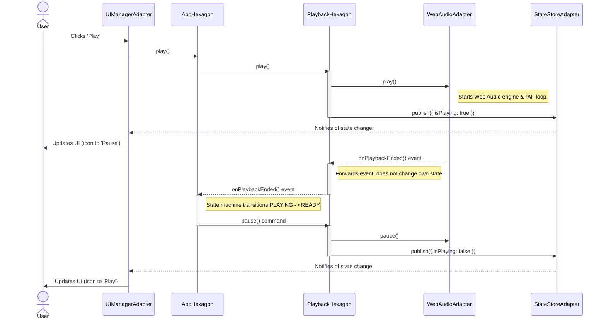
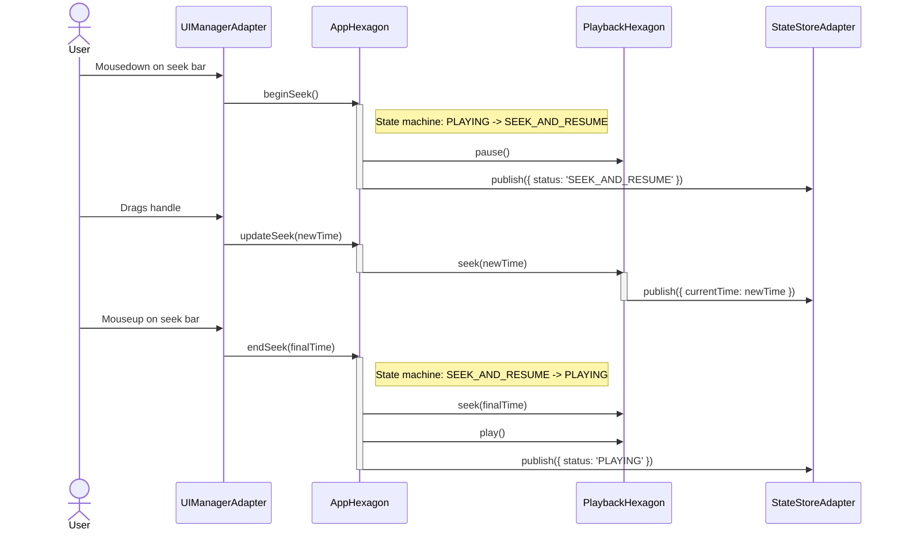
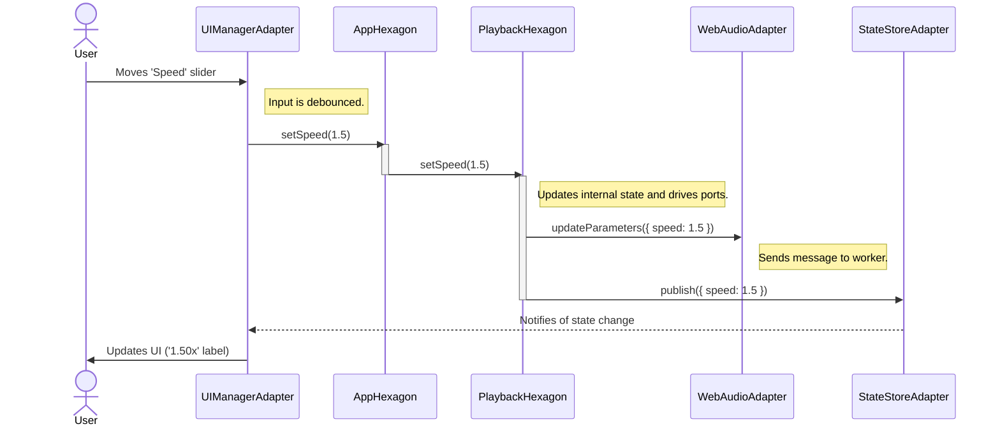

[//]: # ( REFACTOR_PLAN.md )

# **Vibe Player V3: The Hexagonal Architecture Blueprint**

### **0. Context & Executive Summary: Building with Unwavering Precision**

This document outlines the complete architectural blueprint and detailed implementation strategy for Vibe Player V3. It
represents a fundamental, ground-up redesign, moving beyond incremental fixes, driven by a rigorous analysis of past
architectural failures and the explicit commitment to **AI/LLM-driven development**.

The primary objective for V3 is to construct an audio player and analysis tool that is:

* **Fundamentally Robust and Predictable:** By enforcing strict boundaries, formal contracts, and unidirectional data
  flow, we will eliminate classes of bugs related to race conditions, inconsistent state, and fragile inter-module
  communication.
* **Completely Testable and Verifiable:** Every piece of core application logic will be testable in isolation, detached
  from browser APIs and UI frameworks. This is paramount for AI agents, as automated tests become the primary validation
  mechanism.
* **Decoupled and Maintainable:** Core business logic will be entirely separated from external technologies (UI, Web
  Workers, state stores), allowing independent evolution and technology swaps.
* **Transparent and Debuggable:** Through formalized error handling, structured logging, and dedicated observability, AI
  agents will have the necessary feedback loops to self-diagnose and correct issues.
* **Built with No Build Step:** The application will be written in **Pure JavaScript with strict JSDoc typing**. It must
  be runnable directly from a static file server without a bundling or transpilation step, prioritizing simplicity and
  immediate testability.
* **Behavior-Driven:** High-level behaviors will be defined in **Gherkin scenarios**, which serve as executable
  specifications for both AI implementation and automated end-to-end testing.
* **Shareable via URL Hash:** The entire application state—including the loaded audio URL, playback time, and all
  parameters—will be serialized into the URL's **hash fragment (`#`)**, enabling users to share a link that perfectly
  reproduces their session.

This plan serves as the definitive source of truth for all AI agents tasked with V3 development. **Every instruction
within this document is a mandatory directive.**

---

### **1. Architectural Principles & Design Constraints**

This section outlines the non-negotiable rules and rationales that govern all development decisions for V3. The AI agent
must adhere to these constraints at all times.

* **Constraint 1: Zero Build-Step, Static Execution**
    * **Description:** The V3 application **must** be runnable directly from the file system or a simple static server
      with **no build or bundling step required**. All code will be written as standard JavaScript modules (e.g., loaded
      via `<script type="module">` or a similar pattern) and loaded via `<script>` tags in `index.html`.
    * **Rationale:** This prioritizes simplicity, immediate testability, and zero-dependency development, avoiding
      complexities that can arise from build toolchains.
    * **Implication for AI:** The agent **must not** use any syntax that requires a transpiler (e.g., JSX). It must
      manage dependencies via an explicit and correctly ordered list of `<script>` tags in `index.html`.
      `dependency-cruiser` will be used in CI to validate this order.

* **Constraint 2: V1 Logic is the "Golden Master" for Core Algorithms**
    * **Description:** For core signal processing and visualization algorithms (specifically VAD region calculation,
      DTMF/CPT parsing, and waveform peak generation), the V3 implementation **must** be functionally identical to the
      V1 implementation. The V1 code serves as the "golden master" reference.
    * **Rationale:** V1's algorithms are proven to work correctly. The goal of V3 is initially to fix the architecture,
      not re-invent the core processing. Future algorithmic improvements can be made against this stable baseline.
    * **Implication for AI:** The agent's primary goal is to accurately port and refactor the existing, proven logic
      from V1's `.js` files into the new V3 Hexagonal structure. Characterization tests will be the arbiter of success.

* **Constraint 3: Main-Thread-Authoritative Timekeeping**
    * **Description:** The application **must** implement a main-thread-authoritative timekeeping model to ensure a
      smooth UI and prevent visual "jumps" or glitches. The UI's time display and seek bar will be driven by a
      `requestAnimationFrame` loop on the main thread.
    * **Rationale:** As analyzed from V1, audio processing worklets (like Rubberband WASM) can have inherent latency and
      their time reporting can drift from the browser's high-resolution clock. Trusting the worklet's time for UI
      updates leads to a poor user experience.
    * **Implication for AI:** The AI agent must implement the "Hot Path" as described in the state management section.
      The `WebAudioAdapter` will drive the `timeStore` for UI updates. The `AppHexagon` must issue `COMMAND_SEEK` to the
      `PlaybackHexagon` upon explicit user actions (like `COMMAND_PAUSE` or parameter changes) to force the audio engine
      to re-synchronize with the main thread's authoritative time.

* **Constraint 4: Future-Proofing for Remote VAD API**
    * **Description:** The architecture must be designed to allow the local, in-browser VAD processing to be easily
      replaced by an asynchronous HTTP call to a remote VAD API endpoint in the future.
    * **Rationale:** This provides flexibility. Local VAD is great for privacy and offline use, but a remote API could
      offer more powerful models or reduce client-side CPU load.
    * **Implication for AI:** This is a key justification for the Hexagonal Architecture. The AI will implement a
      `VADHexagon` that depends on a port (`IInferenceEnginePort`). Initially, this port will be implemented by a
      `SileroVadAdapter` using the local `WorkerChannel`. In the future, a new `RemoteVadApiAdapter` can be created to
      implement the same port using `fetch`, with no changes required to the `VADHexagon`.

* **Principle 1: Clarity, Functionality, and Clean Design**
    * **Description:** The user interface design should prioritize clarity, information density, and functional utility.
    * **Rationale:** The goal is to create a powerful tool, not a purely aesthetic piece. A clean, well-organized
      interface that provides clear feedback and powerful controls is paramount.
    * **Implication for AI:** When tasked with creating UI components, the agent should produce simple, functional HTML
      and CSS that is well-structured and easy to understand. It should avoid overly complex or purely decorative UI
      elements.

* **Principle 2: Eager Asset Initialization**
    * **Description:** To optimize user experience and minimize latency upon file selection, the application **should**
      adopt a strategy of pre-fetching and pre-initializing heavy assets (like WASM and ONNX models) at startup.
    * **Rationale:** This helps prevent race conditions and provides a more responsive feel, as the user does not have
      to wait for large assets to download *after* they have selected a file.
    * **Implication for AI:** The `AppHexagon`'s `INITIALIZE_APPLICATION` flow must include steps to trigger the
      initialization of adapters that require heavy remote assets.

---

### **2. The `AppHexagon` State Machine**

The `AppHexagon` orchestrates the application's primary lifecycle. Its state transitions are strictly defined to ensure
predictable behavior.

#### **2.1. State Diagram**

```mermaid
stateDiagram-v2
    direction LR

    [*] --> IDLE
    IDLE --> LOADING: COMMAND_LOAD_AUDIO

    LOADING --> READY: EVENT_LOAD_SUCCESS
    LOADING --> ERROR: EVENT_LOAD_FAILURE

    READY --> PLAYING: COMMAND_PLAY
    READY --> SEEK_AND_HOLD: COMMAND_BEGIN_SEEK
    READY --> LOADING: COMMAND_LOAD_AUDIO

    PLAYING --> READY: COMMAND_PAUSE
    PLAYING --> READY: EVENT_PLAYBACK_ENDED
    PLAYING --> SEEK_AND_RESUME: COMMAND_BEGIN_SEEK
    PLAYING --> LOADING: COMMAND_LOAD_AUDIO
    PLAYING --> ERROR: EVENT_PLAYBACK_FAILURE

    SEEK_AND_RESUME --> PLAYING: COMMAND_END_SEEK
    SEEK_AND_RESUME --> SEEK_AND_HOLD: COMMAND_PAUSE

    SEEK_AND_HOLD --> READY: COMMAND_END_SEEK
    SEEK_AND_HOLD --> SEEK_AND_RESUME: COMMAND_PLAY

    ERROR --> LOADING: COMMAND_LOAD_AUDIO

    note for READY
      State: Audio is loaded, playable, and paused.
      (Covers both initial "ready" and subsequent "paused" conditions.)
    end note

    note for SEEK_AND_RESUME
        State: Paused for seeking.
        Intent: Resume playback after seek.
    end note

    note for SEEK_AND_HOLD
        State: Paused for seeking.
        Intent: Remain paused (in READY state) after seek.
    end note
```

#### **2.2. State Definition Table**

This table provides the granular detail an AI agent needs to implement the state machine correctly.

| State Name            | Description                                                                                                                               | Entry Actions (What the AppHexagon does upon entering this state)                                                                         | Allowed Commands (Triggers for leaving this state)                                                  |
|:----------------------|:------------------------------------------------------------------------------------------------------------------------------------------|:------------------------------------------------------------------------------------------------------------------------------------------|:----------------------------------------------------------------------------------------------------|
| **`IDLE`**            | The application has started, but no audio has been loaded. This is the initial state.                                                     | <ul><li>`uiManager.renderInitialView()`</li></ul>                                                                                         | <ul><li>`COMMAND_LOAD_AUDIO`</li></ul>                                                              |
| **`LOADING`**         | An audio source (file or URL) is being fetched, decoded, and prepared by the `AudioLoaderService` and `AudioEngine`.                      | <ul><li>`uiManager.showGlobalSpinner()`</li><li>`uiManager.disableAllControls()`</li></ul>                                                | <ul><li>(No user commands allowed; transitions are via internal events)</li></ul>                   |
| **`READY`**           | Audio is successfully loaded and playable, but playback is paused. This is the default state after loading and after pausing or stopping. | <ul><li>`uiManager.hideGlobalSpinner()`</li><li>`uiManager.enableAllControls()`</li><li>`uiManager.setPlayButtonIcon('play')`</li></ul>   | <ul><li>`COMMAND_PLAY`</li><li>`COMMAND_BEGIN_SEEK`</li><li>`COMMAND_LOAD_AUDIO`</li></ul>          |
| **`PLAYING`**         | Audio is currently playing.                                                                                                               | <ul><li>`uiManager.setPlayButtonIcon('pause')`</li><li>`audioEngine.startUiUpdateLoop()`</li></ul>                                        | <ul><li>`COMMAND_PAUSE`</li><li>`COMMAND_BEGIN_SEEK`</li><li>`COMMAND_LOAD_AUDIO`</li></ul>         |
| **`SEEK_AND_RESUME`** | The user started seeking while the audio was `PLAYING`. Playback is temporarily paused, with the intent to resume after seeking.          | <ul><li>`audioEngine.pausePlayback()`</li><li>`uiManager.showSeekingIndicator()`</li></ul>                                                | <ul><li>`COMMAND_END_SEEK`</li><li>`COMMAND_PAUSE` (user overrides resume intent)</li></ul>         |
| **`SEEK_AND_HOLD`**   | The user started seeking while the audio was `READY` (paused), or paused during a `SEEK_AND_RESUME`. Playback is paused.                  | <ul><li>(No new action needed; already paused)</li><li>`uiManager.showSeekingIndicator()`</li></ul>                                       | <ul><li>`COMMAND_END_SEEK`</li><li>`COMMAND_PLAY` (user overrides pause intent to resume)</li></ul> |
| **`ERROR`**           | A critical, unrecoverable error occurred during loading or playback. The system is halted until a new file is loaded.                     | <ul><li>`uiManager.hideGlobalSpinner()`</li><li>`uiManager.disableAllControls()`</li><li>`uiManager.displayErrorMessage(error)`</li></ul> | <ul><li>`COMMAND_LOAD_AUDIO`</li></ul>                                                              |

#### **2.3. Handling Special Events**

* **`EVENT_PLAYBACK_ENDED`:** When the `AppHexagon` is in the `PLAYING` state and receives this event:
    1. It commands the `PlaybackHexagon` to set its internal time to the `duration`.
    2. It transitions the application state to `READY`.
    3. Crucially, it **does not** trigger the `URLStateAdapter` to update the hash. This prevents the URL from being
       unhelpfully updated with a time equal to the duration.
* **`COMMAND_PLAY` (from `READY` state):**
    1. The `AppHexagon` checks if `currentTime === duration`.
    2. If `true`, it first issues a `COMMAND_SEEK(0)` before issuing the `COMMAND_PLAY`.
    3. If `false`, it just issues `COMMAND_PLAY`.

---

### **3. Detailed State Management & Data Flow**

#### **3.1. Core Principles**

* **Unidirectional Data Flow:** Data flows in one direction: Driving Adapters (UI) -> `AppHexagon` (commands) -> Domain
  Hexagons (logic) -> Driven Adapters (effects, e.g., worker calls, store updates). Updates then flow back (Driven
  Adapters -> Store -> Driving UI Adapter).
* **State Store as a Write-Only Bus:** The centralized "State Store" (a collection of plain JavaScript objects with a
  pub/sub mechanism) is a **Driven Adapter**, not a Hexagon. Hexagons **drive** the `StateStoreAdapter` to write state;
  they do not read from it.
* **Command vs. Event Pattern:**
    * **Commands (Input):** Originate from a **Driving Adapter** (e.g., `uiManager.js`) or the `AppHexagon`. They are
      requests for the application to *do something* (e.g., `COMMAND_PLAY`, `COMMAND_SEEK`).
    * **Events (Output):** Originate from a **Driven Adapter** (e.g., `WebAudioAdapter`). They are notifications that a
      *system event has occurred* (e.g., `EVENT_PLAYBACK_ENDED`, `EVENT_WORKER_CRASHED`).
* **`AppHexagon` as Transactional Authority:** The `AppHexagon` is the sole authority for all major state transitions.
  It receives events, consults its current status, and issues explicit commands back down to the domain hexagons to
  update the canonical state.
* **URL State Management (via Hash Fragment):**
    * The **`AppHexagon`** is responsible for both reading and writing the application state to the URL.
    * **On Initialization:** It drives a `URLStateAdapter` to parse `window.location.hash`. If a state is present, the
      `AppHexagon` issues commands to other hexagons to apply that state. If a `url` parameter exists in the hash, it
      triggers the file loading flow.
    * **On State Change:** It is driven by the state store. On changes to key parameters, a debounced call to the
      `URLStateAdapter` is made, which serializes the current state into the hash fragment using `history.replaceState`.
* **Controlled Exception: The "Hot Path"**
    * **What:** For high-frequency UI updates like the seek bar's position during playback, the `WebAudioAdapter` runs a
      `requestAnimationFrame` loop. Inside this loop, it calculates the estimated time and writes **directly** to a
      dedicated, lightweight UI store (`timeStore`).
    * **Why:** This is a deliberate, controlled exception to achieve smooth 60fps UI updates without burdening the core
      application logic with `rAF` loops.
    * **Limitations:** This is the *only* such exception. The `timeStore` is treated as a read-only sink for UI display
      purposes and does not trigger core application logic.
* **Large Data Handling Protocol:** To maintain UI performance, large, static data payloads (like the `vadProbabilities`
  array) are **not** stored in reactive state stores. The owning hexagon (`VADHexagon`) holds the data internally. The
  state store will only hold a boolean flag (e.g., `hasVadProbabilities: true`), signaling to the UI that it can now
  call a synchronous accessor method on the hexagon's port (e.g., `VADHexagon.getProbabilityData()`) to retrieve the
  data for rendering.

#### **3.2. State Ownership & Pathways**

| State Item                                        | Owning Hexagon       | Location in Store                       | Description                                                                                                                                                   |
|:--------------------------------------------------|:---------------------|:----------------------------------------|:--------------------------------------------------------------------------------------------------------------------------------------------------------------|
| `status` (`loading`, `ready`, etc.)               | `AppHexagon`         | `statusStore`                           | The single source of truth for the application's overall state.                                                                                               |
| `error`                                           | `AppHexagon`         | `statusStore`                           | The global error message, if any.                                                                                                                             |
| `fileName`, `duration`, `isPlayable`, `sourceUrl` | `AppHexagon`         | `playerStore`                           | High-level metadata about the loaded audio, managed by the orchestrator.                                                                                      |
| `isPlaying`, `isLooping`                          | `PlaybackHexagon`    | `playerStore`                           | The canonical boolean playback state.                                                                                                                         |
| `currentTime`                                     | `PlaybackHexagon`    | `timeStore` (Hot), `playerStore` (Cold) | The canonical playback time. Updated on the "hot path" by the `WebAudioAdapter` for UI, and synced on the "cold path" by the `PlaybackHexagon` on pause/seek. |
| `speed`, `pitchShift`, `gain`                     | `PlaybackHexagon`    | `playerStore`                           | Playback manipulation parameters.                                                                                                                             |
| `vadProbabilities`                                | `VADHexagon`         | *Internal to `VADHexagon`*              | The raw frame-by-frame speech probabilities. **Not published to the store.**                                                                                  |
| `hasVadProbabilities`                             | `VADHexagon`         | `analysisStore`                         | A boolean flag indicating that the probability data is available for retrieval via accessor.                                                                  |
| `vadRegions`                                      | `VADHexagon`         | `analysisStore`                         | The calculated speech time segments, derived from `vadProbabilities` and the current thresholds.                                                              |
| `vadPositiveThreshold`, etc.                      | `VADHexagon`         | `analysisStore`                         | The tuning parameters for VAD region calculation.                                                                                                             |
| `dtmfResults`                                     | `DTMFHexagon`        | `dtmfStore`                             | The list of detected DTMF tones.                                                                                                                              |
| `spectrogramData`                                 | `SpectrogramHexagon` | *Internal to `SpectrogramHexagon`*      | The calculated spectrogram data (frequency-magnitude arrays). **Not published to the store.**                                                                 |
| `hasSpectrogramData`                              | `SpectrogramHexagon` | `analysisStore`                         | A boolean flag indicating spectrogram data is available for retrieval via accessor.                                                                           |
| `waveformData`                                    | `WaveformHexagon`    | `playerStore`                           | The calculated peak data for waveform visualization.                                                                                                          |

---

### **4. V3 Implementation Strategy & Process for AI Agents**

This section details the practical, step-by-step process for AI agents to develop Vibe Player V3. It translates the
architectural goals and quality assurances into an actionable workflow.

#### **4.1. Guiding Principles for AI Agent Development**

* **Inside-Out Development:** The AI agent **must** build the application from its pure business logic core (the
  Hexagons) outwards towards the browser-specific technologies (the Adapters and UI). The AI agent **must explicitly
  avoid** a "GUI-first" approach. Core logic **must** be proven correct before any UI is assembled.
* **Test-Driven Development (TDD):** Every new piece of logic **must** begin with a test (unit or integration) that
  defines its requirements. Code **must** only be written to make a failing test pass. For refactoring existing logic
  from V1, this **must** take the form of **Characterization Testing**.
* **Early & Continuous Integration:** The CI/CD pipeline and its automated quality gates are foundational. The AI agent
  **must** ensure every commit is validated against strict standards for type safety, code quality, architectural
  integrity, and documentation.
* **Gherkin-Driven Behavior:** For all user-facing features, the AI agent **must** refer to Gherkin scenarios as the
  source of truth for desired behavior.
* **Strict Adherence to `CONTRIBUTING-LLM.md`:** All directives within `CONTRIBUTING-LLM.md` and **Appendix A** of this
  document **must be followed rigorously**.

#### **4.2. Phase 1: Project Foundation & CI Setup (The First Commit)**

1. **Initialize Project Structure:**
    * The AI agent **must** create the `vibe-player-v3/` project directory as a **completely new, clean Pure JavaScript
      project**. This is not an in-place refactor of `vibe-player-v2.3/`.
    * The AI agent **must** initialize `package.json` with `npm init -y` and install development dependencies (Vitest,
      Playwright, Biome, `dependency-cruiser`, `cucumber`, etc.).
    * The AI agent **must** create the source directory structure as outlined in **Appendix B**.
2. **Configure Core Tooling (Strictly):**
    * **`jsconfig.json`:** Configure for strict JSDoc type checking (`"strict": true`, `"checkJs": true`,
      `"noEmit": true`, `"lib": ["es2017", "dom", "webworker"]`).
    * **`biome.json`:** Configure with a strict set of linting and formatting rules.
    * **`.dependency-cruiser.js`:** Configure to enforce the Hexagonal Architecture rules defined in the testing
      strategy.
    * **`cucumber.js`:** Configure to work with Playwright for running `.feature` files.
    * **Component Isolation Tool:** Set up a simple "Component Explorer" (e.g., using HTML files in `harnesses/`) for
      isolated UI development.
3. **Implement CI/CD Workflows:**
    * The AI agent **must** create initial GitHub Actions workflows (`ci.yml`, `e2e.yml`, CodeQL, SonarCloud).
    * The `ci.yml` workflow **must** be configured to run all static analysis checks and unit/integration tests on every
      pull request.
    * The `e2e.yml` workflow **must** be configured to run the Playwright/Cucumber.js E2E suite.
4. **First Commit:** The AI agent **must** commit this foundational setup to the `main` branch, ensuring a "green" build
   on an "empty but fully configured" project (meaning no application logic yet, but all tooling and CI pass).

#### **4.3. Phase 2: The Core Development Loop (Iterative AI Process)**

1. **Task Assignment:** A human (or higher-level AI) assigns a feature task (e.g., "Implement PlaybackHexagon and its
   `IAudioOutputPort` via `WebAudioAdapter`").
2. **Gherkin Review (Mandatory for Features):**
    * The AI agent **must** review the relevant Gherkin scenarios in `tests/features/` that describe the desired
      external behavior for the task.
    * If no relevant Gherkin scenario exists, the AI agent **must halt** and **propose a new Gherkin scenario** for
      human review and approval.
3. **Characterization Test (If Applicable):**
    * If refactoring a feature from V1 (e.g., VAD region calculation, waveform generation), the AI agent **must first
      generate a "test vector" JSON file** by running the pure logic from the V1 codebase with curated inputs and saving
      exact outputs. These vectors are the "golden master" standard and are checked into
      `tests/characterization_vectors/`.
4. **Hexagon Implementation (TDD with JSDoc):**
    * The AI agent **must** create a new `*.test.js` file for the V3 Hexagon (e.g., `PlaybackService.test.js`).
    * The AI agent **must** write a test that initially fails, defining the Hexagon's behavior (or loads the JSON vector
      for characterization tests).
    * The AI agent **must** implement the pure logic inside the Hexagon file (`src/lib/hexagons/`, e.g.,
      `PlaybackService.js`) until the unit test passes. **No browser APIs or platform-specific code are allowed in this
      step.** All code **must** be fully JSDoc-typed.
5. **Adapter Implementation (Driving & Driven):**
    * Once a Hexagon's core logic is stable, the AI agent **must** implement its associated Adapters (e.g.,
      `WebAudioAdapter.js` for `PlaybackService`).
    * This involves interacting with browser APIs (Web Audio, DOM) or `WorkerChannel`.
    * All Adapter code **must** be fully JSDoc-typed and adhere to strict linting rules.

#### **4.4. Phase 3: Final Application Assembly & E2E Testing**

1. **Application Integration (`src/app.js` and `src/main.js`):**
    * The AI agent **must** implement `src/app.js` as the `AppHexagon` orchestrator. Its role is to perform dependency
      injection: instantiate all Hexagons and Adapters, plug them into each other, and wire up the final UI event
      listeners (from `uiManager`).
    * The `src/main.js` will be the initial entry point, responsible for initializing the `uiManager` and the
      `AppHexagon`.
2. **E2E Testing (CI Only):**
    * The AI agent **must** run the full Playwright E2E test suite (driven by Cucumber.js) against a production build in
      the CI pipeline to simulate user flows defined in Gherkin (`.feature` files`).
    * For `<canvas>`-based visualizations, the AI agent **must** use Playwright's `toHaveScreenshot` capability in the
      E2E suite to automatically detect if code changes unintentionally altered their graphical output. This is a
      mandatory check.

#### **4.5. Phase 4: Documentation & Handover**

1. **Update Project Documentation:**
    * Upon completion, the AI agent **must** update the root `README.md` to reflect the new V3 architecture and setup.
    * The `REFACTOR_PLAN.md` and related appendices **must be moved** to a `docs/` directory to preserve the project's
      history.
    * The old `vibe-player` (V1) and `vibe-player-v2.3` directories **must be archived or removed** to ensure
      `vibe-player-v3` is the sole, definitive codebase.
2. **Final Quality Review:** The AI agent **must** perform a final review of the SonarCloud dashboard to identify and
   address any remaining high-priority issues before the official V3 release.

---
**APPENDICES**
---

# **Appendix A: AI Agent Collaboration Guidelines & Operational Instructions**

This section defines the operational protocols for any AI agent working on this project. It is a mandatory guide for
implementation and integrates the principles from `CONTRIBUTING-LLM.md`.

* **P0: Agent Autonomy & Minimized Interaction:** The agent should operate with a high degree of autonomy once a task
  and its objectives are clearly defined. Default to making reasonable, well-documented decisions to keep work flowing.
* **P1: Task-Driven Workflow & Initial Confirmation:** Complex tasks require an initial proposal and user confirmation
  before full implementation.
* **P2: Clarity & Explicit Communication:** Proactively seek clarification for ambiguous tasks. Explain all changes and
  their rationale in a structured manner (e.g., commit messages).
* **P3: Maintainability & Consistency:**
    * **P3.1:** Strictly adhere to the V3 architectural patterns defined in this document.
    * **P3.2:** Generate high-quality JSDoc comments for all public functions, classes, and types. Preserve existing
      meaningful comments.
    * **P3.4 & P3.5:** All full files must include file identification comments at the start and end. Use section
      headers for long files.
* **P4: Guideline Adherence & Conflict Reporting:** The agent must report if its knowledge suggests a guideline is
  suboptimal for a task, and must report any direct conflicts between user instructions and established guidelines,
  seeking explicit direction.
* **P5: Full Word Naming Convention:** All string keys for states, events, commands, and types must use full,
  descriptive English words in `SCREAMING_SNAKE_CASE` for constants and `camelCase` for other identifiers.
* **P6: README Generation Requirement:** The main `README.md` must contain a reference to this collaboration guide.
* **P7: Branch-Based Code Submission:** The agent must submit all work by committing to feature branches and pushing to
  the remote repository.
* **P8: Gherkin-Driven Implementation and Testing:**
    * When implementing a new feature, the agent **must** consult the relevant Gherkin scenarios (
      `tests/features/*.feature`) to understand the desired external behavior.
    * The agent **must** ensure that its generated code passes the automated E2E tests derived from these Gherkin
      scenarios.
    * If no relevant Gherkin scenario exists for a new feature, the agent **must first propose a new Gherkin scenario**
      for human review and approval before proceeding with implementation.

---

# **Appendix B: Detailed Folder Structure**

```
vibe-player-v3/
├── .github/                           # CI/CD Workflows
│   └── workflows/
│       ├── ci.yml                     # Main CI (static analysis, unit/integration tests)
│       └── e2e.yml                    # E2E & Visual Regression Tests (Gherkin-driven)
├── docs/                              # Project history and detailed explanations
│   └── architecture/
├── src/                               # Main application source code (Pure JS + JSDoc)
│   ├── lib/
│   │   ├── hexagons/                  # Pure Business Logic Modules (Hexagons)
│   │   ├── adapters/                  # Technology-Specific Code (Driven & Driving)
│   │   ├── infrastructure/            # Core Infrastructure Utilities
│   │   ├── stores/                    # Central Application State
│   │   ├── types/                     # JSDoc @typedefs
│   │   └── utils/                     # General Utilities
│   ├── workers/                       # Actual Web Worker scripts
│   └── main.js                        # Main application entry point
├── public/                            # Static assets (copied directly to build output)
│   ├── lib/                           # Third-party JS/WASM
│   ├── models/
│   ├── css/
│   ├── fonts/
│   └── index.html                     # Main application HTML file
├── tests/                             # All test code
│   ├── unit/                          # Unit tests
│   ├── integration/                   # Integration tests
│   ├── e2e/                           # End-to-End Tests (Gherkin-driven, Playwright)
│   │   ├── features/                  # Gherkin .feature files
│   │   ├── step_definitions/          # JavaScript files mapping Gherkin steps to Playwright
│   │   └── page_objects/              # Playwright Page Object Models
│   └── characterization_vectors/      # JSON files capturing V1 behavior
├── CONTRIBUTING-LLM.md                # AI Agent Collaboration Guidelines
├── package.json                       # Project dependencies and scripts
└── ... (config files: jsconfig.json, biome.json, cucumber.js, etc.)
```

---

# **Appendix C: Gherkin Feature Specifications**

This appendix contains the executable specifications that define the application's behavior. The AI agent **must**
ensure the implemented code passes tests derived from these scenarios.

#### **File: `tests/features/file_loading.feature`**

```gherkin
Feature: File Loading
  As a user, I want to load audio files from my computer or a URL
  so that I can analyze and play them in the application.

  Background:
    Given the user is on the main application page

  Scenario: Successfully loading a local audio file
    When the user selects the valid audio file "test-audio/IELTS13-Tests1-4CD1Track_01.mp3"
    Then the file name display should show "IELTS13-Tests1-4CD1Track_01.mp3"
    And the player controls should be enabled
    And the time display should show a duration greater than "0:00"

  Scenario: Attempting to load an unsupported local file type
    When the user selects the invalid file "README.md"
    Then an error message "Invalid file type" should be displayed
    And the player controls should remain disabled

  Scenario: Loading a new file while another is already loaded
    Given the audio file "test-audio/IELTS13-Tests1-4CD1Track_01.mp3" is loaded and ready
    When the user selects the new valid audio file "test-audio/dtmf-123A456B789C(star)0(hex)D.mp3"
    Then the file name display should show "dtmf-123A456B789C(star)0(hex)D.mp3"
    And the player state should be fully reset for the new file
    And the time display should show the duration of the new file
```

#### **File: `tests/features/playback_controls.feature`**

```gherkin
Feature: Playback Controls
  As a user with a loaded audio file, I want to control its playback
  by playing, pausing, stopping, seeking, and jumping through the audio.

  Background:
    Given the audio file "test-audio/Michael Jackson - Bad.mp3" is loaded and the player is ready

  Scenario: Play, Pause, and Resume functionality
    Given the player is paused at "0:00"
    When the user clicks the "Play" button
    Then the "Play" button's text should change to "Pause"
    And after "2" seconds, the current time should be greater than "0:01"
    When the user clicks the "Pause" button
    Then the "Pause" button's text should change to "Play"
    And the current time should stop advancing

  Scenario: Stopping playback
    Given the audio is playing and the current time is "0:15"
    When the user clicks the "Stop" button
    Then the current time should be "0:00"
    And the "Pause" button's text should change to "Play"
    And the player should be paused

  Scenario: Seeking with the progress bar
    When the user drags the seek bar handle to the 50% position
    Then the current time should be approximately half of the total duration

  Scenario Outline: Jumping forwards and backwards
    Given the current time is "0:10"
    When the user jumps <direction> by "5" seconds
    Then the current time should be "<new_time>"

    Examples:
      | direction  | new_time |
      | "forward"  | "0:15"   |
      | "backward" | "0:05"   |
```

#### **File: `tests/features/parameter_adjustment.feature`**

```gherkin
Feature: Playback Parameter Adjustment
  As a user, I want to adjust playback parameters like speed, pitch, and gain
  to change how the audio sounds in real-time.

  Background:
    Given the audio file "test-audio/LearningEnglishConversations-20250325-TheEnglishWeSpeakTwistSomeonesArm.mp3" is loaded and the player is ready

  Scenario Outline: Adjusting a playback parameter slider
    When the user sets the "<Parameter>" slider to "<Value>"
    Then the "<Parameter>" value display should show "<Display>"
    And the audio playback characteristics should reflect the new "<Parameter>" setting

    Examples:
      | Parameter | Value | Display    |
      | "Speed"   | "1.5" | "1.50x"    |
      | "Pitch"   | "1.2" | "1.20x"    |
      | "Gain"    | "2.0" | "2.00x"    |

  Scenario: Resetting parameters to default
    Given the "Speed" slider is at "1.5"
    And the "Pitch" slider is at "0.8"
    When the user clicks the "Reset Controls" button
    Then the "Speed" slider should be at "1.0"
    And the "Pitch" slider should be at "1.0"
    And the "Gain" slider should be at "1.0"
```

#### **File: `tests/features/vad_analysis.feature`**

```gherkin
Feature: Voice Activity Detection (VAD)
  As a user, I want the application to automatically detect speech in an audio file
  and allow me to tune the detection parameters.

  Background:
    Given the audio file "test-audio/IELTS13-Tests1-4CD1Track_01.mp3" is loaded and the player is ready

  Scenario: VAD highlights appear automatically after analysis
    Then the VAD progress bar should appear and complete within "15" seconds
    And the waveform should display one or more speech regions highlighted in yellow

  Scenario: Tuning VAD thresholds updates highlights in real-time
    Given the VAD analysis is complete and highlights are visible
    When the user sets the "VAD Positive Threshold" slider to a very high value of "0.95"
    Then the number of highlighted speech regions on the waveform should decrease or become zero
    When the user sets the "VAD Positive Threshold" slider to a very low value of "0.20"
    Then the number of highlighted speech regions on the waveform should increase
```

#### **File: `tests/features/tone_analysis.feature`**

```gherkin
Feature: Tone Detection
  As a user analyzing call audio, I want the application to detect and display
  standard DTMF and Call Progress Tones.

  Scenario: DTMF tones are detected and displayed correctly
    Given the audio file "test-audio/dtmf-123A456B789C(star)0(hex)D.mp3" is loaded and the player is ready
    Then the DTMF display should eventually contain the sequence "1, 2, 3, A, 4, 5, 6, B, 7, 8, 9, C, *, 0, #, D"

  Scenario: CPT (Busy Tone) is detected and displayed
    Given the audio file "test-audio/Dial DTMF sound _Busy Tone_ (480Hz+620Hz) [OnlineSound.net].mp3" is loaded and the player is ready
    Then the CPT display should eventually contain "Busy Signal"
```

#### **File: `tests/features/url_hash_state.feature`**

```gherkin
Feature: URL Hash Fragment State Management
  As a user, I want to share a link to the player that includes my exact session state,
  and have the application automatically load and apply that state from the URL hash.

  Background:
    Given the application has fully initialized

  Scenario: Application state is serialized to the URL hash fragment
    Given the audio file "test-audio/Michael Jackson - Bad.mp3" is loaded and ready
    When the user sets the "Speed" slider to "1.5"
    And the user sets the "VAD Positive Threshold" slider to "0.8"
    And the user seeks to "0:45" and then pauses playback
    Then the browser URL's hash fragment should contain "speed=1.50"
    And the browser URL's hash fragment should contain "vadPositive=0.80"
    And the browser URL's hash fragment should contain "time=45.00"

  Scenario: Loading an audio file from a URL parameter in the hash fragment
    Given the user navigates to the application with the hash fragment "#url=http%3A%2F%2Fexample.com%2Faudio.mp3"
    When the application finishes loading the audio from the URL
    Then the file name display should show "http://example.com/audio.mp3"
    And the player controls should be enabled

  Scenario: Loading a full session state from the hash fragment on startup
    Given the user navigates to the application with the hash fragment "#url=http%3A%2F%2Fexample.com%2Faudio.mp3&speed=0.75&pitch=0.90&time=15.00"
    When the application finishes loading the audio from the URL
    Then the "Speed" value display should show "0.75x"
    And the "Pitch" value display should show "0.90x"
    And the current time should be approximately "0:15"

  Scenario: Hash fragment is cleared when loading a new local file
    Given the user is on a page with the hash fragment "#speed=1.50&time=20.00"
    When the user selects the new local audio file "test-audio/IELTS13-Tests1-4CD1Track_01.mp3"
    Then the browser URL's hash fragment should be empty
```

---

# **Appendix D: V1 Architectural Analysis & Tradeoffs (Historical Context)**

This section migrates the key insights from the original V1 `architecture.md` file. It serves as historical context for
the AI agent to understand the "why" behind certain V3 design decisions, particularly regarding audio processing and
timekeeping.

* **V1 Core Philosophy:** Prioritized simplicity and minimal dependencies using Vanilla JS, HTML, and CSS. Leveraged
  WebAssembly (WASM) via standard Web APIs for computationally intensive tasks.
* **Time/Pitch Shifting (Rubberband WASM):**
    * **Temporal Inaccuracy Tradeoff:** The V1 plan explicitly notes that Rubberband prioritizes audio quality over
      strict temporal accuracy. The number of output frames generated may not perfectly match the requested time ratio,
      and its internal time reporting can drift relative to the Web Audio clock.
    * **V1 Solution (Adopted by V3):** This drift necessitated the use of **main-thread time calculation** for the UI
      indicator and periodic seek-based synchronization to keep the audio engine aligned with the UI's authoritative
      time.
    * **Performance Tradeoff:** `EngineFiner` was tested but resulted in stuttering playback due to CPU limits; the
      default (faster) engine was chosen.
* **VAD (Silero ONNX):**
    * **Main-Thread VAD (Async):** In V1, VAD processing ran on the main thread but used `async/await` and
      `setTimeout(0)` to yield periodically.
    * **Tradeoff:** This was simpler to implement for an MVP than a dedicated Web Worker but could cause minor UI
      sluggishness and was susceptible to browser throttling in background tabs.
    * **V3 Improvement:** V3 will move this to a dedicated worker managed by a `WorkerChannel` to solve these issues,
      but the core logic from `sileroProcessor.js` remains the "golden master".
* **DTMF & CPT Detection (Goertzel Algorithm):** This was implemented in pure JavaScript (`goertzel.js`) and ran on the
  main thread after audio was resampled. V3 will move this logic into a dedicated worker for better performance and
  isolation.
* **IIFE Module Pattern & Script Order:** V1 used an IIFE (Immediately Invoked Function Expression) pattern to create a
  simple `AudioApp` namespace. This relied on a carefully managed `<script>` loading order in `index.html`, which was a
  primary source of fragility. V3's use of ES Modules or a similar dependency management strategy (verified by
  `dependency-cruiser`) will eliminate this problem.

---

# **Appendix E: V3 Testing and Quality Assurance Strategy**

This appendix outlines the multi-layered testing and quality assurance strategy for Vibe Player V3. The primary
philosophy is to "shift left," enabling the developer to catch as many issues as possible locally with fast, offline
tools before relying on the more comprehensive, slower checks in the CI/CD pipeline. This strategy is designed to
enforce the architectural principles of V3, prevent regressions, and ensure a high degree of code quality and
maintainability.

#### **1. The Testing Pyramid**

Our strategy is structured as a testing pyramid, with a broad base of fast, local checks and a narrow top of slower,
end-to-end tests. Every layer is mandatory.

| Layer                       | Tool(s)                            | Purpose                                                                   | Runs Locally? | Runs in CI? | Speed        |
|:----------------------------|:-----------------------------------|:--------------------------------------------------------------------------|:--------------|:------------|:-------------|
| **Static Analysis**         | `tsc`, Biome, `dependency-cruiser` | Type safety, code quality, style, architectural rule enforcement          | **Yes**       | **Yes**     | Blazing Fast |
| **Unit Tests**              | Vitest                             | Test individual hexagons/functions/algorithms in complete isolation       | **Yes**       | **Yes**     | Fast         |
| **Integration Tests**       | Vitest                             | Test how hexagons and their adapters collaborate without a full browser   | **Yes**       | **Yes**     | Fast         |
| **End-to-End (E2E) Tests**  | Playwright & Cucumber.js           | Verify complete user flows defined in Gherkin scenarios in a real browser | **Yes**       | **Yes**     | Slow         |
| **Visual Regression Tests** | Playwright (`toHaveScreenshot`)    | Prevent unintended visual bugs in UI and `<canvas>`-based visualizations  | No            | **Yes**     | Slow         |
| **CI Static Analysis**      | SonarCloud, GitHub CodeQL          | Deep security, tech debt, and maintainability scans                       | No            | **Yes**     | Slow         |

---

#### **2. Local Development Checks (The Inner Loop)**

These checks are designed to be run by the developer locally, providing instant feedback. They are fully offline after
the initial `npm install` and are the first line of defense against bugs.

* **Type Safety (`tsc`):**
    * **Tool:** The TypeScript compiler (`tsc`) running in "checkJs" mode.
    * **Command:** `npm run types:check` (which will execute `tsc --noEmit --project jsconfig.json`).
    * **Enforcement:** A `jsconfig.json` file will be configured with `"strict": true` and `"checkJs": true`. This
      forces every function, parameter, and variable to be explicitly typed via JSDoc. It is the direct equivalent of
      running `mypy` in a Python project and will fail the build on any untyped or incorrectly typed code.

* **Code Quality & Formatting (Biome):**
    * **Tool:** Biome.
    * **Command:** `npm run lint` (which will execute `npx @biomejs/biome check --apply .`).
    * **Enforcement:** Biome will replace both ESLint and Prettier. It will be configured with a strict set of rules to
      catch code smells, enforce best practices (e.g., `no-var`), identify overly complex code, and check for unused
      variables. The `--apply` flag will also auto-format the code, ensuring 100% consistency across the codebase.

* **Architectural Rules (`dependency-cruiser`):**
    * **Tool:** `dependency-cruiser`.
    * **Command:** `npm run arch:check` (which will execute `npx depcruise src`).
    * **Enforcement:** This is **critical** for maintaining the Hexagonal Architecture. A `.dependency-cruiser.js`
      config file will enforce rules such as:
        * Hexagons (`src/lib/hexagons/`) **must not** import from Adapters (`src/lib/adapters/`).
        * Adapters **can** import their corresponding Hexagon's port definitions (`src/lib/types/`).
        * UI-layer adapters **must not** import from backend adapters (e.g., `uiManager` cannot import
          `WebAudioAdapter`).
        * This test prevents architectural decay over time, which was a key failure mode of previous versions.

---

#### **3. Automated Testing (Unit & Integration)**

These tests are run locally via a single command (`npm test`) and are a mandatory check in the CI pipeline.

* **Unit Tests & V1 Characterization Testing:**
    * **Concept:** For core algorithms (VAD region calculation, DTMF parsing, waveform downsampling), we will use the V1
      implementation as the "golden master" to prevent regressions.
    * **Process:**
        1. **Generate Test Vectors:** We will run the pure logic from the V1 codebase with specific inputs and save the
           inputs and their exact outputs to JSON files (e.g., `vad-test-vector-01.json`). These vectors will be checked
           into the repository at `tests/characterization_vectors/`.
        2. **Write V3 Unit Tests:** The unit tests for the V3 hexagons will load these JSON files. They will feed the
           `input` from the vector into the new V3 function and assert that the `output` is deeply equal to the
           `expectedOutput` from the vector.
    * **Benefit:** This proves that the V3 refactor has perfectly preserved the trusted logic of the original working
      application, dramatically reducing the risk of regressions.

* **Integration Tests:**
    * **Concept:** To verify the collaboration between hexagons and their ports without the overhead of a full browser
      environment.
    * **Example:** A test will instantiate the `AppHexagon` and a real `PlaybackHexagon`, but inject a *mock*
      `WebAudioAdapter` that conforms to the `IAudioOutputPort`. The test will then call `AppHexagon.play()` and assert
      that the mock `WebAudioAdapter`'s `play` method was called correctly. This validates the entire internal command
      chain quickly and efficiently.

---

#### **4. CI/CD Pipeline Checks (The Final Gate)**

The CI pipeline on GitHub Actions runs all the above checks and adds final, deeper layers of analysis. A pull request
cannot be merged unless all these checks pass.

* **Deep Security Analysis (CodeQL):**
    * **Tool:** GitHub CodeQL.
    * **Process:** A GitHub Actions workflow will run on every pull request to perform a deep semantic analysis of the
      code, scanning for a wide range of security vulnerabilities (XSS, injection flaws, etc.). Results are reported
      directly on the PR.

* **Code Maintainability Analysis (SonarCloud):**
    * **Tool:** SonarCloud.
    * **Process:** After a build passes, a workflow will send the code to SonarCloud for analysis. It will report on
      code smells, complexity, duplication, and technical debt.
    * **Quality Gate:** A quality gate will be configured in SonarCloud to fail the check if new code introduces
      high-priority issues or decreases coverage, preventing the merging of low-quality code.

* **End-to-End & Visual Regression Testing (Playwright):**
    * **Tool:** Playwright, driven by Cucumber.js.
    * **Process:** After all other checks pass, the full application will be built and served, and Playwright will run a
      comprehensive test suite.
    * **E2E:** The suite will simulate complete user journeys as defined in the Gherkin `.feature` files (loading a
      file, clicking play, adjusting a slider, verifying URL hash updates).
    * **Visual Regression (Mandatory):** For the `<canvas>`-based waveform and spectrogram visualizations, the test
      suite **must** use Playwright's built-in `toHaveScreenshot` capability. This takes a pixel-perfect snapshot of the
      visual output and compares it against a known-good "golden" image. The build will fail if there are any visual
      differences. This is the only way to automatically detect if a code change has unintentionally altered the
      graphical output and is considered a critical quality check.


---

# **Appendix F: V3 Architecture & Implementation Details**

This appendix provides a complete, detailed walkthrough of the V3 architecture. It serves as the definitive technical specification for how the components interact, the data flows through the system, and how user interactions are handled.

#### **1. Architectural Overview**

The V3 architecture is a **federation of collaborating, self-contained hexagons**, a model based on the Ports and Adapters pattern.

*   **The Hexagon (The Core Logic):** A pure JavaScript module containing isolated business logic. It is entirely decoupled from external technologies like the browser's DOM, Web Audio API, or Web Workers. Its sole purpose is to enforce the rules of its specific domain (e.g., playback, analysis).
*   **Ports (The Contracts):** Formal interfaces, defined via JSDoc `@typedef`s, that act as the "sockets" on a hexagon. They define how data and commands flow in and out.
    *   **Driving Ports:** The public API of the hexagon itself, used by the outside world to command it (e.g., `PlaybackHexagon.play()`).
    *   **Driven Ports:** The interfaces the hexagon depends on to get work done. The hexagon commands an external entity through this port (e.g., `PlaybackHexagon` commands an `IAudioOutputPort`).
*   **Adapters (The Technology):** The "wires" that connect the pure business logic to the real world. They are the only components that interact with platform-specific APIs.
    *   **Driving Adapters:** Initiate action *on* a hexagon. The primary example is the **`UIManagerAdapter`**, which translates user clicks into commands.
    *   **Driven Adapters:** Are driven *by* a hexagon to perform a task. Examples include the **`WebAudioAdapter`** and the **`StateStoreAdapter`**.

---

#### **2. The Hexagons (Core Business Logic)**

##### **2.1. `AppHexagon` (The Central Orchestrator)**

The `AppHexagon` is the brain of the application. It does not contain domain-specific logic but instead orchestrates the other hexagons to fulfill user stories and manages the primary application lifecycle.

*   **Core Responsibility:** To manage the application's primary state machine. It is the only component that can command other hexagons, acting as a central transaction authority.
*   **Internal Logic & State Management:** The `AppHexagon` implements the state machine detailed in Section 2 of the main plan. **Crucially, it does not use separate boolean flags like `isSeeking`.** Instead, seeking is a first-class citizen of the state machine. When a user initiates a seek, the `AppHexagon` transitions from `READY` or `PLAYING` into dedicated `SEEK_AND_HOLD` or `SEEK_AND_RESUME` states. This ensures the application's state is always explicit, atomic, and predictable.
*   **Ports & Schema:**
    *   **Driving Port (`IAppPort`):** The main API for the entire application, exposed to the `UIManagerAdapter`.
        ```javascript
        /**
         * @typedef {object} IAppPort
         * @property {function(): Promise<void>} initializeApplication
         * @property {function(import('./types.js').AudioSource): Promise<void>} loadAudio
         * @property {function(): void} play
         * @property {function(): void} pause
         * @property {function(): void} beginSeek
         * @property {function(number): void} updateSeek
         * @property {function(number): void} endSeek
         * @property {function(number): void} setSpeed
         * @property {function(number): void} setPitch
         * @property {function(number): void} setGain
         * @property {function(number): void} setVadPositiveThreshold
         */
        ```

##### **2.2. `PlaybackHexagon` (The Player Logic)**

*   **Core Responsibility:** To be the pure state machine for a time-stretchable audio player. It manages `duration`, `currentTime`, `speed`, `pitch`, `gain`, and the `isPlaying` flag.
*   **Internal Logic:** It enforces playback rules (e.g., cannot seek past `duration`). It only changes its state in response to commands from the `AppHexagon`.
*   **Ports & Schema:**
    *   **Driving Port (`IPlaybackPort`):** The API the `AppHexagon` uses to command it.
        ```javascript
        /**
         * @typedef {object} IPlaybackPort
         * @property {function(AudioBuffer): void} prepare
         * @property {function(): void} play
         * @property {function(): void} pause
         * @property {function(number): void} seek
         * @property {function(number): void} setSpeed
         * @property {function(number): void} setPitch
         * @property {function(number): void} setGain
         */
        ```
    *   **Driven Ports:** The interfaces it needs other components to implement.
        ```javascript
        /** @typedef {import('./types.js').PlaybackState} PlaybackState */
        /**
         * @typedef {object} IAudioOutputPort
         * @property {function(AudioBuffer): Promise<void>} initialize
         * @property {function(): void} play
         * @property {function(): void} pause
         * @property {function(number): void} seek
         * @property {function(PlaybackState): void} updateParameters
         */

        /**
         * @typedef {object} IPlayerStatePublisherPort
         * @property {function(Partial<PlaybackState>): void} publish
         */
        ```

##### **2.3. Analysis Hexagons (`VADHexagon`, `DTMFHexagon`)**

*   **Core Responsibility:** To transform an `AudioBuffer` into analysis results (speech regions, detected tones). They also handle re-calculation when tuning parameters change.
*   **Internal Logic:** They hold the pure algorithms for their domain. Per the **Large Data Handling Protocol**, they hold large data payloads (like the raw VAD probability array) internally, exposing them only via synchronous accessor methods to avoid polluting reactive stores.
*   **Ports & Schema:**
    *   **Driving Port (`IAnalysisPort`):**
        ```javascript
        /**
         * @typedef {object} IVADAnalysisPort
         * @property {function(AudioBuffer): Promise<void>} analyze
         * @property {function(number): void} setPositiveThreshold
         * @property {function(number): void} setNegativeThreshold
         * @property {function(): Float32Array} getRawProbabilityData
         */
        ```
    *   **Driven Ports:**
        ```javascript
        /**
         * The VADHexagon depends on this port to get raw speech probabilities from a model.
         * @typedef {object} IInferenceEnginePort
         * @property {function(Float32Array): Promise<Float32Array>} compute
         */
        ```

---

#### **3. Adapters & Infrastructure (The Technology Layer)**

##### **3.1. Driving Adapter: `UIManagerAdapter`**

*   **Responsibility:** The bridge from the user to the application. It has two jobs:
    1.  **Input (User to App):** Listens to DOM events (clicks, slider inputs). Translates these low-level events into high-level, debounced commands, and dispatches them to the `AppHexagon`. For a seek operation, it will call `beginSeek`, then a series of `updateSeek` calls, and finally `endSeek`.
    2.  **Output (App to User):** Subscribes to the central state stores. When state changes, it directly manipulates the DOM (e.g., changing a button's text, disabling controls, drawing on a canvas).

##### **3.2. Driven Adapters**

*   **`WebAudioAdapter`:** Implements `IAudioOutputPort`. This adapter is the only part of the application that knows about the Web Audio API. It receives commands from the `PlaybackHexagon` and translates them into Web Audio graph setup and communication with the `rubberband.worker` via its `WorkerChannel`. It also runs the `requestAnimationFrame` loop for the "Hot Path" `currentTime` updates, writing directly to `timeStore`.
*   **`SileroVadAdapter`:** Implements `IInferenceEnginePort`. It is responsible for managing the `silero_vad.worker` via its own `WorkerChannel`. When its `compute()` method is called by the `VADHexagon`, it sends the audio chunk to the worker and returns the resulting probability array.
*   **`StateStoreAdapter`:** Implements all `...StatePublisherPort` interfaces. A simple facade that takes data from a hexagon and writes it into the correct central state store object, decoupling the hexagons from the specific state management implementation.
*   **`URLStateAdapter`:** Subscribes to the state stores. On key state changes, a debounced call serializes the state into the URL hash. It also provides a method for the `AppHexagon` to parse the initial hash on startup.

##### **3.3. Infrastructure Utility: The `WorkerChannel`**

*   **Core Responsibility:** A reusable class that provides a generic, robust, Promise-based request/response communication channel over the native Web Worker API. It acts as an **Anti-Corruption Layer (ACL)**, abstracting away the complexities of `postMessage`, `onmessage` handling, message ID correlation, and `Transferable` objects.
*   **Instantiation:** It is instantiated by driven adapters like `WebAudioAdapter` and `SileroVadAdapter`. Each adapter creates and owns its own `WorkerChannel` instance, which in turn manages a dedicated Web Worker.
*   **Observability:** It provides a centralized point for cross-cutting observability, automatically handling:
    *   **Latency Tracing:** Measuring the roundtrip time for every worker operation.
    *   **Traffic Logging:** Logging message types for debugging.
    *   **Error Metrics:** Tracking communication failures and worker-side errors.

---

#### **4. Detailed Interaction Flows (English Descriptions)**

##### **4.1. Application Initialization**
1.  **Entry Point (`main.js`):** Instantiates all hexagons and adapters, performing dependency injection by "plugging" the adapters into the hexagons' ports.
2.  **`AppHexagon`:** Is commanded to `initializeApplication()`. It transitions to the `LOADING` state and publishes this to the `statusStore`. The `UIManagerAdapter` reacts, showing a global spinner.
3.  **`AppHexagon`** then commands all relevant adapters (e.g., `WebAudioAdapter`, `SileroVadAdapter`) to initialize their underlying technology (e.g., workers loading WASM/ONNX models).
4.  **`AppHexagon`** awaits all initialization promises. Upon successful completion, it checks the `URLStateAdapter` for a file to load. If none, it transitions to the `IDLE` state. The `UIManagerAdapter` hides the spinner and enables the initial UI controls.

##### **4.2. Loading an Audio File**
1.  **`UIManagerAdapter`:** The user selects a file. The adapter calls `AppHexagon.loadAudio(file)`.
2.  **`AppHexagon`:** Transitions to the `LOADING` state and publishes it. The UI shows a spinner. It drives an `AudioLoaderService` to decode the file into an `AudioBuffer`.
3.  **`AppHexagon`:** Once the buffer is ready, it orchestrates the next steps in parallel:
    *   **Critical Path (Awaited):** It commands `PlaybackHexagon.prepare(buffer)` and `WaveformHexagon.generate(buffer)`.
    *   **Background (Fire-and-Forget):** It commands `VADHexagon.analyze(buffer)` and `DTMFHexagon.analyze(buffer)`.
4.  **Hexagons:** The `PlaybackHexagon` and `WaveformHexagon` complete their tasks and publish their state (`duration`, `waveformData`).
5.  **`AppHexagon`:** As soon as the critical path is complete, it transitions to the `READY` state. The `UIManagerAdapter` hides the spinner, enables all controls, and renders the waveform.
6.  **Background Completion:** Later, as the `VADHexagon` and `DTMFHexagon` complete, they publish their results. The `UIManagerAdapter` reacts by drawing VAD regions and displaying DTMF tones.

##### **4.3. The Seek Interaction (Using the State Machine)**
1.  **`mousedown`:** The user presses the seek bar handle.
    *   **`UIManagerAdapter`:** Calls `AppHexagon.beginSeek()`.
    *   **`AppHexagon`:** Consults its current state.
        *   If `PLAYING`, it transitions to `SEEK_AND_RESUME`. As part of this state's entry actions, it commands `PlaybackHexagon.pause()`.
        *   If `READY`, it transitions to `SEEK_AND_HOLD`. No playback command is needed.
    *   In both cases, it publishes the new state. The `UIManagerAdapter` shows a "seeking" indicator on the UI.
2.  **`input` (drag):** The user drags the handle.
    *   **`UIManagerAdapter`:** Calls `AppHexagon.updateSeek(newTime)`.
    *   **`AppHexagon`:** It drives the `PlaybackHexagon` to update its `currentTime`, which is then published to the *cold* `playerStore`. The `WebAudioAdapter` also directly writes to the *hot* `timeStore` for smooth UI feedback.
3.  **`mouseup`:** The user releases the handle.
    *   **`UIManagerAdapter`:** Calls `AppHexagon.endSeek(finalTime)`.
    *   **`AppHexagon`:** It first commands `PlaybackHexagon.seek(finalTime)`. Then, it consults its current state.
        *   If `SEEK_AND_RESUME`, it transitions to `PLAYING` by commanding `PlaybackHexagon.play()`.
        *   If `SEEK_AND_HOLD`, it transitions to `READY`.
    *   The `UIManagerAdapter` hides the "seeking" indicator. The application is now in a new, stable state.

##### **4.4. Parameter Adjustment (e.g., Speed)**
This flow does **not** change the `AppHexagon`'s primary state.
1.  **`UIManagerAdapter`:** The user moves the "Speed" slider. An `on:input` event handler calls a debounced function.
2.  **Debouncer:** After the user stops moving the slider for ~200ms, the function fires.
3.  **`UIManagerAdapter`:** Calls `AppHexagon.setSpeed(finalValue)`.
4.  **`AppHexagon`:** Delegates the command directly to `PlaybackHexagon.setSpeed(finalValue)`.
5.  **`PlaybackHexagon`:** Updates its internal `speed` property and drives its two output ports:
    *   `this.statePublisher.publish({ speed: finalValue })` -> The `StateStoreAdapter` updates the store, and the UI label changes.
    *   `this.audioOutput.updateParameters({ speed: finalValue })` -> The `WebAudioAdapter` receives the new parameter and sends a message to the `rubberband.worker` to adjust the time-stretching.

---

#### **5. Interaction Flows (Sequence Diagrams)**

##### **5.1. Play/Pause Command & Event Flow**


##### **5.2. Seek Interaction Flow**


##### **5.3. Parameter Adjustment Flow (No State Change)**

