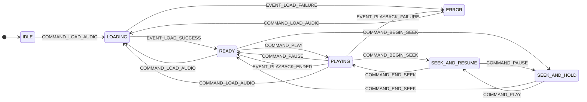
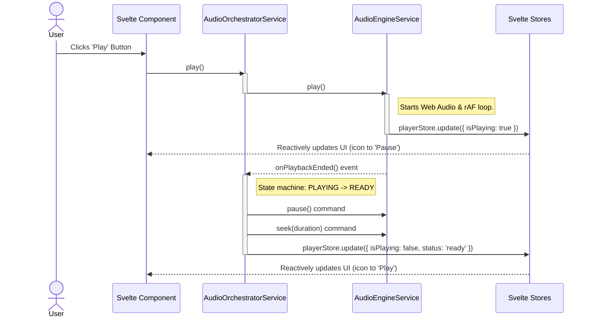

[//]: # ( REFACTOR_PLAN.md )

# **Vibe Player V3: The Definitive Refactor Blueprint**

### **Foreword: A Pragmatic & Modern Architecture**

This document outlines the complete architectural blueprint and detailed implementation strategy for Vibe Player V3. It
represents a fundamental, ground-up redesign driven by a rigorous analysis of past architectural versions and a
commitment to modern, maintainable development practices.

This plan supersedes all previous versions and appendices. It adopts a **minimal, standard, and highly-optimized
toolchain powered by Vite and SvelteKit.** This decision allows us to leverage the full power of TypeScript, a reactive
UI framework, and a rich plugin ecosystem (for PWA support) while still achieving the core goal of producing a simple,
self-contained, and offline-capable static application.

The core principles of testability, decoupling, and maintainability remain paramount. The Hexagonal Architecture for our
business logic is preserved, providing a clean separation of concerns.

This plan is designed to be followed with **100% detail**. All information required for development is contained within
this document. Deviations from this plan are strictly forbidden unless explicitly approved by a higher authority after a
formal review process.

---

## **Chapter 1: The Vision & Guiding Principles**

### **1.1. Executive Summary**

The primary objective for Vibe Player V3 is to construct an audio player and analysis tool that is:

* **Fundamentally Robust:** By enforcing strict boundaries between the UI layer, application services, and core business
  logic, preventing architectural decay.
* **Completely Testable:** Through a multi-layered testing strategy including unit, integration, end-to-end (E2E), and
  isolated component tests. Automated tests are the primary validation mechanism.
* **Highly Maintainable:** By leveraging a modern, strongly-typed language (TypeScript) and a reactive, component-based
  UI architecture (Svelte).
* **Performant:** Using a compiled UI framework (Svelte) and offloading computationally intensive tasks to
  single-threaded Web Workers, ensuring a smooth and responsive user experience.
* **Offline-Capable & Installable:** Built as a Progressive Web App (PWA) that can be installed on user devices and run
  reliably without an internet connection.
* **Shareable via URL:** The entire application state—including the loaded audio URL, playback time, and all
  parameters—will be serialized into the URL's query string, enabling users to share a link that perfectly reproduces
  their session.

### **1.2. Architectural Principles & Design Constraints**

This section outlines the non-negotiable rules and rationales that govern all development decisions for V3. The
developer must adhere to these constraints at all times.

* **Constraint 1: Absolute Static Hostability (No Special Headers)**
    * **Description:** The final `build/` output **must** consist purely of static files (`.html`, `.js`, `.css`, image
      assets, `.wasm`, `.onnx`, `.woff2`, etc.). This means the application **must** be deployable and function
      correctly from any simple static file server (e.g., GitHub Pages, `python -m http.server`) **without requiring any
      server-side configuration for special HTTP headers** (such as `Cross-Origin-Opener-Policy` or
      `Cross-Origin-Embedder-Policy`).
    * **Rationale:** This guarantees maximum portability, zero-friction deployment, and true offline capability for PWA.
    * **Implication:** This constraint explicitly forbids the use of `SharedArrayBuffer` and, consequently, any form of
      **threaded WebAssembly (WASM threads)**. All WASM-based libraries (like ONNX Runtime and Rubberband) **must** be
      configured and used in their single-threaded versions. Performance for parallelizable tasks will be achieved by
      using multiple, separate Web Workers, each performing its task independently.

* **Constraint 2: Minimal, Standard Build Step (Vite + SvelteKit)**
    * **Description:** The application will be built using SvelteKit with its `adapter-static`. The standard
      `npm run build` command will compile the TypeScript and Svelte components into a clean, optimized, and fully
      self-contained static `build/` directory.
    * **Rationale:** This provides robust, industry-standard dependency management, TypeScript transpilation, and PWA
      generation via a fast, well-documented tool. This approach eliminates the fragility and maintenance burden of
      custom build scripts.

* **Constraint 3: First-Class TypeScript & Svelte**
    * **Description:** All application logic (core services, adapters, utilities) will be written in **TypeScript** (
      `.ts` files). The user interface will be constructed using **Svelte components** (`.svelte` files, with
      `<script lang="ts">`).
    * **Rationale:** TypeScript provides superior, ergonomic type safety, compile-time error checking, and better
      tooling support. Svelte's compile-time framework approach results in minimal runtime overhead, small bundle sizes,
      and highly performant UI updates.

* **Constraint 4: Component-Driven UI with Storybook**
    * **Description:** The user interface will be composed of small, single-purpose, and highly testable Svelte
      components. These components will be developed and rigorously verified in **Storybook** in complete isolation
      before integration into the main application. Complex, third-party UI libraries will be avoided for core
      interactive elements to ensure full control.
    * **Rationale:** This guarantees that our UI components render standard HTML elements, making them 100% reliably
      testable by E2E tools like Playwright. It also provides a dedicated environment for visual regression testing and
      component documentation.

* **Constraint 5: V1 Logic is the "Golden Master" for Core Algorithms**
    * **Description:** For core signal processing and analysis algorithms (specifically VAD region calculation, DTMF/CPT
      parsing, and waveform peak generation), the V3 implementation **must** be functionally identical to the V1
      implementation. The V1 JavaScript code serves as the "golden master" reference.
    * **Rationale:** V1's algorithms are proven to work correctly. The initial goal of V3 is to fix the architecture and
      improve the development experience, not re-invent core processing. Characterization tests will be the arbiter of
      success.

* **Constraint 6: Future-Proofing for Remote VAD API**
    * **Description:** The architecture must be designed to allow the local, in-browser VAD processing to be easily
      replaced by an asynchronous HTTP call to a remote VAD API endpoint in the future.
    * **Rationale:** This provides flexibility. The Hexagonal Architecture addresses this by defining an
      `IInferenceEnginePort` that can be implemented by either a local Web Worker adapter or a remote `fetch`-based API
      adapter, with no changes required to the core `AnalysisService` logic.

* **Constraint 7: Main-Thread-Authoritative Timekeeping (for UI)**
    * **Description:** The application **must** implement a main-thread-authoritative timekeeping model to ensure a
      smooth UI. The UI's time display and seek bar will be driven by a `requestAnimationFrame` loop on the main thread,
      managed by the `AudioEngineService`.
    * **Rationale:** Audio processing worklets can have inherent latency and their time reporting can drift. Trusting
      the worklet's time for UI updates leads to a poor user experience. Synchronization with the audio engine will
      occur explicitly upon seek or parameter changes.

* **Constraint 8: Eager Asset Initialization**
    * **Description:** To optimize user experience, the application **should** pre-fetch and pre-initialize heavy
      assets (like WASM and ONNX models) at startup.
    * **Rationale:** This prevents race conditions and provides a more responsive feel, as the user does not have to
      wait for large assets to download *after* they have selected a file.

* **Principle 1: Clarity, Functionality, and Clean Design**
    * **Description:** The user interface design **must** prioritize clarity, information density, and functional
      utility. The goal is to create a powerful tool, not a purely aesthetic piece.
    * **Implication:** Developers should produce simple, functional Svelte components that render standard, accessible
      HTML. This avoids complex third-party UI libraries for core controls, ensuring full control and reliable E2E
      testability.

* **Principle 2: Human-Readable Keys and Constants**
    * **Description:** All string keys used for state serialization (e.g., URL query parameters) or internal messaging *
      *must** use full, descriptive, human-readable English words.
    * **Rationale:** This makes the system transparent and easy to debug. A URL like `?url=...&speed=1.5&time=30` is
      self-documenting. Obscure keys like `?s=1.5&t=30` are forbidden.
    * **Implication:** Constants should use `SCREAMING_SNAKE_CASE` (e.g., `URL_PARAM_SPEED`), and property keys should
      use `camelCase` (e.g., `speed`).

---

## **Chapter 2: Core Components & Folder Structure**

### **2.1. Overall Repository Structure**

```
.
├── .github/                      # GitHub Actions CI/CD workflows
├── .storybook/                   # Storybook configuration and setup
├── build/                        # **STATIC PRODUCTION BUILD OUTPUT** (deployable)
├── src/                          # Main application source code
│   ├── lib/
│   │   ├── components/           # Reusable Svelte UI components (.svelte)
│   │   ├── services/             # Pure Business Logic Modules (Hexagons) (.ts)
│   │   ├── adapters/             # Technology-Specific Code (Driven & Driving Adapters) (.ts)
│   │   ├── stores/               # Central Application State (Svelte Stores) (.ts)
│   │   ├── types/                # TypeScript Interfaces and Type Definitions (Ports) (.ts)
│   │   ├── utils/                # General Utilities and Helpers (.ts)
│   │   └── workers/              # Web Worker scripts (.ts)
│   ├── routes/                   # SvelteKit page routes (e.g., +page.svelte)
│   ├── app.html                  # SvelteKit main HTML template
│   └── app.css                   # Global CSS styles
├── static/                       # Static assets (copied directly to build output)
│   └── ... (favicon, models, vendor libraries)
├── tests/                        # All test code
│   ├── e2e/                      # End-to-End Tests (Playwright, Gherkin-driven)
│   │   └── features/             # Gherkin .feature files (Behavioral Specifications)
│   ├── unit/                     # Vitest Unit and Integration Tests
│   └── characterization_vectors/ # JSON files capturing V1 behavior for testing
├── svelte.config.js              # SvelteKit configuration
├── vite.config.ts                # Vite build tool configuration
├── tsconfig.json                 # TypeScript configuration
└── package.json                  # Project dependencies and scripts
```

### **2.2. Key Hexagons (Services) and Their Responsibilities**

All services are implemented as **Singleton TypeScript Classes** that `implement` a formal Port `interface`. This
enforces the Hexagonal Architecture and ensures a single instance manages the domain logic.

* **`AudioOrchestratorService` (`src/lib/services/audioOrchestrator.service.ts`)**
    * **Role:** The central application orchestrator (the AppHexagon), implementing the `IAudioOrchestratorPort`
      interface.
    * **Responsibility:** Manages the overall application lifecycle state machine (see Chapter 4). Coordinates other
      domain services. Manages global errors.
    * **Key State:** `status` (overall app state), `fileName`, `duration`, `isPlayable`, `sourceUrl`, `waveformData`.

* **`AudioEngineService` (`src/lib/services/audioEngine.service.ts`)**
    * **Role:** The core playback engine (the PlaybackHexagon), implementing the `IAudioEnginePort`.
    * **Responsibility:** Manages the Web Audio API. Communicates with the `rubberband.worker`. Handles audio decoding
      and playback scheduling. Manages `isPlaying` state and directly updates `timeStore` on a `requestAnimationFrame`
      loop.
    * **Key State:** `isPlaying`, `speed`, `pitchShift`, `gain`.

* **`AnalysisService` (`src/lib/services/analysis.service.ts`)**
    * **Role:** Manages Voice Activity Detection (VAD) analysis (the VADHexagon), implementing the `IAnalysisPort`.
    * **Responsibility:** Orchestrates VAD processing via the `sileroVad.worker`. Holds raw VAD probabilities
      internally. Recalculates speech regions based on user-tunable thresholds.
    * **Key State:** `vadProbabilities` (internal), `vadRegions`, `vadPositiveThreshold`, `vadNegativeThreshold`.

* **`DtmfService` (`src/lib/services/dtmf.service.ts`)**
    * **Role:** Manages DTMF and CPT detection (the DTMFHexagon), implementing the `IDtmfPort`.
    * **Responsibility:** Communicates with the `dtmf.worker` to perform tone detection.
    * **Key State:** `dtmfResults`, `cptResults`.

* **`SpectrogramService` (`src/lib/services/spectrogram.service.ts`)**
    * **Role:** Manages spectrogram computation (the SpectrogramHexagon), implementing the `ISpectrogramPort`.
    * **Responsibility:** Communicates with the `spectrogram.worker` to perform FFT calculations.
    * **Key State:** `spectrogramData`.

---

## **Chapter 3: Adapters, Infrastructure & Data Flow**

### **3.1. Driving Adapters (User Input & External Triggers)**

These components initiate commands *on* the core services.

* **Svelte UI Components (`src/lib/components/` & `src/routes/`):**
    * **Role:** The primary driving adapter. Svelte components handle DOM events and call methods on the singleton
      service instances (e.g., `audioEngine.togglePlayPause()`). They depend on the service's Port `interface`, not its
      concrete class.
    * **Key Example (`RangeSlider.svelte`):** This custom component wraps a standard `<input type="range">`. It attaches
      `on:mousedown`, `on:input`, and `on:mouseup` event handlers that dispatch commands like
      `AudioOrchestratorService.beginSeek()`, `updateSeek()`, and `endSeek()`.

* **URL State Listener (`src/routes/+page.ts`):**
    * **Role:** On startup, it parses URL query parameters to retrieve initial application state.
    * **Implementation:** The SvelteKit `load` function in `src/routes/+page.ts` parses `url.searchParams` and provides
      an `initialState` object to the main page component, which then passes it to the `AudioOrchestratorService`.

### **3.2. Driven Adapters (External Interactions & State Output)**

These components are driven *by* the core services to perform a task.

* **Svelte Stores (`src/lib/stores/`):**
    * **Role:** The primary mechanism for pushing state updates from services to the UI. Services update Svelte
      `writable` stores, and UI components reactively consume these updates.

* **Web Workers (`src/lib/workers/`):**
    * **Role:** Perform computationally intensive tasks off the main thread. Communication is managed by the
      `WorkerChannel` utility.

* **`WorkerChannel` Utility (`src/lib/utils/workerChannel.ts`):**
    * **Role:** A mandatory, reusable class providing a robust, Promise-based request/response communication channel
      over the native Web Worker API. It abstracts away `postMessage`/`onmessage` complexities and **must** implement a
      robust timeout mechanism to handle unresponsive workers.

* **URL State Adapter (`src/lib/utils/urlState.ts`):**
    * **Role:** Serializes key application state into the URL's query string.
    * **Implementation:** The `AudioOrchestratorService` subscribes to relevant Svelte Stores. On changes to key
      parameters, it calls a debounced function in `urlState.ts` to update `window.history.replaceState()`.

### **3.3. Core Data Flow Principles**

* **Unidirectional Data Flow:** Data flows in one direction: UI Interaction -> Service Command -> Store Update -> UI
  Reaction. This creates a predictable and debuggable system.

* **Controlled Exception: The "Hot Path"**
    * **What:** For the high-frequency `currentTime` update during playback, the `AudioEngineService` runs a
      `requestAnimationFrame` loop and writes **directly** to the dedicated `timeStore`.
    * **Why:** This is a deliberate exception to achieve smooth 60fps UI updates for the seek bar and time display
      without burdening the entire application with constant re-renders.
    * **Limitations:** This is the *only* such exception. The `timeStore` is for display purposes only and does not
      trigger application logic. The canonical `currentTime` for logic is read from the main `playerStore` during "cold"
      events like `pause` or `seek`.

* **Large Data Handling Protocol**
    * **What:** Services generating large, static data (e.g., `vadProbabilities`) **must** hold it internally. They
      publish a simple boolean flag to a store to indicate readiness. UI components then call a synchronous accessor
      method on the service to retrieve the data for rendering.
    * **Why:** This prevents large data payloads from polluting reactive stores and causing performance issues.

### **3.4. State Ownership & Data Pathways**

| State Item                                                       | Owning Service/Hexagon     | Location in Store                        | Description                                                                                                     |
|:-----------------------------------------------------------------|:---------------------------|:-----------------------------------------|:----------------------------------------------------------------------------------------------------------------|
| `status` (`loading`, `ready`, etc.)                              | `AudioOrchestratorService` | `playerStore` (`status` property)        | The single source of truth for the application's overall state.                                                 |
| `error`                                                          | `AudioOrchestratorService` | `playerStore` (`error` property)         | The global error message, if any.                                                                               |
| `fileName`, `duration`, `isPlayable`, `sourceUrl`, `audioBuffer` | `AudioOrchestratorService` | `playerStore`                            | High-level metadata about the loaded audio. `audioBuffer` is stored here for main-thread access by visualizers. |
| `isPlaying`                                                      | `AudioEngineService`       | `playerStore`                            | The canonical boolean playback state.                                                                           |
| `currentTime`                                                    | `AudioEngineService`       | `timeStore` (Hot) & `playerStore` (Cold) | Canonical time. Updated on `rAF` (`timeStore`) for UI, and synced to `playerStore` on pause/seek.               |
| `speed`, `pitchShift`, `gain`                                    | `AudioEngineService`       | `playerStore`                            | Playback manipulation parameters.                                                                               |
| `vadProbabilities`                                               | `AnalysisService`          | *Internal to `AnalysisService`*          | Raw VAD data. **Not published to the store** per Large Data Handling Protocol.                                  |
| `vadRegions`                                                     | `AnalysisService`          | `analysisStore`                          | Calculated speech time segments.                                                                                |
| `vadPositiveThreshold`, `vadNegativeThreshold`                   | `AnalysisService`          | `analysisStore`                          | Tuning parameters for VAD calculation.                                                                          |
| `dtmfResults`, `cptResults`                                      | `DtmfService`              | `dtmfStore`                              | Detected DTMF and Call Progress Tones.                                                                          |
| `spectrogramData`                                                | `SpectrogramService`       | `analysisStore`                          | Calculated spectrogram data.                                                                                    |
| `waveformData`                                                   | `AudioOrchestratorService` | `playerStore`                            | Peak data for waveform visualization.                                                                           |

### **3.5. Detailed Error Propagation from Workers**

1. **Error in Worker:** A worker encountering a fatal error **must** post a specific error message back to the main
   thread.
2. **`WorkerChannel` Rejection:** The `WorkerChannel`, upon receiving this error or timing out, **must** reject the
   outstanding Promise with a custom `WorkerError`.
3. **Service Catches & Re-throws:** The calling service **must** catch this `WorkerError`, wrap it in a more specific
   high-level `Error` if needed, and **re-throw** it.
4. **Orchestrator Handles State:** The `AudioOrchestratorService` catches the re-thrown error and is the sole authority
   to transition the application into the `ERROR` state, updating the `playerStore` with details for the UI.

### **3.6. URL State Loading Rules**

* **Rule 1: Loading a Local File.** When a user loads a new local audio file, any existing query parameters in the URL *
  *must be cleared**. This prevents state from a previous session from "leaking" into a new one.
* **Rule 2: Loading from a `url` Parameter.** When the application starts with a `url` query parameter (e.g.,
  `?url=...&speed=1.5`), the `AudioOrchestratorService` **must** load the audio from the URL and simultaneously apply
  all other valid parameters to the application's state. The query string **must not** be cleared.

---

## **Chapter 4: The Application State Machine**

The `AudioOrchestratorService` implements the following state machine to manage the application's lifecycle.

### **4.1. State Diagram**



### **4.2. State Definition Table**

| State Name            | Description                               | Entry Actions (What the Orchestrator commands)                                                                                        | Allowed Commands (Triggers for leaving)                                                     |
|:----------------------|:------------------------------------------|:--------------------------------------------------------------------------------------------------------------------------------------|:--------------------------------------------------------------------------------------------|
| **`IDLE`**            | Application started, no audio loaded.     | <ul><li>Update `playerStore` status to 'idle'.</li><li>Eagerly initialize background services.</li></ul>                              | <ul><li>`COMMAND_LOAD_AUDIO`</li></ul>                                                      |
| **`LOADING`**         | Fetching/decoding audio source.           | <ul><li>Update `playerStore` status to 'loading'.</li><li>Show global spinner, disable controls.</li></ul>                            | <ul><li>(Internal events only)</li></ul>                                                    |
| **`READY`**           | Audio loaded, playback is paused.         | <ul><li>Update `playerStore` status to 'ready'.</li><li>Hide spinner, enable controls.</li><li>Trigger background analysis.</li></ul> | <ul><li>`COMMAND_PLAY`</li><li>`COMMAND_BEGIN_SEEK`</li><li>`COMMAND_LOAD_AUDIO`</li></ul>  |
| **`PLAYING`**         | Audio is currently playing.               | <ul><li>Update `playerStore` status to 'playing'.</li><li>Start `AudioEngineService` UI update loop.</li></ul>                        | <ul><li>`COMMAND_PAUSE`</li><li>`COMMAND_BEGIN_SEEK`</li><li>`COMMAND_LOAD_AUDIO`</li></ul> |
| **`SEEK_AND_RESUME`** | User seeking while `PLAYING`.             | <ul><li>Update `playerStore` status to 'seeking'.</li><li>Command `AudioEngineService` to pause.</li></ul>                            | <ul><li>`COMMAND_END_SEEK`</li><li>`COMMAND_PAUSE`</li></ul>                                |
| **`SEEK_AND_HOLD`**   | User seeking while `READY`.               | <ul><li>Update `playerStore` status to 'seeking'.</li></ul>                                                                           | <ul><li>`COMMAND_END_SEEK`</li><li>`COMMAND_PLAY`</li></ul>                                 |
| **`ERROR`**           | A critical, unrecoverable error occurred. | <ul><li>Update `playerStore` status to 'error', `error` with message.</li><li>Disable controls, display error.</li></ul>              | <ul><li>`COMMAND_LOAD_AUDIO`</li></ul>                                                      |

### **4.3. Handling Special Events & Edge Cases**

* **`EVENT_PLAYBACK_ENDED`:** When notified by the `AudioEngineService` that playback has naturally finished:
    1. The orchestrator commands the `AudioEngineService` to set `currentTime` to `duration`.
    2. It transitions the application state to `READY`.
    3. It **must not** trigger a URL state update, to prevent sharing a URL with the time stuck at the end.

* **`COMMAND_PLAY` (from `READY` at End of Track):**
    1. The orchestrator checks if `currentTime === duration`.
    2. If `true`, it first issues a **seek command to `0`** to the `AudioEngineService` before issuing the `play`
       command.
    3. If `false`, it issues the `play` command directly. This ensures clicking "Play" on a finished track restarts it
       from the beginning.

---

## **Chapter 5: The Development Workflow**

### **5.1. Guiding Principles for Development**

* **Component-First UI (Storybook):** All Svelte UI components will be developed and verified in isolation within
  Storybook.
* **Test-Driven Logic (Vitest):** All core business logic within services will be developed using a strict TDD workflow.
* **Behavior-Driven Features (Gherkin & Playwright):** User-facing features will be defined by Gherkin scenarios and
  verified with Playwright E2E tests.
* **Formal Command & Event Naming:** Adhere to a formal distinction between **Commands** (user-initiated actions telling
  the app to do something, e.g., `audioEngine.play()`) and **Events** (system notifications that something has happened,
  e.g., a worker message).
* **Rationale for the Modern Workflow:** This parallel "Component-First + Logic-First" workflow is an intentional
  evolution for a modern reactive stack. It de-risks the UI and business logic simultaneously in their respective ideal
  testing environments (Storybook and Vitest), leading to faster and more reliable final integration.

### **5.2. Project Setup & Initial Configuration**

1. **Initialize SvelteKit Project:** Use `npm create svelte@latest vibe-player-v3`.
2. **Install Dev Dependencies:**
   `npm install -D vitest @testing-library/jest-dom @playwright/test @storybook/svelte vite-plugin-pwa`.
3. **Configure `vite.config.ts`:** Add `adapter-static`, `vite-plugin-pwa`, and `viteStaticCopy` for copying WASM/ONNX
   assets to the `build/` directory.
4. **Configure `svelte.config.js`:** Ensure `adapter-static` is configured for a single-page application (
   `fallback: 'index.html'`).
5. **Configure `tsconfig.json`:** Ensure `lib` includes `webworker` and `target` is `es2020`.
6. **Configure Storybook:** Run `npx storybook@latest init`.

### **5.3. The Core Development Loop (Iterative Process)**

1. **Task & Gherkin Review:** Review the relevant `.feature` file. If none exists, propose one.
2. **UI Component Dev (Storybook):** Create/update the `.svelte` component and its `.stories.ts` file. Build it in
   isolation until visually and functionally correct.
3. **Core Logic Dev (Vitest):** Create/update the `.test.ts` file for the relevant service. Write a failing test (or
   load a characterization vector). Implement the pure TypeScript logic in the service until the test passes. Mock
   service singletons using `vi.mock` for true unit testing.
4. **Application Integration:** Integrate the verified Svelte component into the main application page. Wire up its
   events to call service methods and bind its props to Svelte stores.
5. **E2E Verification (Playwright):** Write a Playwright test to automate the Gherkin scenario. Use `toHaveScreenshot`
   for visual regression testing of canvases.

---

## **Chapter 6: Quality Assurance & Testing Strategy**

### **6.1. The Testing Pyramid Layers**

| Layer                       | Tool(s)                         | Purpose                                                                       | Runs Locally? | Runs in CI? | Speed        |
|:----------------------------|:--------------------------------|:------------------------------------------------------------------------------|:--------------|:------------|:-------------|
| **Static Analysis**         | ESLint, Svelte-Check            | Type safety, code quality, style, architectural rules                         | **Yes**       | **Yes**     | Blazing Fast |
| **Component Testing**       | Storybook                       | Visually inspect and document every component in isolation                    | **Yes**       | No          | Interactive  |
| **Unit Tests**              | Vitest                          | Test individual functions/methods in isolation (includes V1 Characterization) | **Yes**       | **Yes**     | Fast         |
| **Integration Tests**       | Vitest                          | Test collaboration between modules (e.g., service + mocked worker)            | **Yes**       | **Yes**     | Fast         |
| **End-to-End (E2E) Tests**  | Playwright                      | Verify complete user flows defined in Gherkin scenarios                       | **Yes**       | **Yes**     | Slow         |
| **Visual Regression Tests** | Playwright (`toHaveScreenshot`) | Prevent unintended visual bugs in UI and canvases                             | No            | **Yes**     | Slow         |
| **CI Static Analysis**      | **GitHub CodeQL, SonarCloud**   | **Deep security, tech debt, and maintainability scans**                       | **No**        | **Yes**     | **Slow**     |

### **6.2. Local Development Checks (The Inner Loop)**

* **Type Safety (`svelte-check`):** Enforces strict typing for all `.ts` and `.svelte` files.
* **Code Quality & Formatting (ESLint & Prettier):** Enforces best practices and consistent code style.
* **Architectural Rules (ESLint):** This is **critical** for maintaining the Hexagonal Architecture. ESLint, with the
  `eslint-plugin-import` package, **must** be configured to enforce strict architectural boundaries. This check prevents
  architectural decay over time and is a mandatory quality gate. The rules must enforce:
    * UI Components (`src/lib/components/`) **must not** directly import from other technology-specific adapters (e.g.,
      a UI component cannot import a Web Worker module).
    * Core Services (`src/lib/services/`) **must not** import from UI Components (`src/lib/components/`) or page
      routes (`src/routes/`).
    * Services can only depend on other services, stores, types, and their own adapters.

### **6.3. Automated Testing**

* **Unit Tests & V1 Characterization Testing:** Pure logic from V1 is ported and tested against "golden master" JSON
  test vectors to prevent regressions.
* **Integration Tests:** Verify collaboration between modules by mocking out the lowest-level dependencies.
* **End-to-End (E2E) Tests:** Simulated user journeys ensure the entire application functions correctly.

---

## **Chapter 7: UI Element Contract**

This section defines mandatory `data-testid` attributes for all interactive or dynamically updated elements to ensure
stable E2E testing with Playwright.

| Component Group        | Svelte Component (File)      | Test ID                     | Description                                    |
|:-----------------------|:-----------------------------|:----------------------------|:-----------------------------------------------|
| **File Handling**      | `<FileLoader.svelte>`        | `file-input`                | The `<input type="file">` element.             |
|                        |                              | `url-input`                 | The `<input type="text">` for audio URLs.      |
|                        |                              | `file-name-display`         | Displays the name of the loaded file.          |
| **Playback Controls**  | `<Controls.svelte>`          | `play-button`               | The main play/pause toggle button.             |
|                        |                              | `stop-button`               | The stop playback button.                      |
|                        |                              | `jump-back-button`          | Jumps playback backward.                       |
|                        |                              | `jump-forward-button`       | Jumps playback forward.                        |
|                        | `<CustomRangeSlider.svelte>` | `seek-slider-input`         | The `<input type="range">` for seeking.        |
|                        | `+page.svelte`               | `time-display`              | Displays current time and duration.            |
| **Parameter Controls** | `<CustomRangeSlider.svelte>` | `speed-slider-input`        | Controls playback speed.                       |
|                        |                              | `pitch-slider-input`        | Controls pitch shift.                          |
|                        |                              | `gain-slider-input`         | Controls output gain.                          |
|                        | **`<Controls.svelte>`**      | **`reset-controls-button`** | **Resets speed, pitch, and gain to defaults.** |
| **Analysis Controls**  | `<CustomRangeSlider.svelte>` | `vad-positive-slider-input` | Adjusts VAD positive  threshold.               || | | `       vad-negative-slider-input` | Adjusts VAD negative threshold. |
| **Analysis Displays**  | `<ToneDisplay.svelte>`       | `dtmf-display`              | Displays detected DTMF tones.                  |
|                        |                              | `cpt-display`               | Displays detected Call Progress Tones.         |
| **Visualizations**     | `<Waveform.svelte>`          | `waveform-canvas`           | The `<canvas>` for the audio waveform.         |
|                        | `<Spectrogram.svelte>`       | `spectrogram-canvas`        | The `<canvas>` for the spectrogram.            |

***

## **Appendix A: Gherkin Feature Specifications**

This appendix contains the executable specifications that define the application's behavior. The developer **must**
ensure the implemented code passes Playwright E2E tests derived from these scenarios.

### **File: `tests/e2e/features/file_loading.feature`**

```gherkin
Feature: File Loading
  As a user, I want to load audio files from my computer or a URL
  so that I can analyze and play them in the application.

  Background:
    Given the user is on the main application page

  Scenario: Successfully loading a local audio file
    When the user selects the valid audio file "static/test-audio/IELTS13-Tests1-4CD1Track_01.mp3"
    Then the file name display should show "IELTS13-Tests1-4CD1Track_01.mp3"
    And the player controls should be enabled
    And the time display should show a duration greater than "0:00"

  Scenario: Attempting to load an unsupported local file type
    When the user selects the invalid file "static/test-audio/README.md"
    Then an error message "Invalid file type" should be displayed
    And the player controls should remain disabled

  Scenario: Loading a new file while another is already loaded
    Given the audio file "static/test-audio/IELTS13-Tests1-4CD1Track_01.mp3" is loaded and ready
    When the user selects the new valid audio file "static/test-audio/dtmf-123A456B789C(star)0(hex)D.mp3"
    Then the file name display should show "dtmf-123A456B789C(star)0(hex)D.mp3"
    And the player state should be fully reset for the new file
    And the time display should show the duration of the new file
```

### **File: `tests/e2e/features/playback_controls.feature`**

```gherkin
Feature: Playback Controls
  As a user with a loaded audio file, I want to control its playback
  by playing, pausing, seeking, and jumping through the audio.

  Background:
    Given the audio file "static/test-audio/449496_9289636-lq.mp3" is loaded and the player is ready

  Scenario: Play, Pause, and Resume functionality
    Given the player is paused at "0:00"
    When the user clicks the "Play" button
    Then the "Play" button's text should change to "Pause"
    And after "2" seconds, the current time should be greater than "0:01"
    When the user clicks the "Pause" button
    Then the "Pause" button's text should change to "Play"
    And the current time should stop advancing

  Scenario: Stopping playback resets the playhead to the beginning
    Given the audio is playing and the current time is "0:15"
    When the user clicks the "Stop" button
    Then the current time should be "0:00"
    And the "Play" button's text should change to "Play"
    And the player should be paused

  Scenario: Seeking with the progress bar
    When the user drags the seek bar handle to the 50% position
    Then the current time should be approximately half of the total duration
    And the player should resume playing if it was playing before seeking

  Scenario Outline: Jumping forwards and backwards
    Given the current time is "0:10"
    When the user jumps <direction> by "5" seconds
    Then the current time should be "<new_time>"

    Examples:
      | direction  | new_time |
      | "forward"  | "0:15"   |
      | "backward" | "0:05"   |
```

### **File: `tests/e2e/features/parameter_adjustment.feature`**

```gherkin
Feature: Playback Parameter Adjustment
  As a user, I want to adjust playback parameters like speed, pitch, and gain
  to change how the audio sounds in real-time.

  Background:
    Given the audio file "static/test-audio/LearningEnglishConversations-20250325-TheEnglishWeSpeakTwistSomeonesArm.mp3" is loaded and the player is ready

  Scenario Outline: Adjusting a playback parameter slider
    When the user sets the "<Parameter>" slider to "<Value>"
    Then the "<Parameter>" value display should show "<Display>"
    And the browser URL should contain "<URL_Param>"
    And the audio playback characteristics should reflect the new "<Parameter>" setting

    Examples:
      | Parameter | Value | Display           | URL_Param          |
      | "Speed"   | "1.5" | "1.50x"           | "speed=1.50"       |
      | "Pitch"   | "-3"  | "-3.0 semitones"  | "pitch=-3.00"      |
      | "Gain"    | "2.0" | "2.00x"           | "gain=2.00"        |


  Scenario: Resetting parameters to default
    Given the "Speed" slider is at "1.5"
    And the "Pitch" slider is at "-3"
    When the user clicks the "Reset Controls" button
    Then the "Speed" slider should be at "1.0"
    And the "Pitch" slider should be at "0"
    And the "Gain" slider should be at "1.0"

```

### **File: `tests/e2e/features/vad_analysis.feature`**

```gherkin
Feature: Voice Activity Detection (VAD)
  As a user, I want the application to automatically detect speech in an audio file
  and allow me to tune the detection parameters.

  Background:
    Given the audio file "static/test-audio/IELTS13-Tests1-4CD1Track_01.mp3" is loaded and the player is ready

  Scenario: VAD highlights appear automatically after analysis
    Then the VAD progress bar should appear and complete within "15" seconds
    And the waveform should display one or more speech regions highlighted in yellow
    And the VAD positive threshold slider should be enabled
    And the VAD negative threshold slider should be enabled

  Scenario: Tuning VAD thresholds updates highlights in real-time
    Given the VAD analysis is complete and highlights are visible
    When the user sets the "VAD Positive Threshold" slider to a very high value of "0.95"
    Then the number of highlighted speech regions on the waveform should decrease or become zero
    When the user sets the "VAD Positive Threshold" slider to a very low value of "0.20"
    Then the number of highlighted speech regions on the waveform should increase
```

### **File: `tests/e2e/features/tone_analysis.feature`**

```gherkin
Feature: Tone Detection
  As a user analyzing call audio, I want the application to detect and display
  standard DTMF and Call Progress Tones.

  Scenario: DTMF tones are detected and displayed correctly
    Given the audio file "static/test-audio/dtmf-123A456B789C(star)0(hex)D.mp3" is loaded and the player is ready
    Then the DTMF display should eventually contain the sequence "1 2 3 A 4 5 6 B 7 8 9 C * 0 # D"

  Scenario: CPT (Busy Tone) is detected and displayed
    Given the audio file "static/test-audio/Dial DTMF sound _Busy Tone_ (480Hz+620Hz) [OnlineSound.net].mp3" is loaded and the player is ready
    Then the CPT display should eventually contain "Fast Busy / Reorder Tone"
```

### **File: `tests/e2e/features/url_state.feature`**

```gherkin
Feature: URL State Management
  As a user, I want to share a link to the player that includes my exact session state,
  and have the application automatically load and apply that state from the URL.

  Background:
    Given the application has fully initialized

  Scenario: Application state is serialized to the URL query string
    Given the audio file "static/test-audio/449496_9289636-lq.mp3" is loaded and ready
    When the user sets the "Speed" slider to "1.5"
    And the user seeks to "0:45" and then pauses playback
    Then the browser URL should contain "?speed=1.50"
    And the browser URL should contain "&time=45.00"
    And the browser URL should contain "&url=static%2Ftest-audio%2F449496_9289636-lq.mp3"

  Scenario: Loading an audio file from a URL parameter
    Given the user navigates to the application with the URL parameter "?url=static%2Ftest-audio%2F449496_9289636-lq.mp3"
    When the application finishes loading the audio from the URL
    Then the file name display should show "static/test-audio/449496_9289636-lq.mp3"
    And the player controls should be enabled

  Scenario: Loading a full session state from URL parameters on startup
    Given the user navigates to the application with the URL parameter "?url=static%2Ftest-audio%2F449496_9289636-lq.mp3&speed=0.75&pitch=-6.0&time=15.00"
    When the application finishes loading the audio from the URL
    Then the "Speed" value display should show "0.75x"
    And the "Pitch" value display should show "-6.0 semitones"
    And the current time should be approximately "0:15"

  Scenario: URL parameters are cleared when loading a new local file
    Given the user is on a page with the URL parameter "?speed=1.50&time=20.00"
    When the user selects the new local audio file "static/test-audio/IELTS13-Tests1-4CD1Track_01.mp3"
    Then the browser URL query string should be empty
```

---

## **Appendix B: V1 Architectural Analysis & Tradeoffs (Historical Context)**

This section migrates the key insights from the original V1 plan. It serves as historical context to understand the "
why" behind certain V3 design decisions.

* **V1 Core Philosophy:** Prioritized simplicity and minimal dependencies using Vanilla JS, HTML, and CSS. Leveraged
  WebAssembly (WASM) via standard Web APIs for computationally intensive tasks.

* **Time/Pitch Shifting (Rubberband WASM):**
    * **Temporal Inaccuracy Tradeoff:** The V1 plan explicitly noted that Rubberband prioritizes audio quality over
      strict temporal accuracy, causing its time reporting to drift relative to the Web Audio clock.
    * **V1 Solution (Adopted by V3):** This drift necessitated the use of **main-thread `requestAnimationFrame` time
      calculation** for the UI indicator and periodic seek-based synchronization to keep the audio engine aligned with
      the UI's authoritative time. V3 formalizes this as the "Hot Path" pattern.

* **VAD (Silero ONNX):**
    * **Main-Thread VAD (Async):** In V1, VAD processing ran on the main thread but used `async/await` and
      `setTimeout(0)` to yield periodically.
    * **Tradeoff:** This was simpler for an MVP but could cause UI sluggishness and was susceptible to throttling.
    * **V3 Improvement:** V3 moves this to a dedicated Web Worker to solve these issues, but the core VAD logic remains
      the "golden master" for characterization testing.

* **DTMF & CPT Detection (Goertzel Algorithm):**
    * **Main-Thread Processing:** This was implemented in pure JavaScript and ran on the main thread after audio was
      resampled.
    * **V3 Improvement:** V3 moves this logic into a dedicated Web Worker for better performance and isolation,
      preventing it from blocking the UI on long audio files.

* **IIFE Module Pattern & Script Order:**
    * **Fragility:** V1 used an IIFE (Immediately Invoked Function Expression) pattern which relied on a carefully
      managed `<script>` loading order in `index.html`, a primary source of fragility.
    * **V3 Improvement:** V3's use of ES Modules with Vite's build process completely eliminates this problem by
      creating a dependency graph and producing a correctly bundled output.

---

## **Appendix C: AI Agent Collaboration Guidelines**

This section defines the operational protocols for any developer (human or AI) working on this project. It is a
mandatory guide for implementation.

* **P0: Agent Autonomy & Minimized Interaction:** Operate with a high degree of autonomy once a task and its objectives
  are clearly defined. Default to making reasonable, well-documented decisions to keep work flowing.
* **P1: Task-Driven Workflow & Initial Confirmation:** Complex tasks require an initial proposal and user confirmation
  before full implementation.
* **P2: Clarity & Explicit Communication:**
    * **P2.1: Proactive Clarification Seeking:** Seek clarification for ambiguous tasks by halting and asking questions.
    * **P2.2: Explanation of Changes (Structured Output):** Explain actions and rationale in a structured manner (e.g.,
      in a commit message draft or task report).
* **P3: Maintainability & Consistency:**
    * **P3.1: Adherence to Existing Patterns:** Strictly adhere to existing project patterns (style, structure, naming
      conventions) as defined in this plan.
    * **P3.2: High-Quality Documentation & Comments:** Generate comprehensive TypeScript Doc comments (JSDoc-style) for
      all public functions, classes, and types. Preserve existing meaningful comments.
    * **P3.3: Conciseness:** Documentation should be concise and non-redundant.
    * **P3.4: File Identification Comments (Full Files Only):** Full file content must include file identification
      comments at the absolute start and end (e.g., `// path/to/file.ts`).
    * **P3.5: Logical Sectioning (Long Files):** Long files should be logically sectioned using clear section header
      comments (e.g., `// --- SECTION: Core Logic ---`).
* **P4: Guideline Adherence & Conflict Reporting:**
    * **P4.1: Proactive Viability Check:** Report if knowledge suggests a guideline is suboptimal for a task, awaiting
      instruction.
    * **P4.2: Identify and Report Conflicts:** Identify any conflict between user instructions and established
      guidelines, referencing the specific rule, and asking for direction.
* **P5: Full Word Naming Convention:** All string keys for states, events, commands, and types must use full,
  descriptive English words in `SCREAMING_SNAKE_CASE` for constants and `camelCase` for other identifiers.
* **P6: README Generation Requirement:** The main `README.md` must contain a reference to these collaboration
  guidelines.
* **P7: Branch-Based Code Submission:** Submit all work by committing to feature branches and pushing to the remote
  repository. Commits should represent logical units of work.
* **P8: Gherkin-Driven Implementation and Testing:** When implementing a new feature, **must** consult the relevant
  Gherkin scenarios. The generated code **must** pass the automated Playwright E2E tests derived from these scenarios.
  If no relevant scenario exists, **must first propose a new Gherkin scenario** for review before implementation.

---

## **Appendix D: UI/UX Design Philosophy**

This appendix restores the explicit UI/UX philosophy that underpins the component design choices.

### **D.1. Core Principle: Clarity, Functionality, and Clean Design**

* **Description:** The user interface design **must** prioritize clarity, information density, and functional utility
  above all else. The goal is to create a powerful tool for analysis, not a purely aesthetic piece. A clean,
  well-organized interface that provides clear feedback and powerful, predictable controls is paramount.
* **Implication for Component Development:**
    * **Simplicity:** Developers should produce simple, functional Svelte components that render standard, accessible
      HTML elements.
    * **Avoid Abstraction for Core Controls:** For core interactive elements like sliders and buttons, developers **must
      ** build custom Svelte components that directly wrap `<input type="range">` and `<button>` elements. This avoids
      using complex third-party UI libraries for these critical parts, ensuring:
        1. **Full Control:** We have complete control over the component's DOM structure, styling, and event handling.
        2. **Testability:** E2E tests using Playwright can reliably interact with standard HTML elements without
           fighting against a library's custom DOM manipulation.
    * **Information Density:** The UI should present relevant information (e.g., current time, parameter values,
      analysis results) in a way that is easy to scan and understand at a glance.

---

## **Appendix E: State Machine Edge Case Logic**

This appendix provides explicit, mandatory logic for handling specific edge cases within the `AudioOrchestratorService`
state machine.

### **E.1. Handling `EVENT_PLAYBACK_ENDED`**

When the `AudioEngineService` detects that playback has naturally reached the end, it notifies the
`AudioOrchestratorService`. The orchestrator **must** execute the following sequence:

1. **Command `AudioEngineService`:** Command the `AudioEngineService` to set its internal playback time to exactly match
   the `duration`. This ensures the UI seek bar moves to the very end.
2. **Transition State:** Transition the application state from `PLAYING` to `READY`. This updates the `playerStore` and
   changes the UI icon from "Pause" to "Play".
3. **Prevent URL Update:** The orchestrator **must not** trigger the `urlState.ts` utility. This is a deliberate
   exception to prevent sharing a URL with a `time=` parameter equal to the duration.

### **E.2. Handling `COMMAND_PLAY` from `READY` state at End of Track**

When the user clicks "Play" while the application is `READY`, the `AudioOrchestratorService` must:

1. **Check Time:** Check if `currentTime` is equal to (or within a small epsilon of) the `duration`.
2. **Conditional Seek:**
    * If `true`, it must first issue a **seek command to `0`** to the `AudioEngineService`. Only then should it issue
      the `play` command.
    * If `false`, it can immediately issue the `play` command.
3. **Rationale:** This ensures that clicking "Play" on a finished track correctly restarts it from the beginning, which
   is the universally expected behavior.

---

## **Appendix F: Core Data Flow & State Management Principles**

This appendix formalizes the data flow principles that govern how services, stores, and the UI interact.

### **F.1. Unidirectional Data Flow**

Data and commands flow in one primary direction:

1. **User Interaction -> Service Command:** A user interacts with a Svelte component. The component's event handler
   calls a method on a singleton service instance (e.g., `audioOrchestrator.play()`). This is a **Command**.
2. **Service Logic -> Store Update:** The service executes its logic and updates one or more Svelte stores with the new
   state (e.g., `playerStore.update(s => ({ ...s, isPlaying: true }))`).
3. **Store Notification -> UI Reaction:** Svelte's reactivity automatically notifies subscribed UI components, which
   re-render to reflect the new state.

### **F.2. Controlled Exception: The "Hot Path"**

* **What:** For the high-frequency `currentTime` update during playback, the `AudioEngineService` runs a
  `requestAnimationFrame` loop and writes **directly** to the dedicated `timeStore` (a Svelte `writable` store).
* **Why:** This is a deliberate exception to achieve smooth, 60fps UI updates for the seek bar and time display without
  burdening the application with constant, heavy re-renders.
* **Limitations:** This is the *only* such exception. The `timeStore` is for display purposes only. Changes to it **must
  not** trigger any other application logic.

### **F.3. Large Data Handling Protocol**

To maintain performance, the following protocol is mandatory:

1. **Internal Storage:** A service that generates a large, static data payload (e.g., `vadProbabilities`) **must** hold
   this data in a private internal property, not in a Svelte store.
2. **State Store Flag:** The service publishes a simple boolean flag to the relevant store to indicate data readiness (
   e.g., `analysisStore.update(s => ({ ...s, hasVadProbabilities: true }))`).
3. **Synchronous Accessor:** The service **must** expose a public, synchronous accessor method (e.g.,
   `getVadProbabilityData(): Float32Array`) that returns the internal data.
4. **UI Retrieval:** UI components subscribe to the flag. When `true`, they call the service's accessor method to get
   the data for rendering.

---

## **Appendix G: Worker Communication Protocol & Timeout Handling**

This appendix provides a definitive implementation contract for the mandatory `WorkerChannel` utility.

### **G.1. The `WorkerChannel` Utility Class**

A reusable TypeScript class named `WorkerChannel` **must** be created in `src/lib/utils/workerChannel.ts`. This class
provides a generic, Promise-based request/response communication layer on top of the native Web Worker API, abstracting
away the complexities of `postMessage` and `onmessage`.

### **G.2. Mandatory Timeout Mechanism**

The `WorkerChannel` class **must** implement a robust, Promise-based timeout mechanism for all operations to prevent a
hung worker from deadlocking the application.

### **G.3. Reference Implementation Pattern**

```typescript
// src/lib/utils/workerChannel.ts

const DEFAULT_WORKER_TIMEOUT_MS = 30000; // 30 seconds

export class WorkerTimeoutError extends Error {
    constructor(message: string) {
        super(message);
        this.name = 'WorkerTimeoutError';
    }
}

export class WorkerChannel {
    private worker: Worker;
    private nextMessageId = 0;
    private listeners = new Map<number, (response: any) => void>();

    constructor(worker: Worker) {
        this.worker = worker;
        this.worker.onmessage = (event) => {
            const {id, payload, error} = event.data;
            const listener = this.listeners.get(id);
            if (listener) {
                listener({payload, error});
            }
        };
    }

    public post<T>(
        messageType: string,
        payload: any,
        transferables: Transferable[] = [],
        timeout = DEFAULT_WORKER_TIMEOUT_MS
    ): Promise<T> {
        return new Promise<T>((resolve, reject) => {
            const messageId = this.nextMessageId++;
            let timeoutHandle: number;

            const responseListener = (response: { payload: T; error?: string }) => {
                clearTimeout(timeoutHandle);
                this.listeners.delete(messageId);
                if (response.error) {
                    reject(new Error(response.error));
                } else {
                    resolve(response.payload);
                }
            };

            this.listeners.set(messageId, responseListener);

            timeoutHandle = window.setTimeout(() => {
                this.listeners.delete(messageId);
                reject(
                    new WorkerTimeoutError(
                        `Worker operation timed out after ${timeout}ms for message type: ${messageType}.`
                    )
                );
            }, timeout);

            this.worker.postMessage(
                {id: messageId, type: messageType, payload},
                transferables
            );
        });
    }

    public terminate() {
        this.worker.terminate();
    }
}
```

### G.4. Mandatory Observability

To ensure the system is transparent and debuggable, the `WorkerChannel` class **must** provide hooks or be instrumented
to track the following metrics for all operations. This is a non-negotiable requirement for production-level robustness.

* **Latency Tracing:** It must measure and log the roundtrip time (from `post` call to promise resolution/rejection) for
  every worker message to identify performance bottlenecks.
* **Traffic Logging:** It must provide a mechanism to log the `messageType` and payload size of requests for debugging
  communication issues.
* **Error Metrics:** It must track the count and type of errors, including timeouts and worker-side exceptions, to
  monitor the health of background processes.

---

## **Appendix H: Hexagonal Architecture Implementation in TypeScript**

This appendix provides the definitive, mandatory patterns for implementing the Hexagonal Architecture within TypeScript
and SvelteKit.

### **H.1. Ports as Explicit TypeScript `interface`s**

* **Rule:** For every core service (Hexagon), there **must** be a corresponding `interface` file defining its public
  methods. This is its "Driving Port."
* **Location:** Interfaces must reside in `src/lib/types/` to create a neutral dependency location.
* **Rationale:** This is the cornerstone of Dependency Inversion. Other application parts will depend on the
  *interface*, not the concrete implementation, allowing for easy mocking and swapping.

#### **Example: `AudioEngineService`**

1. **Define the Port (the Interface):**
   ```typescript
   // src/lib/types/audioEngine.d.ts
   export interface IAudioEnginePort {
     initialize(): Promise<void>;
     decodeAudioData(audioData: ArrayBuffer): Promise<AudioBuffer>;
     play(): void;
     pause(): void;
     // ... and so on for all public methods
   }
   ```

2. **Implement the Hexagon (the Service):** The service class **must** use `implements` to guarantee it adheres to the
   contract.
   ```typescript
   // src/lib/services/audioEngine.service.ts
   import type { IAudioEnginePort } from '$lib/types/audioEngine';
   export class AudioEngineService implements IAudioEnginePort {
     public async initialize(): Promise<void> { /* ... */ }
     public async decodeAudioData(data: ArrayBuffer): Promise<AudioBuffer> { /* ... */ }
     public play(): void { /* ... */ }
     public pause(): void { /* ... */ }
     // ... all other methods from IAudioEnginePort must be implemented
   }
   ```

### **H.2. Dependency Management: Singletons & Mocking**

* **Rule:** All services **must** be implemented as singletons by instantiating the class once within its own module and
  exporting the instance.
* **Rationale:** This ensures a single, consistent source of truth for each domain.
* **Testability:** This pattern is highly testable using Vitest's `vi.mock` functionality.

#### **Example: Singleton Instantiation and Testing**

1. **Instantiate the Singleton:**
   ```typescript
   // src/lib/services/audioEngine.service.ts
   // ... (imports and class definition)
   // Instantiate and export the single instance
   export const audioEngine = new AudioEngineService();
   ```

2. **Using the Singleton in a Component:**
   ```svelte
   <!-- src/lib/components/Controls.svelte -->
   <script lang="ts">
     import { audioEngine } from '$lib/services/audioEngine.service';
   </script>
   <button on:click={() => audioEngine.play()}>Play</button>
   ```

3. **Mocking the Singleton in a Test:**
   ```typescript
   // tests/unit/components/Controls.test.ts
   import { vi, test, expect } from 'vitest';
   import { render, fireEvent } from '@testing-library/svelte';
   import Controls from '$lib/components/Controls.svelte';

   // Mock the entire service module BEFORE importing the component
   const mockPlay = vi.fn();
   vi.mock('$lib/services/audioEngine.service', () => ({
     audioEngine: {
       play: mockPlay,
     },
   }));

   test('clicking play calls the audio engine service', async () => {
     const { getByText } = render(Controls);
     await fireEvent.click(getByText('Play'));
     expect(mockPlay).toHaveBeenCalledOnce();
   });
   ```

---

## **Appendix I: Core Interaction Flows**

    This appendix provides detailed visual and procedural descriptions of key application interactions to eliminate ambiguity.

### I.1. Play/Pause Command Flow (Sequence Diagram)

This diagram shows how a user's "play" command propagates through the system and how a subsequent `playback_ended` event
is handled.



### I.2. Loading an Audio File (English Description)

1. **UI Component:** The user selects a file. The component's event handler calls
   `AudioOrchestratorService.loadAudio(file)`.
2. **`AudioOrchestratorService`:** Transitions its state machine to `LOADING` and updates the `playerStore`. The UI
   reacts by showing a global spinner. It drives an `AudioEngineService` to decode the file into an `AudioBuffer`.
3. **`AudioOrchestratorService`:** Once the buffer is ready, it orchestrates the next steps in parallel:
    * **Critical Path (Awaited):** It commands `AudioEngineService` to prepare the buffer and generates the
      `waveformData`.
    * **Background (Fire-and-Forget):** It commands `AnalysisService.analyze(buffer)` and `DtmfService.analyze(buffer)`.
4. **Critical Path Completion:** As soon as the critical path is complete, the `AudioOrchestratorService` transitions to
   the `READY` state. The UI hides the spinner, enables controls, and renders the waveform.
5. **Background Completion:** Later, as the `AnalysisService` and `DtmfService` complete, they update their respective
   stores. The UI reacts by drawing VAD regions and displaying DTMF tones.

```