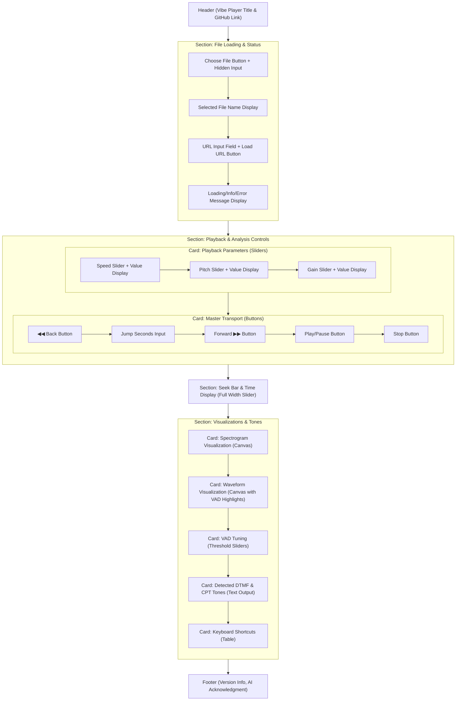

[//]: # ( REFACTOR_PLAN.md )

# **Vibe Player V3: The Hexagonal Architecture Blueprint for AI Agents**

### **0. Context & Executive Summary: Building with Unwavering Precision**

This document outlines the complete architectural blueprint and detailed implementation strategy for Vibe Player V3. It represents a fundamental, ground-up redesign, moving beyond incremental fixes, driven by a rigorous analysis of past architectural failures and the explicit commitment to **AI/LLM-driven development**.

The primary objective for V3 is to construct an audio player and analysis tool that is:

*   **Fundamentally Robust and Predictable:** By enforcing strict boundaries, formal contracts, and unidirectional data flow, we will eliminate classes of bugs related to race conditions, inconsistent state, and fragile inter-module communication.
*   **Completely Testable and Verifiable:** Every piece of core application logic will be testable in isolation, detached from browser APIs and UI frameworks. This is paramount for AI agents, as automated tests become the primary validation mechanism.
*   **Decoupled and Maintainable:** Core business logic will be entirely separated from external technologies (UI, Web Workers, state stores), allowing independent evolution and technology swaps.
*   **Transparent and Debuggable:** Through formalized error handling, structured logging, and dedicated observability, AI agents will have the necessary feedback loops to self-diagnose and correct issues.
*   **Built in Pure JavaScript with Strict JSDoc:** To optimize for simplicity, control, and explicit type checking without a complex build toolchain. Robustness will be achieved through meticulous JSDoc annotations and a comprehensive static analysis suite.
*   **Gherkin-Driven and Behavior-Validated:** High-level behaviors will be defined in Gherkin scenarios, which serve as executable specifications for both AI implementation and automated E2E testing.

This plan serves as the definitive source of truth for all AI agents tasked with V3 development. **Every instruction within this document is a mandatory directive for the AI agent.**

---

### **1. Critical Analysis of Previous Architectures (V1 & V2.3)**

To justify this comprehensive redesign, we must first perform a critical analysis of the previous versions, acknowledging what worked and identifying the root causes of what failed.

#### **1.1. Vibe Player V1: The Working-but-Brittle Prototype (`/vibe-player` directory)**

The original `vibe-player` in Vanilla JS was functionally complete and, importantly, **it worked**. It successfully integrated complex technologies like the Web Audio API, ONNX Runtime, and Rubberband WASM. Its "analyze once, tune in real-time" model for VAD was effective.

*   **Key Flaws:**
    *   **Tight Coupling & Implicit Dependencies:** Stability relied entirely on manual `<script>` loading order in `index.html`. Modules directly accessed a global `AudioApp` namespace, leading to brittle runtime dependencies.
    *   **Monolithic Controller ("God Object"):** `app.js` directly orchestrated almost every aspect (UI, audio, VAD, tones), making isolation, testing, and modification exceedingly difficult.
    *   **Global, Mutable State:** State was managed as properties on the global `AudioApp`, making changes difficult to trace and prone to unpredictable side effects.
    *   **Main-Thread Blocking:** Intensive tasks used `async/await` and `setTimeout` hacks on the main thread, leading to potential UI stuttering and unreliability in background tabs. Worker usage was ad-hoc.

#### **1.2. Vibe Player V2.3: The Flawed Modernization Attempt (`/vibe-player-v2.3` directory)**

The V2.3 refactor aimed to modernize with SvelteKit and TypeScript. While it introduced a proper build system and a reactive UI, it ultimately **failed** and is non-functional (evidenced by commented-out CI steps).

*   **The Architectural Root Failure: Fragile, Decentralized Worker Communication:** V2.3 copied V1's ad-hoc worker communication pattern. Each service (e.g., `audioEngine.service`, `analysis.service`) independently implemented its own manual, error-prone promise management system for worker communication (manual message IDs, storing `resolve`/`reject` callbacks in `Map`s).
*   **The Consequence: Catastrophic, Silent Deadlocks:** This duplicated boilerplate was the direct cause of V2.3's instability. A minor bug, like a worker forgetting to echo a `messageId`, caused corresponding promises to hang indefinitely, silently deadlocking major application parts. This exact pattern was found repeatedly (e.g., in `sileroVad.worker.ts`, `rubberband.worker.ts`).
*   **Behavioral Regressions:** The refactor also introduced functional regressions, such as a simplified waveform visualization that lost fidelity compared to V1.

**Conclusion:** V1 proved feature viability but highlighted an unsustainable architecture. V2.3 demonstrated that modern tooling alone cannot compensate for fundamental architectural flaws; it amplifies them. **V3 is a direct response: a ground-up redesign to create a system that is fundamentally testable, decoupled, and robust, with a dedicated, reusable solution for all asynchronous worker communication.**

---

### **2. V3 Architectural Model: A Federation of Pure JavaScript Hexagons**

Vibe Player V3 will be built as a **federation of collaborating, self-contained Hexagons and specialized Adapters**. This advanced application of the Ports and Adapters pattern prioritizes testability, decoupling, and predictability.

#### **2.1. Core Principles of the V3 Architecture**

*   **Hexagonal (Ports and Adapters) Architecture:**
    *   **Hexagon (Application Core):** A module containing pure, isolated business logic with **no direct dependencies** on external technologies (UI frameworks, browser APIs, Web Workers, state stores). It operates on simple, abstract data.
    *   **Ports:** Formal interfaces (defined by JSDoc `@typedef`s for plain JavaScript objects/functions) that define *how* data and commands flow into or out of a Hexagon. Ports are abstract.
    *   **Adapters:** "Pluggable" pieces of technology that implement a Port. They connect the Hexagon to the outside world.
        *   **Driving Adapters (Primary Actors):** Initiate action *on* the Hexagon (e.g., the User Interface, a test suite). They call the Hexagon's driving ports.
        *   **Driven Adapters (Secondary Actors):** Are driven *by* the Hexagon to perform a task (e.g., a Web Worker, a state store, the browser's URL API). They implement the Hexagon's driven ports.

*   **Pure JavaScript with JSDoc-Driven Static Typing:**
    *   The entire application will be written in **Pure JavaScript (`.js` files)**.
    *   **JSDoc (`@typedef`, `@param`, `@returns`, `@type`, etc.)** will be used rigorously to define all interfaces, data structures, function signatures, and class properties. This provides compile-time type checking via `tsc --noEmit --checkJs` without the overhead of a full TypeScript compilation pipeline.
    *   This choice reduces build complexity and maintains a high degree of control over the codebase.

*   **Single-Authority State Management:** A centralized, observable (via subscription) state store will be the single source of truth for the application's global state. Only the `AppHexagon` (the orchestrator) and specific, controlled Driven Adapters (for "hot path" updates) may update this store.
*   **Unidirectional Data Flow (Strict):** Data flows in one direction: Driving Adapters (UI) -> `AppHexagon` (commands) -> Domain Hexagons (logic) -> Driven Adapters (effects, e.g., worker calls, store updates). Updates then flow back (Driven Adapters -> Store -> Driving UI Adapter).
*   **Framework Agnostic Core:** The core application logic will be pure JavaScript, making it entirely independent of any specific UI framework. The UI will be treated solely as a Driving Adapter.
*   **Robust Worker Communication:** All asynchronous communication with Web Workers will be centralized and standardized using a dedicated `WorkerChannel` utility, eliminating manual promise management boilerplate.

#### **2.2. V3 System Components: The Hexagons and Infrastructure Utilities**

Each major domain of functionality is encapsulated within its own Hexagon, interacting solely through well-defined Ports.

##### **2.2.1. The `AppHexagon` (The Orchestrator)**

*   **Core Responsibility:** Manages the application's top-level state machine (`Initializing`, `Idle`, `Loading`, `Ready`, `Error`) and coordinates high-level user stories. It is the **primary client of all other domain Hexagons**. It acts as the single point of entry for commands from the UI and the central authority for all major state transitions.
*   **Internal Logic (`AppService.js`):** Contains the logic for coordinating other services/Hexagons to fulfill use cases like `loadAudio(source)` and `initializeApp()`. It is where overall application logic and sequencing resides.
*   **Ports (JSDoc `interface` equivalents):**
    *   **Driving (e.g., `IAppDriver`):** The public methods of the `AppService` that external Driving Adapters (like the `uiManager`) call.
    *   **Driven (e.g., `ILoaderPort`, `IPlaybackPort`, `IAnalysisPort`):** Interfaces (JSDoc `@typedef` for callback functions or plain objects) used by the `AppHexagon` to command other Hexagons or Driven Adapters.
*   **Adapters (that interact with `AppHexagon`):**
    *   **Driving:** The `uiManager` (the Driving UI Adapter), Keyboard Input Adapter.
    *   **Driven:** The other Hexagons (`PlaybackHexagon`, `VADHexagon`, `DTMFHexagon`, `SpectrogramHexagon`) implement the specific driven ports that `AppHexagon` calls.

##### **2.2.2. The `PlaybackHexagon`**

*   **Core Responsibility:** The pure state machine for a time-stretchable audio player. It knows nothing of the Web Audio API or browser DOM. It calculates and manages properties like `duration`, `currentTime`, `speed`, `pitchShift`, `gain`, and states like `playing` or `paused`.
*   **Internal Logic (`PlaybackService.js`):** Contains the mathematical logic for time-based calculations and internal state transitions.
*   **Ports:**
    *   **Driving (`IPlaybackDriver`):** Public methods like `play()`, `pause()`, `seek()`.
    *   **Driven (`IAudioOutputPort`, `IPlayerStatePublisher`):** Interfaces to command an audio backend (e.g., `WebAudioAdapter`) and to publish playback state updates to the central store.
*   **Adapters:**
    *   **Driven: `WebAudioAdapter.js`**: The implementation of `IAudioOutputPort` that manages the `AudioContext` and communicates with the `rubberband.worker.js` via a `WorkerChannel`. This is the *only* place with direct Web Audio API code.
    *   **Driven: `StateStoreAdapter.js`**: The implementation of `IPlayerStatePublisher` that writes player state changes to the central player store.

##### **2.2.3. The `VisualizationHexagons` (`WaveformHexagon`, `SpectrogramHexagon`)**

*   **Core Responsibility:** Pure data transformation. These Hexagons contain the algorithms to convert an `AudioBuffer` into visual data (e.g., peak arrays for waveform, frequency-magnitude arrays for spectrogram). They do not perform rendering themselves.
*   **Internal Logic (`WaveformService.js`, `SpectrogramService.js`):** Implement the algorithms.
*   **Ports:**
    *   **Driven (`IFFTEnginePort`):** The `SpectrogramService` depends on a port to perform FFT calculations (e.g., provided by an FFT worker).
*   **Adapters:**
    *   **Driven: `FFTWorkerAdapter.js`**: An adapter for the `IFFTEnginePort` that uses a `WorkerChannel` to run `fft.js` in a background thread.
    *   **Driven: `WaveformRenderer.js`, `SpectrogramRenderer.js`**: These are "dumb" Driven Adapters that only know how to render the data they receive from the `playerStore` or `analysisStore` onto their respective canvases. They subscribe to the relevant central stores.

##### **2.2.4. The `AnalysisHexagons` (`VADHexagon`, `DTMFHexagon`)**

*   **Core Responsibility:** Pure signal processing and analysis logic. These Hexagons encapsulate the algorithms for VAD region merging and Goertzel-based tone detection.
*   **Internal Logic (`VADService.js`, `DTMFService.js`):** Implement the algorithms.
*   **Ports:**
    *   **Driven (`IInferenceEnginePort`):** The `VADService` depends on a port to get raw speech probabilities (e.g., from a Silero VAD worker).
    *   **Driven (`IToneDetectionEnginePort`):** The `DTMFService` depends on a port for raw tone detection results.
*   **Adapters:**
    *   **Driven: `SileroVadWorkerAdapter.js`**: Implements `IInferenceEnginePort`, managing the `sileroVad.worker.js` via a `WorkerChannel`.
    *   **Driven: `DTMFWorkerAdapter.js`**: Implements `IToneDetectionEnginePort`, managing the `dtmf.worker.js` via a `WorkerChannel`.

##### **2.2.5. Infrastructure Utility: The `WorkerChannel` (Web Worker Communication Layer)**

*   **Core Responsibility:** To provide a **generic, robust, Promise-based (`async/await`) request/response communication channel *over the native Web Worker API*** to a *single dedicated worker instance*. It acts as an **Anti-Corruption Layer (ACL)**, abstracting away the low-level complexities of `postMessage`, `onmessage` handling, message ID correlation, `Transferable` object management, and request timeouts.
*   **Nature:** It is a **reusable class** (e.g., `WorkerChannel.js`) that is instantiated by **Driven Adapters** (e.g., `SileroVadWorkerAdapter`, `RubberbandWorkerAdapter`), not by the core Hexagons. Each adapter instance will manage its own `WorkerChannel` instance and its dedicated worker instance (1:1 relationship between adapter-instance / worker-channel-instance / worker-instance). It runs "alongside" the adapter, providing a dedicated communication pipeline.
*   **Schema Responsibility:** The `WorkerChannel` itself **does not implement a message type or schema registry**, nor does it perform content validation of the payloads.
    *   **JSDoc interfaces** (defined via `@typedef` in `src/lib/types/worker.types.js`) serve as the compile-time schema for all worker messages. This is the primary mechanism for ensuring type safety.
    *   The **Driven Adapters** are responsible for constructing message `payload`s that strictly conform to these JSDoc-defined types when sending requests to the `WorkerChannel`.
    *   The **workers** themselves (the ultimate consumers of the messages) are responsible for parsing and, if necessary, implementing light-weight runtime validation of critical incoming message fields to ensure robustness against unexpected inputs.
*   **Observability Hook:** Provides a transparent, centralized point to inject cross-cutting observability concerns for all worker communications. This includes:
    *   **Latency Tracing:** Automatically measure and log the roundtrip time (request sent to response received) for every worker operation.
    *   **Traffic Logging:** Optionally log the `type` and (sanitized) `payload` of messages sent to and received from the worker (e.g., `[WORKER_COMM] Sent INIT to VAD Worker`).
    *   **Error Metrics:** Automatically track and report communication failures, worker-side errors, and unhandled rejections/exceptions.

##### **2.2.6. Driving UI Adapter: The `uiManager`**

*   **Core Responsibility:** To translate the application's central state into visible DOM elements, and to map raw user inputs into formal application commands.
*   **Nature:** This is a **Driving Adapter** (e.g., `uiManager.js`), not a Hexagon. It directly consumes data from the central state stores and directly manipulates the browser DOM.
*   **Key Responsibilities:**
    *   **Direct State Consumption:** It directly **subscribes to** and **reads state from** the application's central pure JS stores (e.g., `playerStore`, `statusStore`, `analysisStore`).
    *   **Embedded Presentation Logic:** The logic for transforming application state into visual properties (e.g., `if isPlaying then button.textContent = 'Pause' else button.textContent = 'Play'`) resides directly within the `uiManager`'s methods.
    *   **Direct DOM Manipulation:** It directly **manipulates the DOM elements** (e.g., setting `textContent`, `disabled` attributes, updating styles, `canvas` drawing commands).
    *   **Command Dispatch:** It is responsible for translating raw user interactions (e.g., button clicks, slider inputs) into high-level **commands** that it dispatches directly to the `AppHexagon`'s driving ports.
*   **Pragmatic Justification:** For a **Pure JavaScript application using JSDoc-driven type checking**, the overhead of an additional `UIHexagon` layer (as initially proposed) outweighs its benefits. This direct-to-DOM approach simplifies the UI layer, minimizes boilerplate, and avoids manual re-implementation of reactive UI patterns. Robustness is achieved through strict JSDoc typing for the `uiManager`'s internal logic and comprehensive unit/integration tests against a mocked DOM.

---

### **3. Cross-Cutting Concerns and Principles**

#### **3.1. Detailed State Management & Data Flow (The Single Source of Truth)**

A foundational principle of this architecture is the clear separation of business logic (Hexagons) from technology (Adapters). The "State Store" (a collection of simple, observable Pure JS objects, not a framework-specific store) acts as a centralized, write-only message bus for the application's core logic.

##### **3.1.1. Communication Hierarchy: Who Can Talk to Whom (Strict Rules)**

To prevent the tight coupling of previous versions, communication follows these strict rules:

| From                                     | Can Call / Drive                                                              | CANNOT Call / Drive                                  | Example                                                                                                     |
|:-----------------------------------------|:------------------------------------------------------------------------------|:-----------------------------------------------------|:------------------------------------------------------------------------------------------------------------|
| **Driving Adapter** (e.g., `uiManager`)  | A **Hexagon's** driving port.                                                 | Another adapter, the State Store, or a worker directly. | The "Play" button in `uiManager` calls `AppHexagon.play()`.                                               |
| **Hexagon** (e.g., `PlaybackService.js`) | A **Driven Adapter's** port (e.g., `StateStoreAdapter`, `WebAudioAdapter`).   | Another Hexagon directly. (Exception: `AppHexagon`). | `PlaybackService` calls `this.statePublisher.publish(...)` which `StateStoreAdapter` implements.            |
| **Technology Adapter** (e.g., `WebAudioAdapter.js`) | A **Worker** (via `WorkerChannel`) or Browser APIs (`AudioContext`). | A Hexagon.                                           | `WebAudioAdapter` calls `this.workerChannel.postRequest(...)` to communicate with the `rubberband.worker.js`. |

The **`AppHexagon`** is the only exception: it is the orchestrator and is allowed to call the driving ports of other domain Hexagons (e.g., `PlaybackHexagon`, `VADHexagon`) to coordinate complex use cases.

##### **3.1.2. State Ownership and Pathways**

The following table details every piece of application state, its official "owner" (the Hexagon responsible for its canonical updates), and its location in the central state store (which will be a collection of Pure JS observable objects).

| State Item                           | Owning Hexagon       | Location in Store                       | Description                                                                                                                                                   |
|:-------------------------------------|:---------------------|:----------------------------------------|:--------------------------------------------------------------------------------------------------------------------------------------------------------------|
| `status` (`loading`, `ready`, etc.)  | `AppHexagon`         | `statusStore`                           | The single source of truth for the application's overall state.                                                                                               |
| `error`                              | `AppHexagon`         | `statusStore`                           | The global error message, if any.                                                                                                                             |
| `fileName`, `duration`, `isPlayable`, `sourceUrl` | `AppHexagon`         | `playerStore`                           | High-level metadata about the loaded audio, managed by the orchestrator.                                                                                      |
| `isPlaying`, `isLooping`             | `PlaybackHexagon`    | `playerStore`                           | The canonical boolean playback state.                                                                                                                         |
| `currentTime`                        | `PlaybackHexagon`    | `timeStore` (Hot), `playerStore` (Cold) | The canonical playback time. Updated on the "hot path" by the `WebAudioAdapter` for UI, and synced on the "cold path" by the `PlaybackHexagon` on pause/seek. |
| `speed`, `pitchShift`, `gain`        | `PlaybackHexagon`    | `playerStore`                           | Playback manipulation parameters.                                                                                                                             |
| **`isSeeking`**, **`wasPlayingBeforeSeek`** | **`AppHexagon`**     | **Internal to `AppHexagon`**            | Ephemeral UI state for managing the seek interaction. **Not published to the store.**                                                                         |
| **`vadProbabilities`**               | **`VADHexagon`**     | **Internal to `VADHexagon`**            | The raw frame-by-frame speech probabilities from the ML model. **Not published directly to the store.** (See "Large Data Handling").                       |
| `hasVadProbabilities`                | `VADHexagon`         | `analysisStore`                         | A boolean flag indicating that the probability data is available for retrieval via `VADHexagon.getProbabilities()`.                                       |
| `vadRegions`                         | `VADHexagon`         | `analysisStore`                         | The calculated speech time segments.                                                                                                                          |
| `vadPositiveThreshold`, etc.         | `VADHexagon`         | `analysisStore`                         | The tuning parameters for VAD region calculation.                                                                                                             |
| `dtmfResults`                        | `DTMFHexagon`        | `dtmfStore`                             | The list of detected DTMF tones.                                                                                                                              |
| `spectrogramData`                    | `SpectrogramHexagon` | `analysisStore`                         | The calculated spectrogram data (frequency-magnitude arrays).                                                                                                 |
| `waveformData`                       | `WaveformHexagon`    | `playerStore`                           | The calculated peak data for waveform visualization.                                                                                                          |

##### **3.1.3. Detailed Interaction Flows & Edge Case Handling (Sequence of Commands & Events)**

The following sections detail the end-to-end data flow for every user interaction, strictly adhering to the Command/Event pattern and state ownership rules.

*   **Command vs. Event Pattern:**
    *   **Commands (Input):** Originate from a **Driving Adapter** (e.g., the `uiManager`). They are requests for the application to *do something* (e.g., `play()`, `seek()`, `setSpeed()`). The flow is always `uiManager -> AppHexagon -> Domain Hexagon`.
    *   **Events (Output):** Originate from a **Driven Adapter** (e.g., `WebAudioAdapter`) or a worker. They are notifications that a *system event has occurred* (e.g., `playbackFinished`, `workerCrashed`). The flow is always `Adapter -> Domain Hexagon -> AppHexagon`.
    *   **`AppHexagon` as Transactional State Machine:** Domain Hexagons report events up to the `AppHexagon`. The `AppHexagon` then consults its current state (`this.status`) and issues explicit commands *back down* to the domain Hexagons to update their canonical state. This makes the system robust and transactional.

*   **Flow 1: Application Initialization & URL Loading**
    1.  **Driving Adapter (`main.js` or `uiManager.js`):** Reads URL parameters (`url`, `time`, `speed`, etc.) from `window.location.hash` via `URLStateAdapter`.
    2.  **Driving Adapter (`uiManager.js`):** Calls `AppHexagon.initializeApp(initialState)`.
    3.  **`AppHexagon` (Orchestrator):**
        *   Sets `statusStore` to `Status: Initializing`.
        *   Calls `initialize()` on all relevant **Driven Adapters** in parallel (e.g., `WebAudioAdapter` to initialize `AudioContext`, `SileroVadWorkerAdapter` to load model). This involves `WorkerChannel` init.
        *   **Awaits** these initializations. If any fail, `statusStore` becomes `Error`.
        *   If `initialState.url` is present, proceeds to `AppHexagon.loadAudio(initialState.url, initialState)`.
        *   Otherwise, sets `statusStore` to `Status: Idle`.

*   **Flow 2: Successful File Load (User Interaction / URL Loading)**
    1.  **Driving Adapter (`uiManager.js`):** User selects file (`<input type="file">` change) or enters URL. Calls `AppHexagon.loadAudio(fileOrUrl, initialState?)`.
    2.  **`AppHexagon`:**
        *   Sets `statusStore` to `Status: Loading`.
        *   Calls `AudioLoaderAdapter.loadAndDecode(fileOrUrl)`.
        *   **Receives `AudioBuffer` from `AudioLoaderAdapter`**.
        *   Sets `playerStore` with `fileName`, `duration`, `audioBuffer` reference.
        *   Calls `PlaybackHexagon.prepare(audioBuffer, initialState?)`.
        *   Calls `WaveformHexagon.generatePeaks(audioBuffer)`.
        *   **`WaveformHexagon` publishes `waveformData` to `playerStore`.**
        *   **IMMEDIATELY** sets `statusStore` to `Status: Ready`, `playerStore` to `isPlayable: true`. (UI enabled instantly).
        *   **In background (fire-and-forget):** Calls `VADHexagon.analyze(audioBuffer)`, `DTMFHexagon.analyze(audioBuffer)`, `SpectrogramHexagon.generate(audioBuffer)`.
        *   As each background Hexagon completes, it publishes its results (`vadRegions`, `dtmfResults`, `spectrogramData`) to `analysisStore` or `dtmfStore`.
        *   **UI (`uiManager`):** Reacts to store updates. Waveform appears instantly. VAD highlights, DTMF results, and spectrogram "pop in" as their data becomes available.

*   **Flow 3: Playback Control (Command/Event Pattern)**
    *   **Play Command:**
        1.  **Driving Adapter (`uiManager.js`):** User clicks "Play" button. Calls `AppHexagon.togglePlayPause()`.
        2.  **`AppHexagon`:** Checks `playerStore.isPlaying`. If `false`, calls `PlaybackHexagon.play()`.
        3.  **`PlaybackHexagon`:** Internally updates `isPlaying` to `true`. Calls `IAudioOutputPort.play()` (implemented by `WebAudioAdapter`).
        4.  **`WebAudioAdapter` (Driven Adapter):** Starts `AudioContext` and `rubberband.worker.js` processing. **Activates the "Hot Path" `requestAnimationFrame` loop.**
        5.  **`PlaybackHexagon`:** Publishes `{ isPlaying: true }` to `IPlayerStatePublisher` (implemented by `StateStoreAdapter`), which updates `playerStore`.
        6.  **UI (`uiManager.js`):** Subscribed to `playerStore`, updates "Play" button to "Pause".

    *   **Playback Finished Event (System-Generated):**
        1.  **`WebAudioAdapter` (Driven Adapter):** Detects audio stream end. Emits internal `playbackEnded` event (or calls `IAudioOutputPort.onPlaybackEnded()`).
        2.  **`PlaybackHexagon`:** Receives `playbackEnded` event. Calls `AppHexagon.onPlaybackEnded()`.
        3.  **`AppHexagon`:** Calls `PlaybackHexagon.stop()` (which also resets `currentTime` to 0).
        4.  **`PlaybackHexagon`:** Updates internal `isPlaying` to `false`, `currentTime` to `duration`. Publishes `{ isPlaying: false, currentTime: duration }` to `playerStore`.
        5.  **UI (`uiManager.js`):** Updates button to "Play", time display to `duration`, seek bar to end.

*   **Flow 4: Seeking (Special Case: Stateful Orchestration)**
    *   **State Owner:** The temporary `isSeeking` and `wasPlayingBeforeSeek` flags are owned internally by the **`AppHexagon`**. They are ephemeral UI orchestration state and do not belong in the `PlaybackHexagon` or the global state store.
    1.  **`mousedown` / `touchstart` (`uiManager.js`):** User presses seek bar. Calls `AppHexagon.beginSeek()`.
    2.  **`AppHexagon`:** Sets internal `this.isSeeking = true`. Reads `playerStore.isPlaying` and saves `this.wasPlayingBeforeSeek`. If playing, calls `PlaybackHexagon.pause()`.
    3.  **`input` / `touchmove` (`uiManager.js`):** User drags seek bar. **Directly updates the "hot" `timeStore` with the new value.** The UI (`uiManager`) subscribed to `timeStore` updates instantly. **The application core is not involved in this high-frequency update.**
    4.  **`mouseup` / `touchend` (`uiManager.js`):** User releases seek bar. Calls `AppHexagon.endSeek(finalTime)`.
    5.  **`AppHexagon`:** Calls `PlaybackHexagon.seek(finalTime)`. If `this.wasPlayingBeforeSeek` was true, calls `PlaybackHexagon.play()`. Resets internal flags.

*   **Flow 5: Parameter Sliders (Cold Path)**
    *   **Speed, Pitch, Gain, VAD Thresholds:**
    1.  **Driving Adapter (`uiManager.js`):** A slider is moved. The `on:input` event triggers a **debounced call** to `AppHexagon.setSpeed(value)` (or `setPitch`, `setVadThreshold`, etc.). The debounce is handled by `uiManager`.
    2.  **`AppHexagon`:** Delegates the call to the appropriate domain Hexagon (e.g., `PlaybackHexagon.setSpeed(value)`).
    3.  **`PlaybackHexagon` / `VADHexagon`:** Updates its internal parameter. It then publishes the new value via its driven port (`IPlayerStatePublisher` or `IAnalysisStatePublisher`), which updates the central store. For VAD, it also re-runs its internal region calculation.
    4.  **UI (`uiManager.js`):** Subscribed to the store, updates slider's display text. `WebAudioAdapter` (subscribed to `playerStore`) sees new speed and commands `rubberband.worker.js`. `WaveformRenderer` (subscribed to `analysisStore`) sees new VAD regions and redraws highlights.

##### **3.1.4. The "Hot Path" (Controlled Exception for `currentTime`)**

This is the high-performance, **read-only** path for UI elements that must update on every animation frame.

*   **Initiator:** The `WebAudioAdapter.js`. When told to play by the `PlaybackHexagon`, it starts a `requestAnimationFrame` loop.
*   **Calculation:** On each frame, the loop calculates the precise `estimatedTime` based on `AudioContext.currentTime` and the current speed from the `playerStore`.
*   **Direct Store Update:** The loop calls `timeStore.set(estimatedTime)`.
*   **Targeted UI Reaction:** Only the `uiManager`'s seek bar thumb and time display (`formatTime`) subscribe to `timeStore`. They are the only components that re-render at 60fps. The rest of the application is unaffected.
*   **Termination:** When the `WebAudioAdapter` is told to pause, it cancels the `requestAnimationFrame` loop.
*   **Controlled Exception Justification:** This is a **deliberate, performance-driven exception** to the general rule that Driven Adapters do not directly write to stores. It is necessary to achieve smooth, high-frequency UI updates without burdening the core application logic. The `timeStore` is treated as a *read-only, UI-specific sink* for this purpose, and its updates do not trigger core application logic. This exception is tightly controlled and not a license for arbitrary direct store manipulation.

##### **3.1.5. Large Data Handling Protocol (Performance Optimization)**

To maintain UI performance and avoid excessive reactivity overhead, large, static data payloads (like the VAD probabilities array or raw spectrogram magnitudes) are **not** stored directly in reactive stores.

*   **Protocol:**
    1.  The "owning" Hexagon (`VADHexagon`, `SpectrogramHexagon`) processes the data and holds the large arrays internally.
    2.  When the data is ready, the Hexagon publishes a simple **boolean flag** (e.g., `hasProbabilities: true`, `hasSpectrogramData: true`) to the `analysisStore`.
    3.  UI components or other modules needing this data will subscribe to this boolean flag. When the flag turns `true`, they will then make a **synchronous accessor call** on the Hexagon's exposed Driving Port to retrieve the data (e.g., `vadHexagon.getProbabilities()`).
*   **Benefit:** This avoids expensive deep comparisons by the store and unnecessary re-renders of components that don't need the raw data, only its availability.

#### **3.2. Error Handling & Automated Reporting for AI Agents**

Errors will propagate up through the promise chain. An error in a worker will reject the `WorkerChannel`'s promise. This rejection will be caught by the Driven Adapter that used it, which then reports to the `AppHexagon` (or directly updates `statusStore` if it's a critical setup error).

*   **Error Categorization:**
    *   `CRITICAL_INIT_ERROR`: Prevents core application launch (e.g., `AudioContext` fails, core WASM model fails to load).
    *   `NON_CRITICAL_ANALYSIS_ERROR`: A background analysis fails but the main player remains functional (e.g., VAD worker crashes after initial setup, tone detection fails).
    *   `RUNTIME_PLAYBACK_ERROR`: Audio glitches, `AudioWorklet` crash during playback.
*   **Agent Behavior on Error (Mandatory Directives):**
    *   **`CRITICAL_INIT_ERROR`:** The AI agent **must** immediately:
        1.  Log the full error stack trace (including source file/line) to console (or designated log output).
        2.  Update `statusStore` to `Error` type with a user-facing message.
        3.  Halt further task execution and report the error to the user/control system in a structured format (e.g., specific JSON output for agent system).
    *   **`NON_CRITICAL_ANALYSIS_ERROR`:** The AI agent **must**:
        1.  Log the warning/error message to console (or designated log output).
        2.  Update the specific analysis store (e.g., `analysisStore.vadError`, `dtmfStore.error`).
        3.  **Continue** primary application execution flow (e.g., main playback, other analyses).
    *   **`RUNTIME_PLAYBACK_ERROR`:** The AI agent **must**:
        1.  Log error to console.
        2.  Call `PlaybackHexagon.pause()`.
        3.  Update `statusStore` to `Error` type.

#### **3.3. Observability and Logging for AI Agents**

To facilitate debugging AI-generated code and asynchronous interactions, a strict logging and observability standard will be enforced.

*   **Logging Levels:** Adhere to common logging levels (e.g., `DEBUG`, `INFO`, `WARN`, `ERROR`, `CRITICAL`).
*   **Standardized Log Format:** All logs **must** follow `[MODULE-NAME] [LEVEL] Message: Details` (e.g., `[AppHexagon] [INFO] Loading audio from URL: example.mp3`).
*   **Mandatory Logging Points:** AI agents **must** include logging at:
    *   Module initialization/disposal.
    *   Entry/exit of all public Hexagon methods.
    *   Sending/receiving messages to/from `WorkerChannel`.
    *   Major state transitions (`statusStore` updates).
    *   Promise resolutions/rejections in critical paths.
    *   Start/end of long-running computations.
*   **`WorkerChannel` Observability:** The `WorkerChannel` utility **must** log:
    *   Request sent: `[WORKER_COMM] [DEBUG] -> {WorkerName} Request {messageId}: {type} (payload size)`
    *   Response received: `[WORKER_COMM] [DEBUG] <- {WorkerName} Response {messageId}: {type} (payload size) in {durationMs}ms`
    *   Errors: `[WORKER_COMM] [ERROR] {WorkerName} Worker Error {messageId}: {message}`

#### **3.4. URL State Management (Persistence and Initial Loading)**

The URL hash (or query parameters) will be used to persist and load application settings on page refresh.

*   **`URLStateAdapter.js` (Driven Adapter):** This module will be responsible for:
    *   Reading URL parameters (`speed`, `pitch`, `time`, `url`, etc.) on `AppHexagon` initialization.
    *   Subscribing to relevant central store changes (`playerStore`, `timeStore`) via a **debounced function** (to prevent excessive updates).
    *   Updating the browser's URL using `history.replaceState()` to reflect the current application state.
    *   It **must** implement a clearing mechanism to remove old parameters when they revert to default values.

---

### **4. Detailed Folder Structure for V3 (Pure JS/JSDoc)**

The following structure directly supports the Hexagonal Architecture and is designed for clarity, modularity, and easy static analysis.

````
vibe-player-v3/
├── .github/                           # CI/CD Workflows
│   └── workflows/
│       ├── ci.yml                     # Main CI (static analysis, unit/integration tests)
│       └── e2e.yml                    # E2E & Visual Regression Tests (Gherkin-driven)
├── .gitignore                         # Standard Git ignore rules
├── .llmignore                         # Files/dirs for LLM to ignore during context loading
├── build_system_prompt.py             # Utility for LLM interaction
├── fix_headers.py                     # Utility for LLM interaction
├── README.md                          # Project overview (to be updated to V3)
├── REFACTOR_PLAN.md                   # THIS DOCUMENT (to be moved to docs/ upon V3 completion)
├── system-prompt.txt                  # Example prompt for LLM
├── CONTRIBUTING-LLM.md                # AI Agent Collaboration Guidelines (CRITICAL)
├── docs/                              # Project history and detailed explanations
│   └── architecture/
│       └── v1_architecture.md         # Original V1 Architecture notes (for historical context)
│       └── v2_analysis.md             # Analysis of V2.3 failures (for historical context)
│   └── testing/
│       └── characterization_tests.md  # Detailed characterization process
├── harnesses/                         # Temporary HTML files for manual component validation during development
├── src/                               # Main application source code (Pure JS + JSDoc)
│   ├── app.js                         # Main application entry point; the AppHexagon orchestrator
│   ├── main.js                        # Entry point for browser; initializes uiManager and AppHexagon
│   ├── lib/
│   │   ├── hexagons/                  # Pure Business Logic Modules (Hexagons)
│   │   │   ├── AppService.js          # Implements AppHexagon
│   │   │   ├── PlaybackService.js     # Implements PlaybackHexagon
│   │   │   ├── VADService.js          # Implements VADHexagon
│   │   │   ├── DTMFService.js         # Implements DTMFHexagon
│   │   │   ├── WaveformService.js     # Implements WaveformHexagon
│   │   │   └── SpectrogramService.js  # Implements SpectrogramHexagon
│   │   ├── adapters/                  # Technology-Specific Code (Driven Adapters)
│   │   │   ├── uiManager.js           # Driving UI Adapter (DOM manipulation, event dispatch)
│   │   │   ├── WebAudioAdapter.js     # Implements IAudioOutputPort for PlaybackHexagon
│   │   │   ├── SileroVadWorkerAdapter.js # Implements IInferenceEnginePort for VADHexagon
│   │   │   ├── DTMFWorkerAdapter.js   # Implements IToneDetectionEnginePort for DTMFHexagon
│   │   │   ├── FFTWorkerAdapter.js    # Implements IFFTEnginePort for SpectrogramHexagon
│   │   │   ├── AudioLoaderAdapter.js  # Loads/decodes audio (File/URL) for AppHexagon
│   │   │   ├── StateStoreAdapter.js   # Implements IStatePublisher ports (writes to stores)
│   │   │   └── URLStateAdapter.js     # Reads/writes URL parameters
│   │   ├── infrastructure/            # Core Infrastructure Utilities (Reusable, Cross-Cutting)
│   │   │   └── WorkerChannel.js       # Generic Promise-based Web Worker communication layer
│   │   ├── stores/                    # Central Application State (Pure JS Observable Objects)
│   │   │   ├── playerStore.js         # Playback-related state
│   │   │   ├── analysisStore.js       # VAD, Spectrogram, etc. results
│   │   │   ├── dtmfStore.js           # DTMF/CPT results
│   │   │   ├── statusStore.js         # Global application status (loading, error, info)
│   │   │   └── timeStore.js           # Current playback time (hot path)
│   │   ├── types/                     # JSDoc @typedefs for Interfaces and Data Structures
│   │   │   ├── ports.types.js         # JSDoc definitions for all Hexagon ports
│   │   │   ├── state.types.js         # JSDoc definitions for store shapes (e.g., PlayerState)
│   │   │   └── worker.types.js        # JSDoc definitions for all worker message schemas
│   │   └── utils/                     # General Utilities
│   │       ├── async.js               # Debounce, yieldToMainThread
│   │       ├── constants.js           # All application-wide constants
│   │       └── formatters.js          # Time formatting, etc.
│   ├── workers/                       # Actual Web Worker scripts (loaded by WorkerChannel)
│   │   ├── rubberband.worker.js
│   │   ├── sileroVad.worker.js
│   │   ├── dtmf.worker.js
│   │   └── spectrogram.worker.js
│   └── index.html                     # Main application HTML file (Pure JS, no SvelteKit)
├── public/                            # Static assets (copied directly to build output)
│   ├── lib/                           # Third-party JS libraries, WASM binaries (e.g., ONNX, Rubberband, FFT)
│   │   ├── ort.min.js
│   │   ├── ort-wasm-simd-threaded.wasm
│   │   ├── rubberband.wasm
│   │   └── fft.js
│   ├── models/
│   │   └── silero_vad.onnx            # Silero VAD ONNX model
│   ├── css/
│   │   ├── 98.css
│   │   └── styles.css
│   ├── fonts/
│   │   └── ms_sans_serif.woff2
│   └── index.html                     # The final deployable HTML (identical to src/index.html)
├── tests/                             # All test code
│   ├── unit/                          # Unit tests for Hexagons, pure functions
│   │   ├── PlaybackService.test.js
│   │   └── AppService.test.js
│   ├── integration/                   # Integration tests for Hexagon-Adapter interactions
│   │   ├── WebAudioAdapter.test.js
│   │   └── WorkerChannel.test.js
│   ├── e2e/                           # End-to-End Tests (Gherkin-driven, Playwright)
│   │   ├── features/                  # Gherkin .feature files
│   │   │   ├── playback.feature
│   │   │   └── file_loading.feature
│   │   ├── step_definitions/          # JavaScript files mapping Gherkin steps to Playwright
│   │   │   └── playback_steps.js
│   │   │   └── common_steps.js
│   │   └── page_objects/              # Playwright Page Object Models
│   │       └── PlayerPage.js          # Encapsulates Playwright locators and actions
│   │   └── setup.e2e.js               # E2E test setup
│   └── characterization_vectors/      # JSON files capturing V1 behavior for characterization tests
│       └── vad_regions_v1.json
├── package.json                       # Project dependencies and scripts
├── .eslintrc.js                       # ESLint config (or biome.json for lint/format)
├── .prettierrc.js                     # Prettier config (or integrated into biome.json)
├── jsconfig.json                      # JSDoc type checking configuration for pure JS
├── playwright.config.js               # Playwright configuration
└── vitest.config.js                   # Vitest configuration
````

#### **4.1. Managing Script Import Order in Pure JavaScript**

For a pure JavaScript project without a bundler (aligning with the V1 model and the "static files" approach), the `<script>` tag order in `index.html` is **critical and mandatory**.

*   **Strategy:**
    1.  **Explicit Dependency Graph:** Each JavaScript file (`.js`) **must** clearly define its dependencies using JSDoc `@requires` tags at the top of the file.
    2.  **Ordered Loading in `index.html`:** The `index.html` file **must** list `<script>` tags in a topologically sorted order, ensuring that all required modules are loaded and available before their dependents.
    3.  **Static Analysis Verification:** `dependency-cruiser` will be configured and run as part of the CI process (Phase 1) to **validate** that the actual import/dependency graph (as inferred from JSDoc `@requires` and file analysis) matches the required loading order and adheres to the architectural rules (e.g., Hexagons do not import Adapters). This is crucial for preventing "implicit dependency" bugs seen in V1.
    4.  **Namespace Augmentation (IIFE Pattern):** Modules will augment a global namespace (`AudioApp`) as in V1, but the AI **must** ensure they correctly check for the existence of the namespace and its sub-objects before augmenting them.

#### **4.2. UI Layout (Initial Sketch) for AI Agents**

This initial layout provides a conceptual framework. The AI agent will translate these sections into concrete HTML/CSS components and styles (using `98.css` and `styles.css` from V1, possibly adapted for cleaner integration). More detailed UI/UX specifications will be provided as separate tasks later.



---

### **5. Quality Assurance & Testing Strategy for AI Agents**

The V3 development strategy embraces a "shift left" approach, ensuring AI agents catch issues locally with fast, automated tools. This strategy is designed to enforce the V3 architectural principles, prevent regressions, and ensure high code quality.

#### **5.1. The Testing Pyramid (AI-Driven)**

Our strategy is structured as a testing pyramid, with a broad base of fast, local checks and a narrow top of slower, end-to-end tests. The AI agent **must** ensure all relevant checks pass for every committed change.

| Layer                     | Tool(s)                                    | Purpose                                                                   | Runs Locally (by AI)? | Runs in CI?    | Speed         |
|:--------------------------|:-------------------------------------------|:--------------------------------------------------------------------------|:----------------------|:---------------|:--------------|
| **Static Analysis**       | `tsc --noEmit --checkJs`, Biome, `dependency-cruiser` | JSDoc Type safety, Code quality, Style, Architectural rules, Security (CodeQL) | **Yes**               | **Yes**        | Blazing Fast  |
| **Unit Tests**            | Vitest                                     | Test individual Hexagons/pure functions in isolation                      | **Yes**               | **Yes**        | Fast          |
| **Integration Tests**     | Vitest                                     | Test how Hexagons and Adapters collaborate (mocking external systems)     | **Yes**               | **Yes**        | Fast          |
| **Component Isolation**   | Custom "Component Explorer"                | Develop and review UI components in isolation                             | **Yes**               | **No**         | Interactive   |
| **End-to-End Tests**      | Playwright (driven by Cucumber.js)         | Verify high-level user flows in a real browser (Gherkin-driven)           | No                    | **Yes**        | Slow          |
| **Visual Regression Tests** | Playwright (`toHaveScreenshot`)            | Prevent visual bugs in UI and visualizations (mandatory for canvases)     | No                    | **Yes**        | Slow          |

#### **5.2. Local Development Checks (The Inner Loop for AI Agents)**

These checks are run by the AI agent locally, providing instant feedback. They are fully offline after initial setup. The AI agent **must** integrate these into its development workflow, running them iteratively.

*   **JSDoc Type Safety (`tsc --noEmit --checkJs`):**
    *   **Tool:** The TypeScript compiler (`tsc`) configured in `jsconfig.json` with `"checkJs": true` and `"strict": true`.
    *   **Command:** `tsc --noEmit --project jsconfig.json`
    *   **Enforcement:** This command acts as the primary static type checker for Pure JS. Every function, parameter, return, and variable **must** have explicit JSDoc types. The AI agent **must** ensure this command runs with zero errors or warnings before proposing any code.
*   **Code Quality & Formatting (Biome):**
    *   **Tool:** Biome (`biome.json` configured globally).
    *   **Command:** `npx biome check --apply .`
    *   **Enforcement:** Biome enforces a strict set of linting rules (code smells, best practices, complexity) and auto-formats the code. The AI agent **must** run `biome check --apply .` on the entire codebase, ensuring no linting errors remain and all formatting is consistent.
*   **Architectural Rules (`dependency-cruiser`):**
    *   **Tool:** `dependency-cruiser` (`.dependency-cruiser.js` config file).
    *   **Command:** `npx depcruise src`
    *   **Enforcement:** This is **critical for maintaining the Hexagonal Architecture**. The config file **must** enforce rules such as:
        *   Hexagons (`src/lib/hexagons/`) **cannot** import directly from Adapters (`src/lib/adapters/`).
        *   Hexagons **cannot** import directly from `infrastructure/` utilities.
        *   Adapters **can** import their corresponding Hexagon's `port.types.js` definitions.
        *   **`uiManager.js` (Driving UI Adapter)** can import from central stores but not directly from other backend Adapters (e.g., `WebAudioAdapter.js`).
        *   Workers (`src/workers/`) can only import from specific `lib/` files or the `utils/` folder within the worker context.
    *   The AI agent **must** resolve any `dependency-cruiser` violations immediately.

#### **5.3. Automated Testing (Unit & Integration) for AI Agents**

These tests are run locally via a single command (`npm run test`) and are a mandatory check in the CI pipeline. AI agents **must** integrate these into their iterative development and self-correction loop.

*   **Unit Tests:**
    *   **Purpose:** Test individual Hexagons (e.g., `PlaybackService.js`, `VADService.js`) in complete isolation. Mocks are used for all external dependencies (other Hexagons' ports, adapters, browser APIs).
    *   **Characterization Testing (V1 as Golden Master):** For core algorithms (VAD region calculation, DTMF parsing, waveform downsampling), the AI agent **must** use V1 as the "golden master."
        *   **Process:** AI agent will run the pure logic from the V1 codebase with specific inputs and save the inputs and their exact outputs to JSON files (e.g., `tests/characterization_vectors/vad_regions_v1.json`).
        *   **V3 Unit Tests:** The unit tests for V3 Hexagons will load these JSON files. They will feed the `input` from the vector into the new V3 function and assert that the `output` is deeply equal to the `expectedOutput`.
    *   **Benefit:** Proves that the V3 refactor perfectly preserves the trusted logic of the original working application, dramatically reducing regression risk.
*   **Integration Tests:**
    *   **Purpose:** Verify the collaboration between a Hexagon and its direct Driven Adapters (or between a Driving Adapter and a Hexagon's Driving Port), *without* the overhead of a full browser.
    *   **Example:** A test could instantiate `AppService.js` and a real `PlaybackService.js`, but inject a *mock* `WebAudioAdapter.js`. The test then calls `AppService.play()` and asserts that the mock `WebAudioAdapter` received the correct commands. This validates the internal command chain.

#### **5.4. Component Isolation for AI Agents**

*   **Tool:** A simple, custom "Component Explorer" (e.g., a set of HTML files in `harnesses/` or a custom development server with specific entry points) will be set up in **Phase 1: Project Foundation**.
*   **Purpose:** To allow AI agents and human developers to build, iterate, and visually review UI components (e.g., a specific slider, the time display) in isolation, outside the full application context. This accelerates UI development and simplifies debugging.
*   **Mandatory Component Stories/Docs:** Every UI component developed by an AI agent **must** have corresponding isolated "story files" (or equivalent documentation/test files demonstrating its various states and interactions) as part of its "Definition of Done." This will be enforced by a CI check.
*   **Primary Review Tool:** This isolated component environment will serve as the **primary review tool** for all UI-related development. Human reviewers will check this rather than the full application for initial UI feedback.

#### **5.5. CI/CD Pipeline Checks (The Final Gate for AI Agents)**

The CI pipeline on GitHub Actions runs all of the above checks and adds final, deeper layers of analysis. AI agents **must** ensure their Pull Requests pass all these checks.

*   **Main CI Workflow (`ci.yml`):**
    *   Triggers on every `push` and `pull_request`.
    *   Runs `tsc --noEmit --project jsconfig.json` (JSDoc type checking).
    *   Runs `npx biome check .` (Code quality and formatting).
    *   Runs `npx depcruise src` (Architectural rule enforcement).
    *   Runs `npm run test:unit` and `npm run test:integration` (Vitest tests).
    *   Fails the build if any check reports errors.
*   **Deep Security Analysis (CodeQL):**
    *   **Tool:** GitHub CodeQL.
    *   **Process:** A separate GitHub Actions workflow will run on every pull request to perform a deep semantic analysis of the code, scanning for security vulnerabilities.
    *   **Agent Behavior:** The AI agent **must** review CodeQL alerts and propose fixes for any critical/high-severity issues it introduces or finds.
*   **Code Maintainability Analysis (SonarCloud):**
    *   **Tool:** SonarCloud.
    *   **Process:** After a successful build, a workflow sends code to SonarCloud for analysis of code smells, complexity, duplication, and technical debt.
    *   **Agent Behavior:** The AI agent **must** monitor SonarCloud quality gates (posted as PR comments) and strive to maintain or improve code quality metrics. Any critical/major quality gate failures it introduces **must** be addressed.
*   **End-to-End Testing (Gherkin-driven Playwright):**
    *   **Tool:** Playwright (orchestrated by Cucumber.js).
    *   **Process:** A dedicated E2E workflow (`e2e.yml`) will build and serve the full application, then run Playwright tests to simulate user flows defined in Gherkin (`.feature` files).
    *   **Agent Behavior:** The AI agent **must** ensure its application code satisfies all existing Gherkin scenarios. If a new user-facing behavior is implemented, the AI agent **must first propose a new Gherkin scenario** for human review, then implement the code to pass it.
*   **Visual Regression Testing (Playwright `toHaveScreenshot`):**
    *   **Tool:** Playwright's `toHaveScreenshot`.
    *   **Process:** Integrated into the E2E suite, this will take snapshots of UI elements, particularly the `<canvas>`-based waveform and spectrogram visualizations.
    *   **Enforcement:** This is a **mandatory check** for visual fidelity. The AI agent **must** ensure its changes do not introduce unintended visual deviations. Baseline images will be managed via git LFS or a dedicated artifact store.

---

### **6. Implementation Strategy & Process for AI Agents**

This appendix details the practical, step-by-step process for AI agents to develop Vibe Player V3. It translates the architectural goals and quality assurances into an actionable workflow.

#### **6.1. Guiding Principles for AI Agent Development**

*   **Inside-Out Development:** The AI agent **must** build the application from its pure business logic core (the Hexagons) outwards towards the browser-specific technologies (the Adapters and UI). The AI agent **must explicitly avoid** a "GUI-first" approach. Core logic **must** be proven correct before any UI is assembled.
*   **Test-Driven Development (TDD):** Every new piece of logic **must** begin with a test (unit or integration) that defines its requirements. Code **must** only be written to make a failing test pass. For refactoring existing logic from V1, this **must** take the form of **Characterization Testing**.
*   **Early & Continuous Integration:** The CI/CD pipeline and its automated quality gates are foundational. The AI agent **must** ensure every commit is validated against strict standards for type safety, code quality, architectural integrity, and documentation.
*   **Gherkin-Driven Behavior:** For all user-facing features, the AI agent **must** refer to Gherkin scenarios as the source of truth for desired behavior.
*   **Strict Adherence to `CONTRIBUTING-LLM.md`:** All directives within `CONTRIBUTING-LLM.md` **must be followed rigorously**.

#### **6.2. Phase 1: Project Foundation & CI Setup (The First Commit)**

This phase is completed once at the very beginning of the project. The goal is to create a robust development environment where quality is enforced from the start.

1.  **Initialize Project Structure:**
    *   The AI agent **must** create the `vibe-player-v3/` project directory as a **completely new, clean Pure JavaScript project**. This is not an in-place refactor of `vibe-player-v2.3/`.
    *   The AI agent **must** initialize `package.json` with `npm init -y` and install development dependencies (Vitest, Playwright, Biome, `dependency-cruiser`, etc.).
    *   The AI agent **must** create the source directory structure as outlined in **Section 4**.
2.  **Configure Core Tooling (Strictly):**
    *   **`jsconfig.json`:** Configure for strict JSDoc type checking (`"strict": true`, `"checkJs": true`, `"noEmit": true`, `"lib": ["es2017", "dom", "webworker"]`).
    *   **`biome.json`:** Configure with a strict set of linting rules and formatting rules.
    *   **`.dependency-cruiser.js`:** Configure to enforce the Hexagonal Architecture rules defined in **Section 5.2**.
3.  **Implement CI/CD Workflows:**
    *   The AI agent **must** create initial GitHub Actions workflows (`ci.yml`, `e2e.yml`, CodeQL, SonarCloud).
    *   The `ci.yml` workflow **must** be configured to run all static analysis checks and unit/integration tests on every pull request.
    *   The `e2e.yml` workflow **must** be configured to run the Playwright/Cucumber.js E2E suite.
4.  **First Commit:** The AI agent **must** commit this foundational setup to the `main` branch, ensuring a "green" build on an empty but fully configured project.

#### **6.3. Phase 2: The Core Development Loop (Iterative AI Process)**

This is the iterative process for building each feature of the application, focusing on the Hexagonal core first.

1.  **Task Assignment:** A human (or higher-level AI) assigns a feature task (e.g., "Implement PlaybackHexagon and its `IAudioOutputPort` via `WebAudioAdapter`").
2.  **Gherkin Review (Mandatory for Features):**
    *   The AI agent **must** review the relevant Gherkin scenarios in `tests/e2e/features/` that describe the desired external behavior for the task.
    *   If no relevant Gherkin scenario exists, the AI agent **must halt** and **propose a new Gherkin scenario** for human review and approval, adhering to `CONTRIBUTING-LLM.md` (P2.1).
3.  **Characterization Test (If Applicable):**
    *   If refactoring a feature from V1 (e.g., VAD region calculation, waveform generation), the AI agent **must first generate a "test vector" JSON file** by running the pure logic from the V1 codebase with curated inputs and saving exact outputs. These vectors are the "golden master" standard and are checked into `tests/characterization_vectors/`.
4.  **Hexagon Implementation (TDD with JSDoc):**
    *   The AI agent **must** create a new `*.test.js` file for the V3 Hexagon (e.g., `PlaybackService.test.js`).
    *   The AI agent **must** write a test that initially fails, defining the Hexagon's behavior (or loads the JSON vector for characterization tests).
    *   The AI agent **must** implement the pure logic inside the Hexagon file (`src/lib/hexagons/`, e.g., `PlaybackService.js`) until the unit test passes. **No browser APIs or platform-specific code are allowed in this step.** All code **must** be fully JSDoc-typed.
5.  **Interface Discovery & Refinement (JSDoc-Driven):**
    *   During TDD, the precise methods and data contracts for the Ports (JSDoc `@typedef`s in `src/lib/types/ports.types.js`) will be discovered.
    *   If the Hexagon needs a new capability from an Adapter, the AI agent **must**:
        1.  Update the JSDoc `@typedef` for the Port in `src/lib/types/ports.types.js`.
        2.  Update the Hexagon's unit/integration test to provide the new data/functionality via its mock adapter.
        3.  Modify the Hexagon's code to use the new interface method.
        4.  Finally, implement the change in the real Adapter. The `tsc --checkJs` will guide this process, flagging any Adapter that no longer conforms to the Port's contract.
6.  **Adapter Implementation (Driving & Driven):**
    *   Once a Hexagon's core logic is stable, the AI agent **must** implement its associated Adapters (e.g., `WebAudioAdapter.js` for `PlaybackService`).
    *   This involves interacting with browser APIs (Web Audio, DOM) or `WorkerChannel`.
    *   All Adapter code **must** be fully JSDoc-typed and adhere to strict linting rules.

#### **6.4. Phase 3: Final Application Assembly & E2E Testing**

1.  **Application Integration (`src/app.js` and `src/main.js`):**
    *   The AI agent **must** implement `src/app.js` as the `AppHexagon` orchestrator. Its role is to perform dependency injection: instantiate all Hexagons and Adapters, plug them into each other, and wire up the final UI event listeners (from `uiManager`).
    *   The `src/main.js` will be the initial entry point, responsible for initializing the `uiManager` and the `AppHexagon`.
2.  **HTML/CSS Integration:** The AI agent **must** integrate the application logic with `src/index.html` (which will be copied to `public/index.html`), ensuring all UI elements function as expected according to the UI layout sketch.
3.  **End-to-End & Visual Regression Testing (CI Only):**
    *   The AI agent **must** run the full Playwright E2E test suite (driven by Cucumber.js) against a production build in the CI pipeline.
    *   For `<canvas>`-based visualizations (waveform, spectrogram), the AI agent **must** use Playwright's `toHaveScreenshot` capability in the E2E suite to automatically detect if code changes unintentionally altered their graphical output. This is a mandatory check.

#### **6.5. Phase 4: Documentation & Handover**

1.  **Update Project Documentation:**
    *   Upon completion, the AI agent **must** update the root `README.md` to reflect the new V3 architecture and setup.
    *   The `REFACTOR_PLAN.md` and related appendices **must be moved** to a `docs/` directory to preserve the project's history.
    *   The old `vibe-player` (V1) and `vibe-player-v2.3` directories **must be archived or removed** to ensure `vibe-player-v3` is the sole, definitive codebase.
2.  **Final Quality Review:** The AI agent **must** perform a final review of the SonarCloud dashboard to identify and address any remaining high-priority issues before the official V3 release.
3.  **Agent Behavior for Handover:** The AI agent **must** ensure all generated code is accompanied by comprehensive JSDoc, inline comments for complex logic, and adherence to `CONTRIBUTING-LLM.md`, to facilitate future human or AI maintenance.

---
**END OF REFACTOR_PLAN.md**