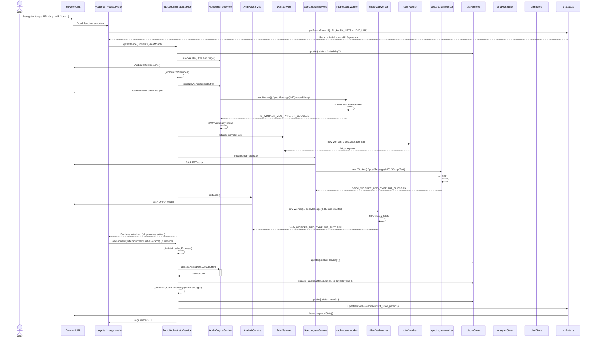
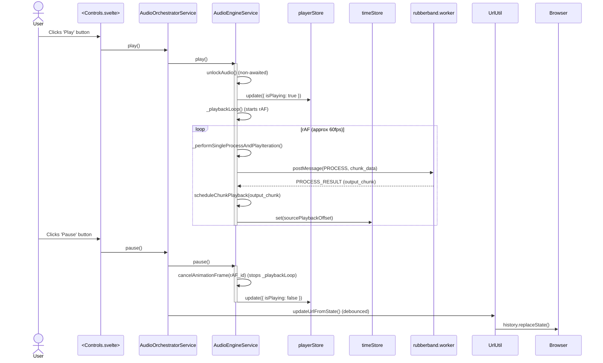
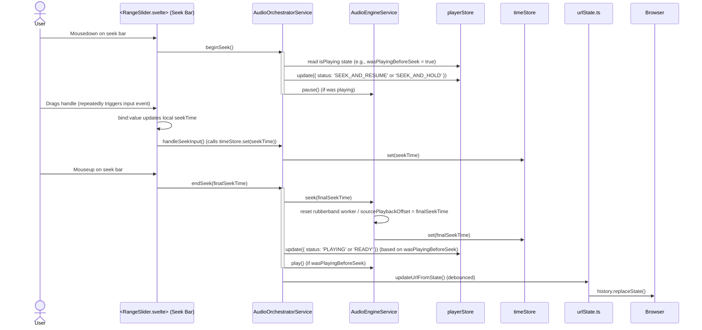
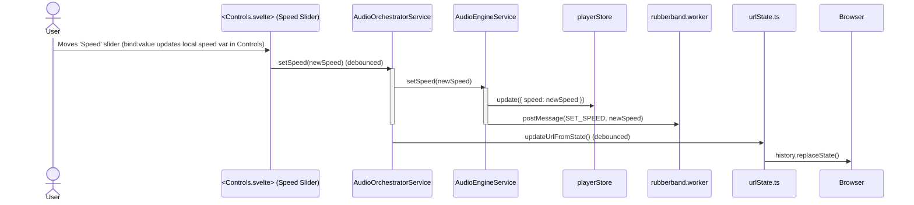

[//]: # ( REFACTOR_PLAN.md )

# **Vibe Player V3: The Definitive Refactor Blueprint**

### **Foreword: A Pragmatic & Modern Architecture**

This document outlines the complete architectural blueprint and detailed implementation strategy for Vibe Player V3. It represents a fundamental, ground-up redesign driven by a rigorous analysis of past architectural versions and a commitment to modern, maintainable development practices.

This plan supersedes all previous versions and appendices. It adopts a **minimal, standard, and highly-optimized toolchain powered by Vite and SvelteKit.** This decision allows us to leverage the full power of TypeScript, a reactive UI framework, and a rich plugin ecosystem (for PWA support) while still achieving the core goal of producing a simple, self-contained, and offline-capable static application.

The core principles of testability, decoupling, and maintainability remain paramount. The Hexagonal Architecture for our business logic is preserved, providing a clean separation of concerns.

This plan is designed to be followed with **100% detail**. All information required for development is contained within this document. Deviations from this plan are strictly forbidden unless explicitly approved by a higher authority after a formal review process.

---

## **Chapter 1: The Vision & Guiding Principles**

### **1.1. Executive Summary**

The primary objective for Vibe Player V3 is to construct an audio player and analysis tool that is:

*   **Fundamentally Robust:** By enforcing strict boundaries between the UI layer, application services, and core business logic, preventing architectural decay.
*   **Completely Testable:** Through a multi-layered testing strategy including unit, integration, end-to-end (E2E), and isolated component tests. Automated tests are the primary validation mechanism.
*   **Highly Maintainable:** By leveraging a modern, strongly-typed language (TypeScript) and a reactive, component-based UI architecture (Svelte).
*   **Performant:** Using a compiled UI framework (Svelte) and offloading computationally intensive tasks to single-threaded Web Workers, ensuring a smooth and responsive user experience.
*   **Offline-Capable & Installable:** Built as a Progressive Web App (PWA) that can be installed on user devices and run reliably without an internet connection.
*   **Shareable via URL:** The entire application state—including the loaded audio URL, playback time, and all parameters—will be serialized into the URL's query string, enabling users to share a link that perfectly reproduces their session.

### **1.2. Architectural Principles & Design Constraints**

This section outlines the non-negotiable rules and rationales that govern all development decisions for V3. The developer must adhere to these constraints at all times.

*   **Constraint 1: Absolute Static Hostability (No Special Headers)**
    *   **Description:** The final `build/` output **must** consist purely of static files (`.html`, `.js`, `.css`, image assets, `.wasm`, `.onnx`, `.woff2`, etc.). This means the application **must** be deployable and function correctly from any simple static file server (e.g., GitHub Pages, `python -m http.server`) **without requiring any server-side configuration for special HTTP headers** (such as `Cross-Origin-Opener-Policy` or `Cross-Origin-Embedder-Policy`).
    *   **Rationale:** This guarantees maximum portability, zero-friction deployment, and true offline capability for PWA.
    *   **Implication:** This constraint explicitly forbids the use of `SharedArrayBuffer` and, consequently, any form of **threaded WebAssembly (WASM threads)**. All WASM-based libraries (like ONNX Runtime and Rubberband) **must** be configured and used in their single-threaded versions. Performance for parallelizable tasks will be achieved by using multiple, separate Web Workers, each performing its task independently.

*   **Constraint 2: Minimal, Standard Build Step (Vite + SvelteKit)**
    *   **Description:** The application will be built using SvelteKit with its `adapter-static`. The standard `npm run build` command will compile the TypeScript and Svelte components into a clean, optimized, and fully self-contained static `build/` directory.
    *   **Rationale:** This replaces the previous "no-build-step" constraint. It provides robust, industry-standard dependency management, TypeScript transpilation, and PWA generation via a fast, well-documented tool. This approach eliminates the fragility and maintenance burden of custom build scripts (like manual script tag ordering).

*   **Constraint 3: First-Class TypeScript & Svelte**
    *   **Description:** All application logic (core services, adapters, utilities) will be written in **TypeScript** (`.ts` files). The user interface will be constructed using **Svelte components** (`.svelte` files, with `<script lang="ts">`).
    *   **Rationale:** TypeScript provides superior, ergonomic type safety, compile-time error checking, and better tooling support (for both humans and AI) compared to a JSDoc-only approach. Svelte's compile-time framework approach results in minimal runtime overhead, small bundle sizes, and highly performant UI updates.

*   **Constraint 4: Component-Driven UI with Storybook**
    *   **Description:** The user interface will be composed of small, single-purpose, and highly testable Svelte components. These components will be developed and rigorously verified in **Storybook** in complete isolation before integration into the main application. Complex, third-party UI libraries (like Skeleton UI) will be avoided for core interactive elements (sliders, buttons) to ensure full control over their DOM and event behavior.
    *   **Rationale:** This guarantees that our UI components render standard HTML elements, making them 100% reliably testable by E2E tools like Playwright. It also provides a dedicated environment for visual regression testing and component documentation.

*   **Constraint 5: V1 Logic is the "Golden Master" for Core Algorithms**
    *   **Description:** For core signal processing and analysis algorithms (specifically VAD region calculation, DTMF/CPT parsing, and waveform peak generation), the V3 implementation **must** be functionally identical to the V1 implementation. The V1 JavaScript code serves as the "golden master" reference.
    *   **Rationale:** V1's algorithms are proven to work correctly. The initial goal of V3 is to fix the architecture and improve the development experience, not re-invent core processing. Characterization tests (see Chapter 6) will be the arbiter of success.

*   **Constraint 6: Future-Proofing for Remote VAD API**
    *   **Description:** The architecture must be designed to allow the local, in-browser VAD processing to be easily replaced by an asynchronous HTTP call to a remote VAD API endpoint in the future.
    *   **Rationale:** This provides flexibility. The Hexagonal Architecture addresses this by defining an `IInferenceEnginePort` that can be implemented by either a local Web Worker adapter or a remote `fetch`-based API adapter, with no changes required to the core `AnalysisService` logic.

*   **Constraint 7: Main-Thread-Authoritative Timekeeping (for UI)**
    *   **Description:** The application **must** implement a main-thread-authoritative timekeeping model to ensure a smooth UI and prevent visual "jumps" or glitches. The UI's time display and seek bar will be driven by a `requestAnimationFrame` loop on the main thread, managed by the `AudioEngineService`.
    *   **Rationale:** Audio processing worklets (like Rubberband WASM) can have inherent latency and their time reporting can drift from the browser's high-resolution clock. Trusting the worklet's time for UI updates leads to a poor user experience. Synchronization with the audio engine will occur explicitly upon seek or parameter changes.

*   **Constraint 8: Eager Asset Initialization**
    *   **Description:** To optimize user experience and minimize latency upon file selection, the application **should** adopt a strategy of pre-fetching and pre-initializing heavy assets (like WASM and ONNX models) at startup.
    *   **Rationale:** This helps prevent race conditions and provides a more responsive feel, as the user does not have to wait for large assets to download *after* they have selected a file. The `AudioOrchestratorService`'s initialization flow must include steps to trigger this.

---

## **Chapter 2: Core Components & Folder Structure**

### **2.1. Overall Repository Structure**

```
.
├── .github/                      # GitHub Actions CI/CD workflows
├── .storybook/                   # Storybook configuration and setup
├── node_modules/                 # Node.js dependencies
├── build/                        # **STATIC PRODUCTION BUILD OUTPUT** (deployable)
├── src/                          # Main application source code
│   ├── lib/
│   │   ├── components/           # Reusable Svelte UI components (.svelte)
│   │   ├── services/             # Pure Business Logic Modules (Hexagons) (.ts)
│   │   ├── adapters/             # Technology-Specific Code (Driven & Driving Adapters) (.ts)
│   │   ├── stores/               # Central Application State (Svelte Stores) (.ts)
│   │   ├── types/                # TypeScript Interfaces and Type Definitions (.ts)
│   │   ├── utils/                # General Utilities and Helpers (.ts)
│   │   └── workers/              # Web Worker scripts (.ts)
│   ├── routes/                   # SvelteKit page routes (e.g., +page.svelte)
│   ├── app.html                  # SvelteKit main HTML template
│   └── app.css                   # Global CSS styles
├── static/                       # Static assets (copied directly to build output)
│   ├── favicon.png
│   ├── models/                   # ONNX models (e.g., silero_vad.onnx)
│   └── vendor/                   # Third-party JS/WASM libraries (fft.js, rubberband.wasm)
├── tests/                        # All test code
│   ├── e2e/                      # End-to-End Tests (Playwright, Gherkin-driven)
│   │   └── features/             # Gherkin .feature files (Behavioral Specifications)
│   ├── unit/                     # Vitest Unit and Integration Tests
│   └── characterization_vectors/ # JSON files capturing V1 behavior for testing
├── svelte.config.js              # SvelteKit configuration
├── vite.config.ts                # Vite build tool configuration
├── tsconfig.json                 # TypeScript configuration
├── package.json                  # Project dependencies and scripts
└── ... (other config files like .eslintignore, .prettierrc)
```

### **2.2. Key Hexagons (Services) and Their Responsibilities**

All services are implemented as **Singleton TypeScript Classes** to ensure a single instance manages the domain logic. They primarily operate on `Float32Array` or `AudioBuffer` for raw audio data.

*   **`AudioOrchestratorService` (`src/lib/services/audioOrchestrator.service.ts`)**
    *   **Role:** The central application orchestrator, implementing the core application state machine (see Chapter 4). It is the `AppHexagon`.
    *   **Responsibility:** Manages the overall application lifecycle (loading, playing, error states). Coordinates the initialization and processing flow between other domain services (AudioEngine, Analysis, DTMF, Spectrogram). Manages global errors.
    *   **Key State:** `status` (overall app state), `fileName`, `duration`, `isPlayable`, `sourceUrl`, `waveformData`.

*   **`AudioEngineService` (`src/lib/services/audioEngine.service.ts`)**
    *   **Role:** The core playback engine, implementing the `PlaybackHexagon`.
    *   **Responsibility:** Manages Web Audio API `AudioContext` and `GainNode`. Communicates with the `rubberband.worker` for time/pitch manipulation. Handles audio decoding, resampling (if necessary for internal worker communication), and scheduling audio chunks for playback. Manages `isPlaying` state, and directly updates `timeStore` on a `requestAnimationFrame` loop.
    *   **Key State:** `isPlaying`, `speed`, `pitchShift`, `gain`.
    *   **Dependencies:** Driven by `AudioOrchestratorService`. Drives `playerStore` and `timeStore`. Depends on `rubberband.worker`.

*   **`AnalysisService` (`src/lib/services/analysis.service.ts`)**
    *   **Role:** Manages Voice Activity Detection (VAD) analysis, implementing the `VADHexagon`.
    *   **Responsibility:** Orchestrates VAD processing via the `sileroVad.worker`. Holds raw VAD probabilities internally (Large Data Handling Protocol). Provides logic to recalculate speech regions based on `vadPositiveThreshold` and `vadNegativeThreshold`.
    *   **Key State:** `vadProbabilities` (internal), `vadRegions`, `vadPositiveThreshold`, `vadNegativeThreshold`.
    *   **Dependencies:** Driven by `AudioOrchestratorService`. Drives `analysisStore`. Depends on `sileroVad.worker`.

*   **`DtmfService` (`src/lib/services/dtmf.service.ts`)**
    *   **Role:** Manages DTMF (Dual-Tone Multi-Frequency) and CPT (Call Progress Tone) detection, implementing the `DTMFHexagon`.
    *   **Responsibility:** Communicates with the `dtmf.worker` to perform tone detection on audio data.
    *   **Key State:** `dtmfResults`, `cptResults`.
    *   **Dependencies:** Driven by `AudioOrchestratorService`. Drives `dtmfStore`. Depends on `dtmf.worker`.

*   **`SpectrogramService` (`src/lib/services/spectrogram.service.ts`)**
    *   **Role:** Manages spectrogram computation, implementing the `SpectrogramHexagon`.
    *   **Responsibility:** Communicates with the `spectrogram.worker` to perform FFT calculations and generate spectrogram data.
    *   **Key State:** `spectrogramData`.
    *   **Dependencies:** Driven by `AudioOrchestratorService`. Drives `analysisStore`. Depends on `spectrogram.worker`.

---

## **Chapter 3: Adapters, Infrastructure & Data Flow**

### **3.1. Driving Adapters (User Input & External Triggers)**

These components initiate actions *on* the core services.

*   **Svelte UI Components (`src/lib/components/` & `src/routes/`):**
    *   **Role:** The primary driving adapter, translating user interactions into commands for the core services.
    *   **Implementation:** Svelte components like `<Controls.svelte>` or `<FileLoader.svelte>` handle DOM events (e.g., `on:click`, `on:input`) and call methods directly on the singleton service instances (e.g., `audioEngine.togglePlayPause()`, `orchestrator.loadFromFile()`).
    *   **Key Example (`RangeSlider.svelte` for Seek/Parameters):** This custom component will render a standard `<input type="range">`. It will attach `on:mousedown`, `on:input`, and `on:mouseup` event handlers that dispatch relevant commands (e.g., `AudioOrchestratorService.beginSeek()`, `AudioOrchestratorService.updateSeek()`, `AudioOrchestratorService.endSeek()`). This ensures precise control and reliable E2E testing.

*   **URL State Listener (`src/routes/+page.ts`):**
    *   **Role:** On application startup, it parses URL query parameters to retrieve initial application state (audio URL, playback time, parameter settings).
    *   **Implementation:** The SvelteKit `load` function in `src/routes/+page.ts` will parse `url.searchParams` and provide an `initialState` object to the main `+page.svelte` component, which then passes it to the `AudioOrchestratorService` for application.

### **3.2. Driven Adapters (External Interactions & State Output)**

These components are driven *by* the core services to perform a task or update external state.

*   **Svelte Stores (`src/lib/stores/`):**
    *   **Role:** The primary mechanism for pushing application state updates from the services to the UI.
    *   **Implementation:** Services (Hexagons) update Svelte `writable` stores (e.g., `playerStore.update({ isPlaying: true })`). UI components then reactively consume these updates using Svelte's reactivity (`{$playerStore.isPlaying}`).
    *   **The "Hot Path" (`timeStore`):** The `timeStore` is a dedicated `writable` Svelte store that `AudioEngineService` updates on every `requestAnimationFrame` tick during playback. This allows the UI (e.g., seek bar, time display) to update at 60fps directly, without triggering heavy re-renders in other parts of the application or complex state recalculations.

*   **Web Workers (`src/lib/workers/`):**
    *   **Role:** Perform computationally intensive tasks off the main thread.
    *   **Implementation:** Adapters within the `services/` layer (e.g., `AudioEngineService`, `AnalysisService`) instantiate and manage dedicated Web Workers (`new RubberbandWorker()`, `new SileroVadWorker()`). Communication occurs via `postMessage` and `onmessage`.
    *   **`WorkerChannel` (`src/lib/utils/workerChannel.ts` - *New proposed utility*):** A reusable class providing a robust, Promise-based request/response communication channel over the native Web Worker API. It will abstract away `postMessage`, `onmessage` handling, message ID correlation, and `Transferable` objects. It **must** implement a robust timeout mechanism to handle unresponsive workers.

*   **URL State Adapter (`src/lib/utils/urlState.ts`):**
    *   **Role:** Serializes key application state into the URL's query string for shareability.
    *   **Implementation:** The `AudioOrchestratorService` subscribes to relevant Svelte Stores. On changes to key parameters (speed, pitch, gain, active audio URL, playback time), it calls a debounced function within `urlState.ts` to update `window.history.replaceState()`.

### **3.3. State Ownership & Data Pathways**

This table defines the single source of truth for every piece of application state. Each state item is primarily *owned* and managed by one specific service/hexagon.

| State Item | Owning Service/Hexagon | Location in Store | Description |
|:---|:---|:---|:---|
| `status` (`loading`, `ready`, etc.) | `AudioOrchestratorService` | `playerStore` (`status` property) | The single source of truth for the application's overall state. |
| `error` | `AudioOrchestratorService` | `playerStore` (`error` property) | The global error message, if any. |
| `fileName`, `duration`, `isPlayable`, `sourceUrl`, `audioBuffer` | `AudioOrchestratorService` | `playerStore` | High-level metadata about the loaded audio. `audioBuffer` is stored here for main-thread access by visualizers. |
| `isPlaying` | `AudioEngineService` | `playerStore` | The canonical boolean playback state. |
| `currentTime` | `AudioEngineService` | `timeStore` (Hot) & `playerStore` (Cold) | The canonical playback time. Updated on every `requestAnimationFrame` by `AudioEngineService` for UI display (`timeStore`), and synced to `playerStore.currentTime` on pause/seek/stop. |
| `speed`, `pitchShift`, `gain`, `jumpSeconds` | `AudioEngineService` | `playerStore` | Playback manipulation parameters. |
| `vadProbabilities` | `AnalysisService` | *Internal to `AnalysisService`* | The raw frame-by-frame speech probabilities. **Not published to the store** (Large Data Handling Protocol). |
| `vadRegions` | `AnalysisService` | `analysisStore` | The calculated speech time segments, derived from `vadProbabilities` and current thresholds. |
| `vadPositiveThreshold`, `vadNegativeThreshold` | `AnalysisService` | `analysisStore` | The tuning parameters for VAD region calculation. |
| `dtmfResults`, `cptResults` | `DTMFService` | `dtmfStore` | The list of detected DTMF and Call Progress Tones. |
| `spectrogramData` | `SpectrogramService` | `analysisStore` | The calculated spectrogram data (frequency-magnitude arrays). |
| `waveformData` | `AudioOrchestratorService` | `playerStore` | The calculated peak data for waveform visualization. |

### **3.4. Detailed Interaction Flows (Sequence Diagrams)**

These diagrams illustrate how commands and events flow through the system for key features.

#### **3.4.1. Application Initialization (Includes URL State & Eager Loading)**



#### **3.4.2. Loading a New Audio File (Local or URL)**

```mermaid
sequenceDiagram
    actor User
    participant FileLoader as <FileLoader.svelte>
    participant Orchestrator as AudioOrchestratorService
    participant AudioEng as AudioEngineService
    participant Analysis as AnalysisService
    participant Dtmf as DtmfService
    participant Spec as SpectrogramService
    participant PlayerStore as playerStore
    participant AnalysisStore as analysisStore
    participant DtmfStore as dtmfStore
    participant TimeStore as timeStore
    participant UrlUtil as urlState.ts

    User->>FileLoader: Selects local file OR Enters URL & Clicks Load
    FileLoader->>Orchestrator: `loadFromFile(File)` OR `loadFromUrl(URL)`
    Orchestrator->>Orchestrator: isBusy = true
    Orchestrator->>PlayerStore: update({ status: 'loading', fileName, sourceUrl })
    Orchestrator->>AudioEng: stop()
    AudioEng->>AudioEng: pause() / reset worker
    AudioEng->>TimeStore: set(0)
    AudioEng-->>Orchestrator: Promise resolved
    Orchestrator->>AudioEng: unlockAudio() (fire and forget)
    Orchestrator->>+Orchestrator: Fetch & decode audio (File.arrayBuffer() or fetch())
    Orchestrator->>AudioEng: decodeAudioData(ArrayBuffer)
    AudioEng-->>-Orchestrator: decoded AudioBuffer
    Orchestrator->>PlayerStore: update({ audioBuffer, duration, isPlayable: true, status: 'ready' })
    Orchestrator->>UrlUtil: updateUrlWithParams({}) (clears hash on local file)
    Orchestrator->>+Orchestrator: _runBackgroundAnalysis()
    Orchestrator->>Dtmf: process(AudioBuffer)
    Dtmf->>DtmfStore: update({status: 'processing'})
    Dtmf->>DtmfWorker: postMessage(PROCESS, resampled_data)
    DtmfWorker-->>Dtmf: result (dtmf, cpt)
    Dtmf->>DtmfStore: update({status: 'complete', dtmf, cpt})
    Orchestrator->>Spec: process(AudioBuffer.getChannelData(0))
    Spec->>AnalysisStore: update({spectrogramStatus: 'processing'})
    Spec->>SpectrogramWorker: postMessage(PROCESS, audio_data_copy)
    SpectrogramWorker-->>Spec: result (magnitudes)
    Spec->>AnalysisStore: update({spectrogramStatus: 'complete', spectrogramData})
    Orchestrator->>Analysis: processVad(resampled_data_16k)
    Analysis->>AnalysisStore: update({vadStatus: 'processing'})
    Analysis->>SileroVadWorker: postMessage(PROCESS, pcm_data_16k)
    SileroVadWorker-->>Analysis: result (probabilities)
    Analysis->>AnalysisStore: update({vadStatus: 'complete', probabilities})
    Analysis->>AnalysisStore: update({vadRegions}) (after recalculation)
    Orchestrator->>Orchestrator: isBusy = false
    Orchestrator->>UrlUtil: updateUrlFromState() (if URL or parameters were used)
    UrlUtil->>Browser: history.replaceState()
```

#### **3.4.3. Play/Pause Command & Event Flow**



#### **3.4.4. Seek Interaction Flow**



#### **3.4.5. Parameter Adjustment Flow (e.g., Speed)**



### **3.5. Detailed Error Propagation from Workers**

To ensure robust and predictable error handling, the following flow is mandatory for all worker interactions:

1.  **Error in Worker:** If a Web Worker encounters a fatal error (e.g., WASM initialization failure, unhandled exception, `SharedArrayBuffer` unavailability), its `self.onerror` handler or internal `try...catch` blocks **must** post a specific error message back to the main thread.
2.  **`WorkerChannel` Rejection:** The `WorkerChannel` instance on the main thread, upon receiving this error message or experiencing a communication timeout, **must** reject the outstanding Promise for the current operation. The rejected reason **must** be a custom `WorkerError` object containing details about the failure (e.g., type, message, worker name).
3.  **Service Catches Error:** The calling service (e.g., `AudioEngineService`, `AnalysisService`) **must** have a `.catch()` block to handle this `WorkerError` (or general `Error` if `WorkerChannel` is not yet implemented).
4.  **Service Delegates Error:** The service **must not** handle the error itself in terms of UI state. Instead, it **must** translate the low-level worker error into a high-level `Error` object and **re-throw** it or return a rejected promise.
5.  **`AudioOrchestratorService` Handles State Transition:** The `AudioOrchestratorService` is the ultimate recipient of all critical errors. Its `_initiateLoadingProcess` or `handleError` methods will catch these re-thrown errors. It is the sole authority to decide what to do. It **must** transition the application into the `ERROR` state, updating the `playerStore` with the error details to be displayed by the UI.

### **3.6. URL State Loading Rules**

The handling of the URL's query string (`?`) on application startup and state changes is governed by the following explicit rules:

*   **Rule 1: Loading a Local File.** When a user loads a new audio file from their local machine via the file input, any existing query parameters in the URL **must be cleared**. This ensures that the state from a previous shared session does not "leak" into a new, unrelated session. The `URLStateAdapter` (`urlState.ts`) will be responsible for calling `history.replaceState` to clear the query string.
*   **Rule 2: Loading from a `url` Parameter.** When the application starts and the URL contains a `url` query parameter (e.g., `?url=http://.../audio.mp3&speed=1.5`), the `AudioOrchestratorService` **must** proceed as follows:
    1.  Parse all initial parameters from the URL (including `url`, `speed`, `pitch`, `time`, etc.) via the `+page.ts` `load` function.
    2.  Initiate the loading of the audio from the specified URL parameter.
    3.  Simultaneously, apply all *other valid parameters* found in the URL to the application's state stores (speed, pitch, gain, time).
    4.  The query string **must not** be cleared in this case. It should be preserved so the user can see and copy the state-sharing URL. The application state will simply load *on top of* the values specified in the URL.

---

## **Chapter 4: The Application State Machine**

The `AudioOrchestratorService` (the AppHexagon) implements the following state machine to manage the application's primary lifecycle and ensure predictable behavior.

### **4.1. State Diagram**

```mermaid
stateDiagram-v2
    direction LR

    [*] --> IDLE
    IDLE --> LOADING: COMMAND_LOAD_AUDIO

    LOADING --> READY: EVENT_LOAD_SUCCESS
    LOADING --> ERROR: EVENT_LOAD_FAILURE

    READY --> PLAYING: COMMAND_PLAY
    READY --> SEEK_AND_HOLD: COMMAND_BEGIN_SEEK
    READY --> LOADING: COMMAND_LOAD_AUDIO

    PLAYING --> READY: COMMAND_PAUSE
    PLAYING --> READY: EVENT_PLAYBACK_ENDED
    PLAYING --> SEEK_AND_RESUME: COMMAND_BEGIN_SEEK
    PLAYING --> LOADING: COMMAND_LOAD_AUDIO
    PLAYING --> ERROR: EVENT_PLAYBACK_FAILURE

    SEEK_AND_RESUME --> PLAYING: COMMAND_END_SEEK
    SEEK_AND_RESUME --> SEEK_AND_HOLD: COMMAND_PAUSE

    SEEK_AND_HOLD --> READY: COMMAND_END_SEEK
    SEEK_AND_HOLD --> SEEK_AND_RESUME: COMMAND_PLAY

    ERROR --> LOADING: COMMAND_LOAD_AUDIO

    note for READY
      State: Audio is loaded, playable, and paused.
      (Covers both initial "ready" and subsequent "paused" conditions.)
    end note

    note for SEEK_AND_RESUME
        State: Paused for seeking.
        Intent: Resume playback after seek.
    end note

    note for SEEK_AND_HOLD
        State: Paused for seeking.
        Intent: Remain paused (in READY state) after seek.
    end note
```

### **4.2. State Definition Table**

This table provides the granular detail needed to implement the state machine correctly.

| State Name | Description | Entry Actions (What the Orchestrator commands upon entering this state) | Allowed Commands (Triggers for leaving this state) |
|:---|:---|:---|:---|
| **`IDLE`** | The application has started, but no audio has been loaded. This is the initial state. | <ul><li>Update `playerStore` status to 'idle'.</li><li>Tell UI to render its initial view (e.g., show file loader).</li><li>Initialize necessary background services (e.g., `AnalysisService` for VAD model eager loading).</li></ul> | <ul><li>`COMMAND_LOAD_AUDIO`</li></ul> |
| **`LOADING`** | An audio source (file or URL) is being fetched, decoded, and prepared by the `AudioOrchestratorService` and `AudioEngineService`. All critical service initializations are also part of this phase. | <ul><li>Update `playerStore` status to 'loading'.</li><li>Tell UI to show a global spinner and disable all user controls.</li><li>Clear previous error messages.</li><li>Initiate fetching/decoding audio.</li><li>Initiate/await initialization of all core services (`AudioEngineService`, `DTMFService`, `SpectrogramService`, `AnalysisService`).</li></ul> | <ul><li>(No user commands allowed; transitions are via internal events `EVENT_LOAD_SUCCESS` or `EVENT_LOAD_FAILURE`)</li></ul> |
| **`READY`** | Audio is successfully loaded and playable, but playback is paused. This is the default state after loading and after pausing or stopping. | <ul><li>Update `playerStore` status to 'ready'.</li><li>Tell UI to hide the global spinner.</li><li>Tell UI to enable all playback and analysis controls.</li><li>Tell UI to set the play button icon to 'play'.</li><li>Trigger background analysis processes (DTMF, Spectrogram, VAD) if not already complete.</li></ul> | <ul><li>`COMMAND_PLAY`</li><li>`COMMAND_BEGIN_SEEK`</li><li>`COMMAND_LOAD_AUDIO`</li></ul> |
| **`PLAYING`** | Audio is currently playing. | <ul><li>Update `playerStore` status to 'playing'.</li><li>Tell UI to set the play button icon to 'pause'.</li><li>Command `AudioEngineService` to start its continuous UI update loop (`requestAnimationFrame`).</li></ul> | <ul><li>`COMMAND_PAUSE`</li><li>`COMMAND_BEGIN_SEEK`</li><li>`COMMAND_LOAD_AUDIO`</li></ul> |
| **`SEEK_AND_RESUME`** | The user started seeking while the audio was `PLAYING`. Playback is temporarily paused, with the intent to resume after seeking. | <ul><li>Update `playerStore` status to 'seeking'.</li><li>Command `AudioEngineService` to pause playback immediately.</li><li>Tell UI to show a seeking indicator.</li></ul> | <ul><li>`COMMAND_END_SEEK`</li><li>`COMMAND_PAUSE` (user overrides resume intent)</li></ul> |
| **`SEEK_AND_HOLD`** | The user started seeking while the audio was `READY` (paused), or paused during a `SEEK_AND_RESUME` operation. Playback remains paused. | <ul><li>Update `playerStore` status to 'seeking'.</li><li>Tell UI to show a seeking indicator.</li></ul> | <ul><li>`COMMAND_END_SEEK`</li><li>`COMMAND_PLAY` (user overrides pause intent to resume)</li></ul> |
| **`ERROR`** | A critical, unrecoverable error occurred during loading, initialization, or playback. The system is halted until a new file is loaded. | <ul><li>Update `playerStore` status to 'error', `playerStore.error` with message.</li><li>Tell UI to hide global spinner, disable all controls, and display the error message prominently.</li></ul> | <ul><li>`COMMAND_LOAD_AUDIO`</li></ul> |

---

## **Chapter 5: The Development Workflow**

This section details the practical, step-by-step process for developing Vibe Player V3.

### **5.1. Guiding Principles for Development**

*   **Component-First UI (Storybook):** All Svelte UI components will be developed and rigorously verified in isolation within Storybook. This ensures visual correctness, proper state handling, and reliable interaction logic before components are integrated into the main application.
*   **Test-Driven Logic (Vitest):** All core business logic within the services (Hexagons) must be developed using a strict Test-Driven Development (TDD) workflow. Every new piece of logic must begin with a failing unit or integration test that defines its requirements. Code must only be written to make a failing test pass. For porting existing logic from V1, this must take the form of Characterization Testing.
*   **Behavior-Driven Features (Gherkin & Playwright):** All user-facing features will be defined by high-level Gherkin scenarios. These scenarios serve as executable specifications for both AI implementation and automated end-to-end testing with Playwright.
*   **Strict Adherence to Guidelines (Appendix C):** All directives within Appendix C "AI Agent Collaboration Guidelines" must be followed rigorously.

### **5.2. Project Setup & Initial Configuration**

1.  **Initialize SvelteKit Project:**
    *   Execute `npm create svelte@latest vibe-player-v3` (choose "Skeleton project" and "TypeScript").
    *   Navigate into the new directory: `cd vibe-player-v3`.
    *   Install initial dependencies: `npm install`.
2.  **Install Development Dependencies:**
    *   Install testing tools and plugins:
        ```bash
        npm install -D vitest @testing-library/jest-dom @playwright/test @storybook/svelte vite-plugin-pwa
        ```
3.  **Configure Vite (`vite.config.ts`):**
    *   Update `vite.config.ts` to include the `adapter-static` and the `vite-plugin-pwa`. It must also handle copying WASM/ONNX assets to the `build/` directory for static hosting.

    ```typescript
    // vibe-player-v3/vite.config.ts
    import { sveltekit } from "@sveltejs/kit/vite";
    import { defineConfig } from "vitest/config";
    import { viteStaticCopy } from "vite-plugin-static-copy";
    import { VitePWA } from "vite-plugin-pwa";

    export default defineConfig({
      plugins: [
        sveltekit(),
        viteStaticCopy({
          targets: [
            // Copy ONNX runtime WASM files (single-threaded only for Constraint 1)
            {
              src: "./node_modules/onnxruntime-web/dist/*.wasm",
              dest: "ort-wasm", // Creates a 'build/ort-wasm' directory
            },
            // Copy Rubberband WASM files (single-threaded only for Constraint 1)
            {
              src: "./static/vendor/rubberband/*.wasm", // Assuming your rubberband.wasm is here
              dest: "vendor/rubberband",
            },
            // Copy ONNX model
            {
              src: "./static/models/silero_vad.onnx",
              dest: "models",
            },
            // Copy FFT.js if used directly as a file (not via worker importScripts)
            // If the worker imports it directly, the worker script will handle it.
            // If the main thread uses it, ensure it's in a path accessible to main.
            // For now, assume it's for worker or bundled by Vite.
          ],
        }),
        VitePWA({
          registerType: "autoUpdate",
          // Define what assets to cache for offline use
          workbox: {
            globPatterns: [
              "**/*.{js,css,html,ico,png,svg,wasm,onnx,woff2}",
              "ort-wasm/*.wasm", // Ensure WASM files are explicitly cached
            ],
            // Ensure WASM files are properly served with correct MIME types by the PWA server.
            // This often means ensuring the service worker handles them or the server does.
            // As this is for static hosting, Workbox's default caching should handle it.
          },
          // Define your app's manifest for installability
          manifest: {
            name: "Vibe Player",
            short_name: "VibePlayer",
            description: "Browser-based audio analysis tool.",
            theme_color: "#c0c0c0", // Example color, can be updated
            icons: [
              { src: "/favicon.png", sizes: "192x192", type: "image/png" },
              { src: "/favicon.png", sizes: "512x512", type: "image/png" },
            ],
            display: "standalone",
            start_url: "/",
          },
          // Additional PWA configuration specific to SvelteKit's prerendering
          // (if not using adapter-static, adapter-auto requires different PWA setup)
          // For adapter-static, default injectManifest works well.
        }),
      ],
      test: {
        globals: true,
        environment: "jsdom",
        include: ["src/**/*.{test,spec}.{js,ts}"],
        setupFiles: ["./src/setupTests.ts"],
      },
      resolve: {
        // Necessary for ONNX Runtime Web.
        // It helps resolve the correct entry point for browser environments.
        conditions: ["browser", "module", "import", "default"],
      },
      optimizeDeps: {
        // Explicitly include onnxruntime-web for Vite to handle its dependencies correctly
        include: ["onnxruntime-web"],
      },
    });
    ```
4.  **Configure SvelteKit (`svelte.config.js`):**
    *   Ensure `adapter-static` is configured correctly for static output.

    ```typescript
    // vibe-player-v3/svelte.config.js
    import adapter from "@sveltejs/adapter-static";
    import { vitePreprocess } from "@sveltejs/vite-plugin-svelte";

    /** @type {import('@sveltejs/kit').Config} */
    const config = {
      preprocess: vitePreprocess(),
      kit: {
        adapter: adapter({
          pages: "build",
          assets: "build",
          fallback: "index.html", // Crucial for SPAs on static hosts
          precompress: false, // For simpler static serving, no special headers needed
          strict: true,
        }),
        // Ensure paths for $lib are configured by default.
      },
    };
    export default config;
    ```
5.  **Configure TypeScript (`tsconfig.json`):**
    *   Set `target` to a modern ES version (e.g., `es2020`).
    *   Ensure `lib` includes `webworker` types.
    *   Explicitly include `src` and `tests` directories.

    ```json
    // vibe-player-v3/tsconfig.json
    {
      "extends": "./.svelte-kit/tsconfig.json",
      "compilerOptions": {
        "allowJs": true,
        "checkJs": true,
        "esModuleInterop": true,
        "forceConsistentCasingInFileNames": true,
        "resolveJsonModule": true,
        "skipLibCheck": true,
        "sourceMap": true,
        "strict": true,
        "module": "esnext",
        "moduleResolution": "bundler",
        "target": "es2020", // Modern ES target for native async/await
        "lib": ["es2020", "dom", "webworker"], // Add webworker for worker contexts
        "paths": {
          "$lib": ["./src/lib"],
          "$lib/*": ["./src/lib/*"]
        }
      },
      "include": [
        "src/**/*.ts",
        "src/**/*.js",
        "src/**/*.svelte",
        "src/**/*.d.ts",
        "tests/**/*.ts",
        "tests/**/*.js",
        "tests/**/*.svelte",
        ".storybook/**/*.ts"
      ],
      "exclude": [
        "node_modules",
        "build",
        ".svelte-kit",
        "vite.config.ts",
        "svelte.config.js",
        "playwright.config.ts",
        "postcss.config.js",
        "eslint.config.js"
      ]
    }
    ```
6.  **Configure Storybook:**
    *   Run `npx storybook@latest init` to set up Storybook for SvelteKit and Vite.
    *   Verify `.storybook/main.ts` and `src/stories/Example.stories.ts` are created.

### **5.3. The Core Development Loop (Iterative Process)**

1.  **Task Assignment & Gherkin Review (Mandatory for Features):**
    *   A human (or higher-level AI) assigns a feature task (e.g., "Implement playback speed adjustment").
    *   The developer **must** review the relevant Gherkin scenarios in `tests/e2e/features/` that describe the desired external behavior for the task.
    *   If no relevant Gherkin scenario exists for a new feature, the developer **must halt** and **propose a new Gherkin scenario** for human review and approval before proceeding.

2.  **UI Component Development (Storybook & Svelte):**
    *   Navigate to the Storybook directory: `npm run storybook`.
    *   Create or update the Svelte component file (e.g., `src/lib/components/RangeSlider.svelte`).
    *   Create a corresponding story file (e.g., `src/stories/RangeSlider.stories.ts`).
    *   Implement the component's markup, styling, and Svelte reactivity until it functions correctly and looks as expected across its defined states within the isolated Storybook environment. This phase focuses solely on UI integrity.

3.  **Core Logic Development (Vitest & TypeScript):**
    *   Create a unit or integration test file for the relevant service (e.g., `tests/unit/services/AudioEngineService.test.ts`).
    *   **Characterization Testing (if applicable):** If porting logic from V1 (e.g., VAD region calculation, DTMF parsing), **first generate a "test vector" JSON file** by running the pure logic from the V1 codebase with curated inputs and saving exact outputs. These vectors are the "golden master" standard and are checked into `tests/characterization_vectors/`. The V3 unit test will load these vectors and assert deep equality.
    *   Write a test that initially fails, defining the service's (Hexagon's) pure business logic behavior.
    *   Implement the pure logic inside the service file (`src/lib/services/`, e.g., `AudioEngineService.ts`) until the unit test passes. **No DOM, Svelte-specific, or Web Worker APIs are allowed in this step.** All code **must** be fully TypeScript-typed.

4.  **Application Integration (`src/routes/+page.svelte` & Services):**
    *   Integrate the now-verified Svelte component from Storybook into the main application page (e.g., `src/routes/+page.svelte`).
    *   Wire up the component's events (e.g., `on:click`, `on:input`) to call the appropriate methods on the singleton service instances (e.g., `audioEngine.setSpeed()`).
    *   Bind the component's props to the relevant Svelte stores (e.g., `bind:value={$playerStore.speed}`) to ensure reactive display updates.
    *   Ensure services push state updates to the stores, and the UI components reactively subscribe.

5.  **E2E Verification (Playwright):**
    *   Write a Playwright E2E test file (`tests/e2e/*.spec.ts`) that automates the full user journey defined in the Gherkin scenario (`.feature` file).
    *   Run the E2E test (`npm run test:e2e`). This test simulates a real user interacting with the fully integrated application in a browser environment.
    *   For `<canvas>`-based visualizations (waveform, spectrogram), the Playwright test suite **must** use Playwright's `toHaveScreenshot` capability to automatically detect if code changes unintentionally altered their graphical output. This is a mandatory check.

---

## **Chapter 6: Quality Assurance & Testing Strategy**

The V3 testing strategy is a multi-layered pyramid designed to catch issues early, enforce architectural rules, and ensure a high degree of code quality.

### **6.1. The Testing Pyramid Layers**

| Layer | Tool(s) | Purpose | Runs Locally? | Runs in CI? | Speed |
|:---|:---|:--- |:---:|:---:|:---|
| **Static Analysis** | ESLint (`npm run lint`), Svelte-Check (`npm run check`) | Type safety, code quality, stylistic consistency, architectural rule enforcement (via ESLint plugins) | **Yes** | **Yes** | Blazing Fast |
| **Component Testing** | Storybook (`npm run storybook`) | Visually inspect, manually interact with, and document every component in isolation across all its states. | **Yes** | No (visual regression only in E2E) | Interactive |
| **Unit Tests** | Vitest (`npm run test:unit`) | Test individual functions, algorithms, and service methods in complete isolation, mocking all external dependencies. Includes V1 Characterization Tests. | **Yes** | **Yes** | Fast |
| **Integration Tests** | Vitest (`npm run test:unit`) | Test how multiple services or a service and its adapter collaborate, using mocks for external systems (e.g., Web Workers). | **Yes** | **Yes** | Fast |
| **End-to-End (E2E) Tests** | Playwright (`npm run test:e2e`) | Verify complete user flows as defined in Gherkin scenarios by interacting with the deployed application in a real browser. | **Yes** | **Yes** | Slow |
| **Visual Regression Tests** | Playwright (`toHaveScreenshot`) | Automated detection of unintended visual changes in UI layout and `<canvas>`-based visualizations (spectrogram, waveform). Runs as part of E2E suite. | No (requires golden images) | **Yes** | Slow |
| **CI Static Analysis** | GitHub CodeQL, SonarCloud (Optional) | Deep security vulnerability analysis, code smell detection, technical debt reporting. | No | **Yes** | Slow |

### **6.2. Local Development Checks (The Inner Loop)**

These checks are designed to be run frequently by the developer locally, providing instant feedback.

*   **Type Safety (`svelte-check`):** The TypeScript compiler (`tsc`) integrated via `svelte-check` enforces strict typing for all `.ts` and `.svelte` files.
*   **Code Quality & Formatting (ESLint & Prettier):** ESLint is configured with a strict set of rules to catch code smells and enforce best practices. Prettier (integrated via ESLint/plugins) auto-formats code to ensure consistency.
*   **Architectural Rules (ESLint):** ESLint plugins can be configured to enforce architectural boundaries (e.g., ensuring service modules do not import directly from UI components, or that Hexagons do not import adapters directly, relying instead on dependency injection).

### **6.3. Automated Testing**

*   **Unit Tests & V1 Characterization Testing:** Pure logic from V1 (e.g., Goertzel, VAD region calculation) is ported and tested against "golden master" JSON test vectors to prevent regressions.
*   **Integration Tests:** Verify collaboration between modules (e.g., a service and its worker) by mocking out the lowest-level dependencies (e.g., the raw `Worker` object).
*   **End-to-End (E2E) Tests:** Simulated user journeys ensure the entire application functions correctly. Visual regression ensures UI integrity.

---

## **Chapter 7: UI Element Contract**

This section provides a definitive list of all user-interactive or dynamically updated HTML elements managed by the Svelte components. It serves as a stable contract between the component implementation and the Playwright E2E tests. All `data-testid` attributes are considered mandatory for testability.

| Component Group | Svelte Component (File) | Test ID | Description |
|:---|:---|:---|:---|
| **Global UI** | `+layout.svelte` / `App.svelte` | `app-bar-title` | The main title/header of the application. |
| | `<Toaster>` (from `svelte-sonner`) | `(implicit)` | The component for displaying global toast notifications (errors, status). |
| **File Handling** | `<FileLoader.svelte>` | `file-input` | The `<input type="file">` element for selecting local audio files. |
| | | `url-input` | The `<input type="text">` element for entering audio URLs. |
| | | `url-load-button` | The `<button>` to trigger loading audio from the URL input. |
| | | `file-name-display` | The element displaying the name of the currently loaded audio file or URL. |
| | | `file-info-status` | The element displaying general file info or loading status messages. |
| **Playback Controls** | `<Controls.svelte>` | `play-button` | The main `<button>` for toggling between play and pause states. |
| | | `stop-button` | The `<button>` to stop playback and reset the playhead to 0:00. |
| | | `jump-back-button` | The `<button>` to jump backward by `jumpSeconds`. |
| | | `jump-forward-button` | The `<button>` to jump forward by `jumpSeconds`. |
| | | `jump-duration-input` | The `<input type="number">` for specifying the jump time in seconds. |
| | `<CustomRangeSlider.svelte>` (for seek bar) | `seek-slider-input` | The `<input type="range">` element for seeking through the audio track. |
| | `+page.svelte` | `time-display` | The element displaying the current playback time and total duration (e.g., "0:00 / 5:30"). |
| **Parameter Controls** | `<CustomRangeSlider.svelte>` (for speed) | `speed-slider-input` | The `<input type="range">` element for controlling playback speed. |
| | | `speed-value` | The element displaying the current speed value (e.g., "1.50x"). |
| | `<CustomRangeSlider.svelte>` (for pitch) | `pitch-slider-input` | The `<input type="range">` element for controlling pitch shift. |
| | | `pitch-value` | The element displaying the current pitch value (e.g., "-3.0 semitones"). |
| | `<CustomRangeSlider.svelte>` (for gain) | `gain-slider-input` | The `<input type="range">` element for controlling output gain (volume boost). |
| | | `gain-value` | The element displaying the current gain value (e.g., "2.00x"). |
| **Analysis Controls** | `<CustomRangeSlider.svelte>` (for VAD pos threshold) | `vad-positive-slider-input` | The `<input type="range">` for adjusting the VAD positive threshold. |
| | | `vad-positive-value` | The element displaying the VAD positive threshold value. |
| | `<CustomRangeSlider.svelte>` (for VAD neg threshold) | `vad-negative-slider-input` | The `<input type="range">` for adjusting the VAD negative threshold. |
| | | `vad-negative-value` | The element displaying the VAD negative threshold value. |
| **Analysis Displays** | `<ToneDisplay.svelte>` | `dtmf-display` | The element displaying the detected DTMF tone sequence. |
| | | `cpt-display` | The element displaying the detected Call Progress Tones. |
| | `+page.svelte` | `vad-progress-bar` | The progress bar indicating VAD analysis status. |
| **Visualizations** | `<Waveform.svelte>` | `waveform-canvas` | The `<canvas>` element for drawing the audio waveform. |
| | `<Spectrogram.svelte>` | `spectrogram-canvas` | The `<canvas>` element for drawing the audio spectrogram. |

---

## **Appendix A: Gherkin Feature Specifications**

This appendix contains the executable specifications that define the application's behavior. The developer **must** ensure the implemented code passes Playwright E2E tests derived from these scenarios.

### **File: `tests/e2e/features/file_loading.feature`**

```gherkin
Feature: File Loading
  As a user, I want to load audio files from my computer or a URL
  so that I can analyze and play them in the application.

  Background:
    Given the user is on the main application page

  Scenario: Successfully loading a local audio file
    When the user selects the valid audio file "static/test-audio/C.Noisy_Voice.wav"
    Then the file name display should show "C.Noisy_Voice.wav"
    And the player controls should be enabled
    And the time display should show a duration greater than "0:00"

  Scenario: Attempting to load an unsupported local file type
    When the user selects the invalid file "static/test-audio/README.md"
    Then an error message "Invalid file type" should be displayed
    And the player controls should remain disabled

  Scenario: Loading a new file while another is already loaded
    Given the audio file "static/test-audio/C.Noisy_Voice.wav" is loaded and ready
    When the user selects the new valid audio file "static/test-audio/dtmf-123A456B789C(star)0(hex)D.mp3"
    Then the file name display should show "dtmf-123A456B789C(star)0(hex)D.mp3"
    And the player state should be fully reset for the new file
    And the time display should show the duration of the new file
```

### **File: `tests/e2e/features/playback_controls.feature`**

```gherkin
Feature: Playback Controls
  As a user with a loaded audio file, I want to control its playback
  by playing, pausing, seeking, and jumping through the audio.

  Background:
    Given the audio file "static/test-audio/449496_9289636-lq.mp3" is loaded and the player is ready

  Scenario: Play, Pause, and Resume functionality
    Given the player is paused at "0:00"
    When the user clicks the "Play" button
    Then the "Play" button's text should change to "Pause"
    And after "2" seconds, the current time should be greater than "0:01"
    When the user clicks the "Pause" button
    Then the "Pause" button's text should change to "Play"
    And the current time should stop advancing

  Scenario: Stopping playback resets the playhead to the beginning
    Given the audio is playing and the current time is "0:15"
    When the user clicks the "Stop" button
    Then the current time should be "0:00"
    And the "Play" button's text should change to "Play"
    And the player should be paused

  Scenario: Seeking with the progress bar
    When the user drags the seek bar handle to the 50% position
    Then the current time should be approximately half of the total duration
    And the player should resume playing if it was playing before seeking

  Scenario Outline: Jumping forwards and backwards
    Given the current time is "0:10"
    When the user jumps <direction> by "5" seconds
    Then the current time should be "<new_time>"

    Examples:
      | direction  | new_time |
      | "forward"  | "0:15"   |
      | "backward" | "0:05"   |
```

### **File: `tests/e2e/features/parameter_adjustment.feature`**

```gherkin
Feature: Playback Parameter Adjustment
  As a user, I want to adjust playback parameters like speed, pitch, and gain
  to change how the audio sounds in real-time.

  Background:
    Given the audio file "static/test-audio/LearningEnglishConversations-20250325-TheEnglishWeSpeakTwistSomeonesArm.mp3" is loaded and the player is ready

  Scenario Outline: Adjusting a playback parameter slider
    When the user sets the "<Parameter>" slider to "<Value>"
    Then the "<Parameter>" value display should show "<Display>"
    And the browser URL should contain "<URL_Param>"
    And the audio playback characteristics should reflect the new "<Parameter>" setting

    Examples:
      | Parameter | Value | Display           | URL_Param          |
      | "Speed"   | "1.5" | "1.50x"           | "speed=1.50"       |
      | "Pitch"   | "0.8" | "-3.0 semitones"  | "pitch=-3.00"      |
      | "Gain"    | "2.0" | "2.00x"           | "gain=2.00"        |
```

### **File: `tests/e2e/features/vad_analysis.feature`**

```gherkin
Feature: Voice Activity Detection (VAD)
  As a user, I want the application to automatically detect speech in an audio file
  and allow me to tune the detection parameters.

  Background:
    Given the audio file "static/test-audio/IELTS13-Tests1-4CD1Track_01.mp3" is loaded and the player is ready

  Scenario: VAD highlights appear automatically after analysis
    Then the VAD progress bar should appear and complete within "15" seconds
    And the waveform should display one or more speech regions highlighted in yellow
    And the VAD positive threshold slider should be enabled
    And the VAD negative threshold slider should be enabled

  Scenario: Tuning VAD thresholds updates highlights in real-time
    Given the VAD analysis is complete and highlights are visible
    When the user sets the "VAD Positive Threshold" slider to a very high value of "0.95"
    Then the number of highlighted speech regions on the waveform should decrease or become zero
    When the user sets the "VAD Positive Threshold" slider to a very low value of "0.20"
    Then the number of highlighted speech regions on the waveform should increase
```

### **File: `tests/e2e/features/tone_analysis.feature`**

```gherkin
Feature: Tone Detection
  As a user analyzing call audio, I want the application to detect and display
  standard DTMF and Call Progress Tones.

  Scenario: DTMF tones are detected and displayed correctly
    Given the audio file "static/test-audio/dtmf-123A456B789C(star)0(hex)D.mp3" is loaded and the player is ready
    Then the DTMF display should eventually contain the sequence "1 2 3 A 4 5 6 B 7 8 9 C * 0 # D"

  Scenario: CPT (Busy Tone) is detected and displayed
    Given the audio file "static/test-audio/Dial DTMF sound _Busy Tone_ (480Hz+620Hz) [OnlineSound.net].mp3" is loaded and the player is ready
    Then the CPT display should eventually contain "Fast Busy / Reorder Tone"
```

### **File: `tests/e2e/features/url_state.feature`**

```gherkin
Feature: URL State Management
  As a user, I want to share a link to the player that includes my exact session state,
  and have the application automatically load and apply that state from the URL.

  Background:
    Given the application has fully initialized

  Scenario: Application state is serialized to the URL query string
    Given the audio file "static/test-audio/449496_9289636-lq.mp3" is loaded and ready
    When the user sets the "Speed" slider to "1.5"
    And the user seeks to "0:45" and then pauses playback
    Then the browser URL should contain "speed=1.50"
    And the browser URL should contain "time=45.00"
    And the browser URL should contain "url=static%2Ftest-audio%2F449496_9289636-lq.mp3"

  Scenario: Loading an audio file from a URL parameter
    Given the user navigates to the application with the URL parameter "?url=static%2Ftest-audio%2F449496_9289636-lq.mp3"
    When the application finishes loading the audio from the URL
    Then the file name display should show "static/test-audio/449496_9289636-lq.mp3"
    And the player controls should be enabled

  Scenario: Loading a full session state from URL parameters on startup
    Given the user navigates to the application with the URL parameter "?url=static%2Ftest-audio%2F449496_9289636-lq.mp3&speed=0.75&pitch=-6.0&time=15.00"
    When the application finishes loading the audio from the URL
    Then the "Speed" value display should show "0.75x"
    And the "Pitch" value display should show "-6.0 semitones"
    And the current time should be approximately "0:15"

  Scenario: URL parameters are cleared when loading a new local file
    Given the user is on a page with the URL parameter "?speed=1.50&time=20.00"
    When the user selects the new local audio file "static/test-audio/IELTS13-Tests1-4CD1Track_01.mp3"
    Then the browser URL query string should be empty
```

---

## **Appendix B: V1 Architectural Analysis & Tradeoffs (Historical Context)**

This section migrates the key insights from the original V1 `vibe-player/architecture.md` file. It serves as historical context to understand the "why" behind certain V3 design decisions, particularly regarding audio processing and timekeeping.

*   **V1 Core Philosophy:** Prioritized simplicity and minimal dependencies using Vanilla JS, HTML, and CSS. Leveraged WebAssembly (WASM) via standard Web APIs for computationally intensive tasks.
*   **Time/Pitch Shifting (Rubberband WASM):**
    *   **Temporal Inaccuracy Tradeoff:** The V1 plan explicitly notes that Rubberband prioritizes audio quality over strict temporal accuracy. The number of output frames generated may not perfectly match the requested time ratio, and its internal time reporting can drift relative to the Web Audio clock.
    *   **V1 Solution (Adopted by V3):** This drift necessitated the use of **main-thread time calculation** for the UI indicator and periodic seek-based synchronization to keep the audio engine aligned with the UI's authoritative time.
    *   **Performance Tradeoff:** `EngineFiner` was tested but resulted in stuttering playback due to CPU limits; the default (faster) engine was chosen.
*   **VAD (Silero ONNX):**
    *   **Main-Thread VAD (Async):** In V1, VAD processing ran on the main thread but used `async/await` and `setTimeout(0)` to yield periodically.
    *   **Tradeoff:** This was simpler to implement for an MVP than a dedicated Web Worker but could cause minor UI sluggishness and was susceptible to browser throttling in background tabs.
    *   **V3 Improvement:** V3 moves this to a dedicated worker to solve these issues, but the core logic remains the "golden master".
*   **DTMF & CPT Detection (Goertzel Algorithm):** This was implemented in pure JavaScript (`goertzel.js`) and ran on the main thread after audio was resampled. V3 moves this logic into a dedicated worker for better performance and isolation.
*   **IIFE Module Pattern & Script Order:** V1 used an IIFE (Immediately Invoked Function Expression) pattern to create a simple `AudioApp` namespace. This relied on a carefully managed `<script>` loading order in `index.html`, which was a primary source of fragility. V3's use of ES Modules with Vite will eliminate this problem.

---

## **Appendix C: AI Agent Collaboration Guidelines**

This section defines the operational protocols for any AI agent working on this project. It is a mandatory guide for implementation.

*   **P0: Agent Autonomy & Minimized Interaction:** The agent should operate with a high degree of autonomy once a task and its objectives are clearly defined. Default to making reasonable, well-documented decisions to keep work flowing.
*   **P1: Task-Driven Workflow & Initial Confirmation:** Complex tasks require an initial proposal and user confirmation before full implementation.
*   **P2: Clarity & Explicit Communication:**
    *   **P2.1: Proactive Clarification Seeking:** The agent must seek clarification for ambiguous tasks or requirements by halting and asking questions.
    *   **P2.2: Explanation of Changes (Structured Output):** The agent must explain its actions and rationale in a structured manner (e.g., in a commit message draft, task report, or logs).
*   **P3: Maintainability & Consistency:**
    *   **P3.1: Adherence to Existing Patterns & Controlled Refactoring:** The agent must analyze and strictly adhere to existing project patterns (style, structure, naming conventions). Refactoring requires explicit user approval.
    *   **P3.2: High-Quality Documentation & Comments:** The agent must generate comprehensive TypeScript Doc comments (JSDoc-style) for all public functions, classes, and types. It must preserve existing meaningful comments unless the code they refer to is removed.
    *   **P3.3: Conciseness and Non-Redundancy in Documentation:** All generated documentation should be concise and non-redundant, prioritizing clarity for both human and future AI understanding.
    *   **P3.4: File Identification Comments (Full Files Only):** Full file content generated by the agent must include file identification comments at the absolute start and end (e.g., `// path/to/file.ts`). Use the appropriate comment style. Not needed for partial replacements.
    *   **P3.5: Logical Sectioning (Long Files):** Long files should be logically sectioned using clear section header comments (e.g., `// --- SECTION: Core Logic ---`). Use the appropriate comment style.
*   **P4: Guideline Adherence & Conflict Reporting:**
    *   **P4.1: Proactive Viability Check & Reporting:** The agent should report if its knowledge suggests a guideline or constraint is suboptimal for a task, awaiting user instruction.
    *   **P4.2: Identify and Report Guideline Conflicts:** The agent must identify and clearly point out any conflict between user instructions and established guidelines, referencing the specific rule, and asking for explicit direction.
*   **P5: Full Word Naming Convention:** All string keys for states, events, commands, and types must use full, descriptive English words in `SCREAMING_SNAKE_CASE` for constants and `camelCase` for other identifiers.
*   **P6: README Generation Requirement:** The main `README.md` must contain a reference to these collaboration guidelines.
*   **P7: Branch-Based Code Submission:** The agent must submit all work by committing to feature branches and pushing to the remote repository. Commits should represent logical units of work.
*   **P8: Gherkin-Driven Implementation and Testing:** When implementing a new feature, the agent **must** consult the relevant Gherkin scenarios (`tests/e2e/features/*.feature`). The agent **must** ensure that its generated code passes the automated Playwright E2E tests derived from these Gherkin scenarios. If no relevant Gherkin scenario exists for a new feature, the agent **must first propose a new Gherkin scenario** for human review and approval before proceeding with implementation.