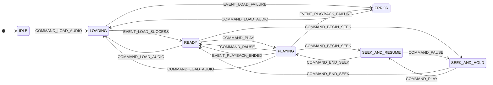
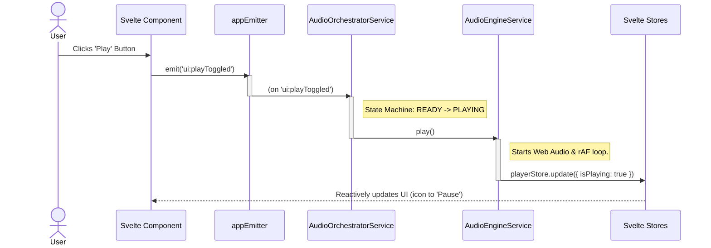
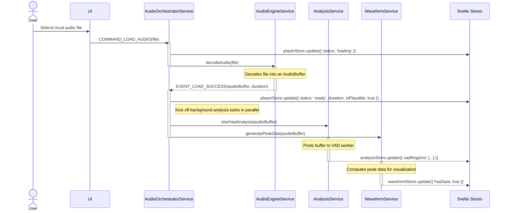
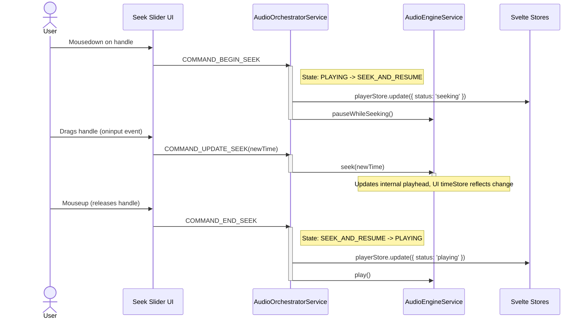

[//]: # ( REFACTOR_PLAN.md )

# **Vibe Player V3: The Definitive Refactor Blueprint**

### **Foreword: A Pragmatic & Modern Architecture**

This document outlines the complete architectural blueprint and detailed implementation strategy for Vibe Player V3. It
represents a fundamental, ground-up redesign driven by a rigorous analysis of past architectural versions and a
commitment to modern, maintainable development practices.

This plan supersedes all previous versions and appendices. It adopts a **minimal, standard, and highly-optimized
toolchain powered by Vite and SvelteKit.** This decision allows us to leverage the full power of TypeScript, a reactive
UI framework, and a rich plugin ecosystem (for PWA support) while still achieving the core goal of producing a simple,
self-contained, and offline-capable static application.

The core principles of testability, decoupling, and maintainability are paramount. We will implement a clear Hexagonal
Architecture for our business logic, an event-driven communication model between services, and a component-driven UI
development workflow.

This plan is designed to be followed with **100% detail**. All information required for development is contained within
this document. Deviations from this plan are strictly forbidden unless explicitly approved by a higher authority after a
formal review process.

---

## **Chapter 1: The Vision & Guiding Principles**

### **1.1. Executive Summary**

The primary objective for Vibe Player V3 is to construct an audio player and analysis tool that is:

* **Fundamentally Robust:** By enforcing strict boundaries between the UI, application services, and core business
  logic, preventing architectural decay. This is achieved through a Hexagonal Architecture and an event-driven
  communication model.
* **Completely Testable:** Through a multi-layered testing strategy including unit, integration, and end-to-end (E2E)
  tests. We will leverage Dependency Injection to make UI components perfectly testable in isolation.
* **Highly Maintainable:** By leveraging a modern, strongly-typed language (TypeScript), a reactive, component-based UI
  architecture (Svelte), and a centralized configuration system.
* **Performant:** Using a compiled UI framework (Svelte) and offloading all computationally intensive tasks to
  single-threaded Web Workers, ensuring a smooth and responsive user experience.
* **Offline-Capable & Installable:** Built as a Progressive Web App (PWA) that can be installed on user devices and run
  reliably without an internet connection.
* **Shareable via URL:** The entire application state—including the loaded audio URL, playback time, and all
  parameters—will be serialized into the URL's query string, enabling users to share a link that perfectly reproduces
  their session.

### **1.2. Architectural Principles & Design Constraints**

This section outlines the non-negotiable rules and rationales that govern all development decisions for V3. The
developer must adhere to these constraints at all times.

* **Constraint 1: Absolute Static Hostability (No Special Headers)**
    * **Description:** The final `build/` output **must** consist purely of static files (`.html`, `.js`, `.css`, image
      assets, `.wasm`, `.onnx`, `.woff2`, etc.). This means the application **must** be deployable and function
      correctly from any simple static file server (e.g., GitHub Pages, `python -m http.server`) **without requiring any
      server-side configuration for special HTTP headers** (such as `Cross-Origin-Opener-Policy` or
      `Cross-Origin-Embedder-Policy`).
    * **Rationale:** This guarantees maximum portability, zero-friction deployment, and true offline capability for PWA.
    * **Implication:** This constraint explicitly forbids the use of `SharedArrayBuffer` and, consequently, any form of
      **threaded WebAssembly (WASM threads)**. All WASM-based libraries (like ONNX Runtime and Rubberband) **must** be
      configured and used in their single-threaded versions. Performance for parallelizable tasks will be achieved by
      using multiple, separate Web Workers, each performing its task independently.

* **Constraint 2: Minimal, Standard Build Step (Vite + SvelteKit)**
    * **Description:** The application will be built using SvelteKit with its `adapter-static`. The standard
      `npm run build` command will compile the TypeScript and Svelte components into a clean, optimized, and fully
      self-contained static `build/` directory.
    * **Rationale:** This provides robust, industry-standard dependency management, TypeScript transpilation, and PWA
      generation via a fast, well-documented tool. This approach eliminates the fragility and maintenance burden of
      custom build scripts.

* **Constraint 3: First-Class TypeScript & Svelte**
    * **Description:** All application logic (core services, adapters, utilities) will be written in **TypeScript** (
      `.ts` files). The user interface will be constructed using **Svelte components** (`.svelte` files, with
      `<script lang="ts">`).
    * **Rationale:** TypeScript provides superior, ergonomic type safety, compile-time error checking, and better
      tooling support. Svelte's compile-time framework approach results in minimal runtime overhead, small bundle sizes,
      and highly performant UI updates.

* **Constraint 4: Component-Driven UI with Dependency Injection & Storybook**
    * **Description:** The UI will be composed of small, single-purpose Svelte components. Services and stores will be
      provided to components via **Svelte's Context API (Dependency Injection)**, not via direct imports. All components
      **must** be developed and verified in isolation in **Storybook** before integration.
    * **Rationale:** Dependency Injection decouples UI components from concrete service implementations, making them
      highly portable and easy to test. The Storybook-first workflow ensures components are robust and handles all their
      states correctly before they enter the main application.

* **Constraint 5: V1 Logic is the "Golden Master" for Core Algorithms**
    * **Description:** For core signal processing and analysis algorithms (specifically VAD region calculation, DTMF/CPT
      parsing, and waveform peak generation), the V3 implementation **must** be functionally identical to the V1
      implementation. The V1 JavaScript code serves as the "golden master" reference.
    * **Rationale:** V1's algorithms are proven to work correctly. The initial goal of V3 is to fix the architecture and
      improve the development experience, not re-invent core processing. Characterization tests will be the arbiter of
      success.

* **Constraint 6: Future-Proofing for Remote VAD API**
    * **Description:** The architecture must be designed to allow the local, in-browser VAD processing to be easily
      replaced by an asynchronous HTTP call to a remote VAD API endpoint in the future.
    * **Rationale:** This provides flexibility. The Hexagonal Architecture addresses this by defining an
      `IInferenceEnginePort` that can be implemented by either a local Web Worker adapter or a remote `fetch`-based API
      adapter, with no changes required to the core `AnalysisService` logic.

* **Constraint 7: Main-Thread-Authoritative Timekeeping (for UI)**
    * **Description:** The application **must** implement a main-thread-authoritative timekeeping model to ensure a
      smooth UI. The UI's time display and seek bar will be driven by a `requestAnimationFrame` loop on the main thread,
      managed by the `AudioEngineService`.
    * **Rationale:** Audio processing worklets can have inherent latency and their time reporting can drift. Trusting
      the worklet's time for UI updates leads to a poor user experience. Synchronization with the audio engine will
      occur explicitly upon seek or parameter changes.

* **Constraint 8: Eager Asset Initialization**
    * **Description:** To optimize user experience, the application **should** pre-fetch and pre-initialize heavy
      assets (like WASM and ONNX models) at startup.
    * **Rationale:** This prevents race conditions and provides a more responsive feel, as the user does not have to
      wait for large assets to download *after* they have selected a file.

* **Constraint 9: Centralized & Typed Configuration**
    * **Description:** All tunable parameters, magic numbers, and environmental constants (e.g., VAD thresholds, FFT
      sizes, API keys) **must** be defined in a central `src/lib/config.ts` file. Modules must import configuration from
      this single source of truth.
    * **Rationale:** This eliminates hard-coded values scattered throughout the codebase, making the system transparent
      and easy to reconfigure or A/B test in the future.

* **Constraint 10: Decoupled Services via Event Emitter**
    * **Description:** Services **must not** call each other's methods directly. Communication between services will be
      handled by a **type-safe event emitter**. For example, the `AudioEngineService` will `emit('playbackEnded')`
      instead of calling a method on the orchestrator.
    * **Rationale:** This enforces a true Hexagonal Architecture where core services are completely decoupled from each
      other, improving maintainability and testability.

---

* **Principle 1: Clarity, Functionality, and Clean Design**
    * **Description:** The user interface design **must** prioritize clarity, information density, and functional
      utility. The goal is to create a powerful tool, not a purely aesthetic piece.
    * **Implication:** Developers should produce simple, functional Svelte components that render standard, accessible
      HTML. This avoids complex third-party UI libraries for core controls, ensuring full control and reliable E2E
      testability.

* **Principle 2: Human-Readable Keys and Constants**
    * **Description:** All string keys used for state serialization (e.g., URL query parameters) or internal messaging *
      *must** use full, descriptive, human-readable English words.
    * **Rationale:** This makes the system transparent and easy to debug. A URL like `?url=...&speed=1.5&time=30` is
      self-documenting. Obscure keys like `?s=1.5&t=30` are forbidden.
    * **Implication:** Constants should use `SCREAMING_SNAKE_CASE` (e.g., `URL_PARAM_SPEED`), and property keys should
      use `camelCase` (e.g., `speed`).

* **Principle 3: Stable Selectors for E2E Testing**
    * **Description:** All UI elements that are interactive (e.g., buttons, inputs) or that display dynamic data subject to assertions in tests (e.g., time displays, file names) **must** be assigned a unique `data-testid` attribute.
    * **Rationale:** This decouples automated tests from fragile implementation details like CSS class names or DOM structure. It creates a stable, explicit contract between the application's view and its test suite, dramatically increasing the reliability and maintainability of E2E tests.
    * **Implication:** Developers are required to add these attributes during component creation. E2E tests **must** use `getByTestId()` selectors as their primary method for locating elements.

* **Principle 4: End-to-End Traceability**
    * **Description:** All user-initiated operations **must** be traceable across services, event emitters, and workers. This is a non-negotiable requirement for debugging the decoupled architecture.
    * **Implication:** A unique `traceId` **must** be generated at the start of any new operation (e.g., loading a file, playing). This `traceId` must be propagated through all subsequent service calls, event payloads, and worker messages related to that operation. The full implementation contract is defined in **Appendix K**.

---

## **Chapter 2: Core Components & Folder Structure**

### **2.1. Overall Repository Structure**

```
.
├── .github/                      # GitHub Actions CI/CD workflows
├── .storybook/                   # Storybook configuration and setup
├── build/                        # **STATIC PRODUCTION BUILD OUTPUT** (deployable)
├── src/                          # Main application source code
│   ├── lib/
│   │   ├── components/           # Reusable Svelte UI components (.svelte)
│   │   ├── services/             # Pure Business Logic Modules (Hexagons) (.ts)
│   │   ├── adapters/             # Technology-Specific Code (Driven & Driving Adapters) (.ts)
│   │   ├── stores/               # Central Application State (Svelte Stores) (.ts)
│   │   ├── types/                # TypeScript Interfaces and Type Definitions (Ports) (.ts)
│   │   ├── utils/                # General Utilities and Helpers (.ts)
│   │   ├── workers/              # Web Worker scripts (.ts)
│   │   └── config.ts             # Central application configuration
│   ├── routes/                   # SvelteKit page routes (e.g., +page.svelte)
│   ├── app.html                  # SvelteKit main HTML template
│   └── app.css                   # Global CSS styles
├── static/                       # Static assets (copied directly to build output)
│   └── ... (favicon, models, vendor libraries)
├── tests/                        # All test code
│   ├── e2e/                      # End-to-End Tests (Playwright, Gherkin-driven)
│   │   └── features/             # Gherkin .feature files (Behavioral Specifications)
│   ├── unit/                     # Vitest Unit and Integration Tests
│   └── characterization_vectors/ # JSON files capturing V1 behavior for testing
├── svelte.config.js              # SvelteKit configuration
├── vite.config.ts                # Vite build tool configuration
├── tsconfig.json                 # TypeScript configuration
└── package.json                  # Project dependencies and scripts
```

### **2.2. Key Hexagons (Services) and Their Responsibilities**

All services are implemented as **Singleton TypeScript Classes**. They are instantiated once at the application root and
provided to the UI via Svelte's Context API.

* **`appEmitter` (`src/lib/services/emitter.service.ts`)**
    * **Role:** The application's central nervous system. A type-safe event bus for inter-service communication.
    * **Responsibility:** To decouple services from one another. Services emit events to the bus, and other services
      subscribe to those events.

* **`AudioOrchestratorService` (`src/lib/services/audioOrchestrator.service.ts`)**
    * **Role:** The central application coordinator.
    * **Responsibility:** Listens for events from the UI and other services. Manages the overall application state
      machine (see Chapter 4). Dispatches commands to other services based on state transitions. Manages global error
      state. **It does not contain any business logic itself.**
    * **Key State:** `status` (overall app state), `fileName`, `duration`, `isPlayable`, `sourceUrl`.

* **`AudioEngineService` (`src/lib/services/audioEngine.service.ts`)**
    * **Role:** The core playback engine (the PlaybackHexagon), implementing the `IAudioEnginePort`.
    * **Responsibility:** Manages the Web Audio API. Communicates with the `rubberband.worker`. Handles audio decoding
      and playback scheduling. Manages `isPlaying` state and directly updates `timeStore` on a `requestAnimationFrame`
      loop.
    * **Key State:** `isPlaying`, `speed`, `pitchShift`, `gain`.

* **`AnalysisService` (`src/lib/services/analysis.service.ts`)**
    * **Role:** Manages Voice Activity Detection (VAD) analysis (the VADHexagon), implementing the `IAnalysisPort`.
    * **Responsibility:** Orchestrates VAD processing via the `sileroVad.worker`. Holds raw VAD probabilities
      internally. Recalculates speech regions based on user-tunable thresholds.
    * **Key State:** `vadProbabilities` (internal), `vadRegions`, `vadPositiveThreshold`, `vadNegativeThreshold`.

* **`DtmfService` (`src/lib/services/dtmf.service.ts`)**
    * **Role:** Manages DTMF and CPT detection (the DTMFHexagon), implementing the `IDtmfPort`.
    * **Responsibility:** Communicates with the `dtmf.worker` to perform tone detection.
    * **Key State:** `dtmfResults`, `cptResults`.

* **`WaveformService` (`src/lib/services/waveform.service.ts`)**
    * **Role:** Manages all data generation for the waveform visualization.
    * **Responsibility:** Listens for a loaded `AudioBuffer`. Computes `waveformData` (peak data) for the waveform display.
    * **Key State:**  `waveformData` (internal).

* **`SpectrogramService` (`src/lib/services/spectrogram.service.ts`)**
    * **Role:** Manages spectrogram computation (the SpectrogramHexagon), implementing the `ISpectrogramPort`.
    * **Responsibility:** Communicates with the `spectrogram.worker` to perform FFT calculations.
    * **Key State:** `spectrogramData` (internal).

---

## **Chapter 3: Adapters, Infrastructure & Data Flow**

### **3.1. Driving Adapters (User Input & External Triggers)**

These components initiate commands *on* the core services.

* **Svelte UI Components (`src/lib/components/` & `src/routes/`):**
    * **Role:** The primary driving adapter. Components receive service instances via `getContext`. They handle DOM
      events and either call methods on the `AudioOrchestratorService` (for state-changing commands) or emit events to
      the `appEmitter`.
    * **Key Example (`RangeSlider.svelte`):** This custom component wraps a standard `<input type="range">`. It attaches
      `on:mousedown`, `on:input`, and `on:mouseup` event handlers that dispatch commands like
      `AudioOrchestratorService.beginSeek()`, `updateSeek()`, and `endSeek()`.

* **URL State Listener (`src/routes/+page.ts`):**
    * **Role:** On startup, the SvelteKit `load` function parses URL query parameters and provides an `initialState`
      object to the main page component.
    * **Implementation:** The SvelteKit `load` function in `src/routes/+page.ts` parses `url.searchParams` and provides
      an `initialState` object to the main page component, which then passes it to the `AudioOrchestratorService`.

### **3.2. Driven Adapters (External Interactions & State Output)**

These components are driven *by* the core services to perform a task.

* **Svelte Stores (`src/lib/stores/`):**
    * **Role:** The primary mechanism for pushing state updates from services to the UI. Services update Svelte
      `writable` stores, and UI components reactively consume these updates.

* **Web Workers (`src/lib/workers/`):**
    * **Role:** Perform computationally intensive tasks off the main thread. Communication is managed by the
      `WorkerChannel` utility.

* **`WorkerChannel` Utility (`src/lib/utils/workerChannel.ts`):**
    * **Role:** A mandatory, reusable class providing a **type-safe, Promise-based request/response communication
      channel** over the native Web Worker API. It will use TypeScript discriminated unions to ensure type safety of
      message payloads and implement robust timeout and observability mechanisms.

* **URL State Adapter (`src/lib/utils/urlState.ts`):**
    * **Role:** Serializes key application state into the URL's query string.
    * **Implementation:** The `AudioOrchestratorService` subscribes to relevant Svelte Stores. On changes to key
      parameters, it calls a debounced function in `urlState.ts` to update `window.history.replaceState()`.

* **Toast Notifications:**
    * **Role:** A top-level component will subscribe to the `statusStore`. When it detects a new error object, it will
      display a user-friendly toast notification.

### **3.3. Core Data Flow Principles**

* **Unidirectional Data Flow:** Data flows in one direction: UI Interaction -> Service Command -> Store Update -> UI
  Reaction. This creates a predictable and debuggable system.

* **Controlled Exception: The "Hot Path"**
    * **What:** For the high-frequency `currentTime` update during playback, the `AudioEngineService` runs a
      `requestAnimationFrame` loop and writes **directly** to the dedicated `timeStore`.
    * **Why:** This is a deliberate exception to achieve smooth 60fps UI updates for the seek bar and time display
      without burdening the entire application with constant re-renders.
    * **Synchronization:** This is the *only* such exception. The `timeStore` is for display purposes only. To maintain a single source of truth, when a "cold" event occurs (e.g., `pause`, `endSeek`), the `AudioOrchestratorService` **must** command the `AudioEngineService` to report its final authoritative time. The orchestrator then commits this value to the main `playerStore`, ensuring the canonical application state is always correct.

* **Large Data Handling Protocol**
    * **What:** Services generating large, static data (e.g., `vadProbabilities`) **must** hold it internally. They
      publish a simple boolean flag to a store to indicate readiness. UI components then call a synchronous accessor
      method on the service to retrieve the data for rendering.
    * **Why:** This prevents large data payloads from polluting reactive stores and causing performance issues.

### **3.4. State Ownership & Data Pathways**

| State Item | Owning Service/Hexagon | Location in Store | Description |
| :--- | :--- | :--- | :--- |
| `status` (`loading`, `ready`, etc.) | `AudioOrchestratorService` | `playerStore` (`status` property) | The single source of truth for the application's overall state. |
| `error` (Structured Error Object) | `AudioOrchestratorService` | `statusStore` | A structured object with details for user-facing toasts and technical logs. |
| `fileName`, `duration`, `isPlayable`, `sourceUrl` | `AudioOrchestratorService` | `playerStore` | High-level metadata about the loaded audio. |
| **`audioBuffer`** | **`AudioEngineService`** | **_Internal to `AudioEngineService`_** | Raw decoded audio data. **Not in a store.** Provided to other services on request. |
| `isPlaying` | `AudioEngineService` | `playerStore` | The canonical boolean playback state. |
| `currentTime` | `AudioEngineService` | `timeStore` (Hot) & `playerStore` (Cold) | Canonical time. Updated on `rAF` (`timeStore`) for UI, and synced to `playerStore` on pause/seek. |
| `speed`, `pitchShift`, `gain` | `AudioEngineService` | `playerStore` | Playback manipulation parameters. |
| `vadProbabilities` | `AnalysisService` | _Internal to `AnalysisService`_ | Raw VAD data. **Not in a store** per Large Data Handling Protocol. |
| `vadRegions` | `AnalysisService` | `analysisStore` | Calculated speech time segments. |
| `vadPositiveThreshold`, `vadNegativeThreshold` | `AnalysisService` | `analysisStore` | Tuning parameters for VAD calculation. |
| `dtmfResults`, `cptResults` | `DtmfService` | `dtmfStore` | Detected DTMF and Call Progress Tones. |
| **`spectrogramData`** | **`SpectrogramService`** | **_Internal to `SpectrogramService`_** | Calculated spectrogram data. **Not in a store.** Readiness signaled by a flag. |
| **`waveformData`** | **`WaveformService`** | **_Internal to `WaveformService`_** | Peak data for waveform visualization. **Not in a store.** Readiness signaled by a flag. |

### **3.5. Detailed Error Propagation from Workers**

1. **Error in Worker:** A worker encountering a fatal error **must** post a specific error message back to the main
   thread.
2. **`WorkerChannel` Rejection:** The `WorkerChannel`, upon receiving this error or timing out, **must** reject the
   outstanding Promise with a custom `WorkerError`.
3. **Service Catches & Re-throws:** The calling service **must** catch this `WorkerError`, wrap it in a more specific
   high-level `Error` if needed, and **re-throw** it.
4. **Orchestrator Handles State:** The `AudioOrchestratorService` catches the re-thrown error and is the sole authority
   to transition the application into the `ERROR` state, updating the `playerStore` with details for the UI.

### **3.6. URL State Loading Rules**

* **Rule 1: Loading a Local File.** When a user loads a new local audio file, any existing query parameters in the URL *
  *must be cleared**. This prevents state from a previous session from "leaking" into a new one.
* **Rule 2: Loading from a `url` Parameter.** When the application starts with a `url` query parameter (e.g.,
  `?url=...&speed=1.5`), the `AudioOrchestratorService` **must** load the audio from the URL and simultaneously apply
  all other valid parameters to the application's state. The query string **must not** be cleared.

---

## **Chapter 4: The Application State Machine**

The `AudioOrchestratorService` implements the following state machine to manage the application's lifecycle.

Note: there are two seek states because if you are playing, start seeking (playback should pause while seeking), hit the spacebar (toggle pause), then stop seeking, playback should be paused - and vice versa.

### **4.1. State Diagram**



### **4.2. State Definition Table**

| State Name            | Description                               | Entry Actions (What the Orchestrator commands)                                                                                        | Allowed Commands (Triggers for leaving)                                                     |
|:----------------------|:------------------------------------------|:--------------------------------------------------------------------------------------------------------------------------------------|:--------------------------------------------------------------------------------------------|
| **`IDLE`**            | Application started, no audio loaded.     | <ul><li>Update `playerStore` status to 'idle'.</li><li>Eagerly initialize background services.</li></ul>                              | <ul><li>`COMMAND_LOAD_AUDIO`</li></ul>                                                      |
| **`LOADING`**         | Fetching/decoding audio source.           | <ul><li>Update `playerStore` status to 'loading'.</li><li>Show global spinner, disable controls.</li></ul>                            | <ul><li>(Internal events only)</li></ul>                                                    |
| **`READY`**           | Audio loaded, playback is paused.         | <ul><li>Update `playerStore` status to 'ready'.</li><li>Hide spinner, enable controls.</li><li>Trigger background analysis.</li></ul> | <ul><li>`COMMAND_PLAY`</li><li>`COMMAND_BEGIN_SEEK`</li><li>`COMMAND_LOAD_AUDIO`</li></ul>  |
| **`PLAYING`**         | Audio is currently playing.               | <ul><li>Update `playerStore` status to 'playing'.</li><li>Start `AudioEngineService` UI update loop.</li></ul>                        | <ul><li>`COMMAND_PAUSE`</li><li>`COMMAND_BEGIN_SEEK`</li><li>`COMMAND_LOAD_AUDIO`</li></ul> |
| **`SEEK_AND_RESUME`** | User seeking while `PLAYING`.             | <ul><li>Update `playerStore` status to 'seeking'.</li><li>Command `AudioEngineService` to pause.</li></ul>                            | <ul><li>`COMMAND_END_SEEK`</li><li>`COMMAND_PAUSE`</li></ul>                                |
| **`SEEK_AND_HOLD`**   | User seeking while `READY`.               | <ul><li>Update `playerStore` status to 'seeking'.</li></ul>                                                                           | <ul><li>`COMMAND_END_SEEK`</li><li>`COMMAND_PLAY`</li></ul>                                 |
| **`ERROR`**           | A critical, unrecoverable error occurred. | <ul><li>Update `playerStore` status to 'error', `error` with message.</li><li>Disable controls, display error.</li></ul>              | <ul><li>`COMMAND_LOAD_AUDIO`</li></ul>                                                      |

### **4.3. Handling Special Events & Edge Cases**

* **`EVENT_PLAYBACK_ENDED`:** When notified by the `AudioEngineService` that playback has naturally finished:
    1. The orchestrator commands the `AudioEngineService` to set `currentTime` to `duration`.
    2. It transitions the application state to `READY`.
    3. It **must not** trigger a URL state update, to prevent sharing a URL with the time stuck at the end.

* **`COMMAND_PLAY` (from `READY` at End of Track):**
    1. The orchestrator checks if `currentTime === duration`.
    2. If `true`, it first issues a **seek command to `0`** to the `AudioEngineService` before issuing the `play`
       command.
    3. If `false`, it issues the `play` command directly. This ensures clicking "Play" on a finished track restarts it
       from the beginning.

---

## **Chapter 5: The Development Workflow**

### **5.1. Guiding Principles for Development**

* **Storybook-First UI:** All Svelte UI components **must** be developed, documented, and visually verified in isolation
  within Storybook *before* being integrated into the main application.
* **Test-Driven Logic:** All core business logic within services will be developed using a strict TDD workflow with
  Vitest.
* **Behavior-Driven Features:** User-facing features will be defined by Gherkin scenarios and verified with Playwright
  E2E tests.
* **Dependency Injection for Testing:** All tests for UI components will inject mock services via Svelte's Context API,
  ensuring tests are fast and reliable.
* **Formal Command & Event Naming:** Adhere to a formal distinction between **Commands** (user-initiated actions telling
  the app to do something, e.g., `audioEngine.play()`) and **Events** (system notifications that something has happened,
  e.g., a worker message).
* **Rationale for the Modern Workflow:** This parallel "Component-First + Logic-First" workflow is an intentional
  evolution for a modern reactive stack. It de-risks the UI and business logic simultaneously in their respective ideal
  testing environments (Storybook and Vitest), leading to faster and more reliable final integration.

### **5.2. Project Setup & Initial Configuration**

1. **Initialize SvelteKit Project:** Use `npm create svelte@latest vibe-player-v3`.
2. **Copy Configurations:** Copy `package.json` (for dependencies), `vite.config.ts`, `svelte.config.js`, and
   `tsconfig.json` from the `v2.3` reference project. Run `npm install`.
3. **Configure Storybook:** Run `npx storybook@latest init`. Configure it to work with the Svelte Context API for
   providing mock services in stories.
4. **Create Directory Structure:** Manually create the `services`, `stores`, `workers`, `types`, and `config` folders
   inside `src/lib`.

### **5.3. The Core Development Loop (Iterative Process)**

1. **Task & Gherkin Review:** Review the relevant `.feature` file that defines the user-facing behavior.
2. **UI Component Dev (Storybook):** Create/update the `.svelte` component and its `.stories.ts` file. Build it in
   isolation, creating stories for all its visual states (disabled, loading, etc.). Use the Context API to provide mock
   services and data.
3. **Core Logic Dev (Vitest):** Create/update the `.test.ts` file for the relevant service. Write a failing test.
   Implement the pure TypeScript logic in the service until the test passes.
4. **Application Integration:** In the main application (`+page.svelte`), provide the real service instances via
   `setContext`. Use the verified Svelte component from Storybook. Wire up its events to the `appEmitter`.
5. **E2E Verification (Playwright):** Write a Playwright test to automate the Gherkin scenario.

---

## **Chapter 6: Quality Assurance & Testing Strategy**

### **6.1. The Testing Pyramid Layers**

### 6.1. The Testing Pyramid Layers

| Layer                       | Tool(s)                         | Purpose                                                                        | Run on PR? | Is Fast? |
|:----------------------------|:--------------------------------|:-------------------------------------------------------------------------------|:----------:|:--------:|
| **Static Analysis**         | ESLint, Svelte-Check, TypeScript| Enforce type safety, code quality, style, and architectural rules.             |    Yes     |  Blazing |
| **Component Testing**       | Storybook, Vitest, Testing Lib  | Visually inspect and unit test every component in complete isolation.          |    Yes     |   Fast   |
| **Unit Tests**              | Vitest                          | Test individual functions/methods in isolation (includes V1 Characterization). |    Yes     |   Fast   |
| **Integration Tests**       | Vitest                          | Test collaboration between services via the event emitter.                     |    Yes     |   Fast   |
| **End-to-End (E2E) Tests**  | Playwright                      | Verify complete user flows defined in Gherkin scenarios.                       |    Yes     |   Slow   |
| **Visual Regression Tests** | Playwright (`toHaveScreenshot`) | Prevent unintended visual bugs in UI and canvases in CI.                       |  Optional  |   Slow   |
| **CI Static Analysis**      | GitHub CodeQL, SonarCloud       | Deep security, tech debt, and maintainability scans.                           |    Yes     |  Medium  |

### **6.2. Local Development Checks (The Inner Loop)**

* **Type Safety (`svelte-check`):** Enforces strict typing for all `.ts` and `.svelte` files.
* **Code Quality & Formatting (ESLint & Prettier):** Enforces best practices and consistent code style.
* **Architectural Rules (ESLint):** This is **critical** for maintaining the Hexagonal Architecture. ESLint, with the
  `eslint-plugin-import` package, **must** be configured to enforce strict architectural boundaries. This check prevents
  architectural decay over time and is a mandatory quality gate. The rules must enforce:
    * UI Components (`src/lib/components/`) **must not** directly import from other technology-specific adapters (e.g.,
      a UI component cannot import a Web Worker module).
    * Core Services (`src/lib/services/`) **must not** import from UI Components (`src/lib/components/`) or page
      routes (`src/routes/`).
    * Services can only depend on other services, stores, types, and their own adapters.
*   **Traceability for Debugging:** All logical operations must be traceable via a `traceId` passed through all events and service calls. This allows developers to easily filter logs and debug complex, asynchronous flows. **(See Appendix K for the full implementation contract).**


### **6.3. Automated Testing**

* **Unit Tests & V1 Characterization Testing:** Pure logic from V1 is ported and tested against "golden master" JSON
  test vectors to prevent regressions.
* **Component Tests:** UI components will be rendered with mock services provided via the Context API. Tests will assert
  that components render correctly and dispatch the correct events on user interaction.
* **Integration Tests:** Verify collaboration between modules by mocking out the lowest-level dependencies.
* **End-to-End (E2E) Tests:** Simulated user journeys ensure the entire application functions correctly.

---

## **Chapter 7: UI Element Contract**

In accordance with **Principle 3 (Stable Selectors for E2E Testing)**, this chapter defines the mandatory `data-testid` attributes that serve as a stable contract between the application's UI and the automated test suite. These IDs are the single source of truth for locating elements in Playwright tests. All interactive or dynamically updated elements relevant to a user flow must be included here.

| Component Group        | Svelte Component (File)      | Test ID                     | Description                                    |
|:-----------------------|:-----------------------------|:----------------------------|:-----------------------------------------------|
| **File Handling**      | `<FileLoader.svelte>`        | `file-input`                | The `<input type="file">` element.             |
|                        |                              | `url-input`                 | The `<input type="text">` for audio URLs.      |
|                        |                              | `file-name-display`         | Displays the name of the loaded file.          |
| **Playback Controls**  | `<Controls.svelte>`          | `play-button`               | The main play/pause toggle button.             |
|                        |                              | `stop-button`               | The stop playback button.                      |
|                        |                              | `jump-back-button`          | Jumps playback backward.                       |
|                        |                              | `jump-forward-button`       | Jumps playback forward.                        |
|                        | `<CustomRangeSlider.svelte>` | `seek-slider-input`         | The `<input type="range">` for seeking.        |
|                        | `+page.svelte`               | `time-display`              | Displays current time and duration.            |
| **Parameter Controls** | `<CustomRangeSlider.svelte>` | `speed-slider-input`        | Controls playback speed.                       |
|                        |                              | `pitch-slider-input`        | Controls pitch shift.                          |
|                        |                              | `gain-slider-input`         | Controls output gain.                          |
|                        | `<Controls.svelte>`      | `reset-controls-button` | Resets speed, pitch, and gain to defaults. |
| **Analysis Controls**  | `<CustomRangeSlider.svelte>` | `vad-positive-slider-input` | Adjusts VAD positive threshold.                |
|                        |                              | `vad-negative-slider-input` | Adjusts VAD negative threshold.                |
| **Analysis Displays**  | `<ToneDisplay.svelte>`       | `dtmf-display`              | Displays detected DTMF tones.                  |
|                        |                              | `cpt-display`               | Displays detected Call Progress Tones.         |
| **Visualizations**     | `<Waveform.svelte>`          | `waveform-canvas`           | The `<canvas>` for the audio waveform.         |
|                        | `<Spectrogram.svelte>`       | `spectrogram-canvas`        | The `<canvas>` for the spectrogram.            |
| **Application State**  | `+layout.svelte` or `GlobalSpinner.svelte` | `loading-spinner`           | The global spinner element shown during the `LOADING` state. |

***

## **Appendix A: Gherkin Feature Specifications**

This appendix contains the executable specifications that define the application's behavior. The developer **must**
ensure the implemented code passes Playwright E2E tests derived from these scenarios.

### **File: `tests/e2e/features/file_loading.feature`**

```gherkin
Feature: File Loading
  As a user, I want to load audio files from my computer or a URL
  so that I can analyze and play them in the application.

  Background:
    Given the user is on the main application page

  Scenario: Successfully loading a local audio file
    When the user selects the valid audio file "static/test-audio/IELTS13-Tests1-4CD1Track_01.mp3"
    Then the file name display should show "IELTS13-Tests1-4CD1Track_01.mp3"
    And the player controls should be enabled
    And the time display should show a duration greater than "0:00"

  Scenario: Attempting to load an unsupported local file type
    When the user selects the invalid file "static/test-audio/README.md"
    Then an error message "Invalid file type" should be displayed
    And the player controls should remain disabled

  Scenario: Loading a new file while another is already loaded
    Given the audio file "static/test-audio/IELTS13-Tests1-4CD1Track_01.mp3" is loaded and ready
    When the user selects the new valid audio file "static/test-audio/dtmf-123A456B789C(star)0(hex)D.mp3"
    Then the file name display should show "dtmf-123A456B789C(star)0(hex)D.mp3"
    And the player state should be fully reset for the new file
    And the time display should show the duration of the new file
```

### **File: `tests/e2e/features/playback_controls.feature`**

```gherkin
Feature: Playback Controls
  As a user with a loaded audio file, I want to control its playback
  by playing, pausing, seeking, and jumping through the audio.

  Background:
    Given the audio file "static/test-audio/449496_9289636-lq.mp3" is loaded and the player is ready

  Scenario: Play, Pause, and Resume functionality
    Given the player is paused at "0:00"
    When the user clicks the "Play" button
    Then the "Play" button's text should change to "Pause"
    And after "2" seconds, the current time should be greater than "0:01"
    When the user clicks the "Pause" button
    Then the "Pause" button's text should change to "Play"
    And the current time should stop advancing

  Scenario: Stopping playback resets the playhead to the beginning
    Given the audio is playing and the current time is "0:15"
    When the user clicks the "Stop" button
    Then the current time should be "0:00"
    And the "Play" button's text should change to "Play"
    And the player should be paused

  Scenario: Seeking with the progress bar
    When the user drags the seek bar handle to the 50% position
    Then the current time should be approximately half of the total duration
    And the player should resume playing if it was playing before seeking

  Scenario Outline: Jumping forwards and backwards
    Given the current time is "0:10"
    When the user jumps <direction> by "5" seconds
    Then the current time should be "<new_time>"

    Examples:
      | direction  | new_time |
      | "forward"  | "0:15"   |
      | "backward" | "0:05"   |
```

### **File: `tests/e2e/features/parameter_adjustment.feature`**

```gherkin
Feature: Playback Parameter Adjustment
  As a user, I want to adjust playback parameters like speed, pitch, and gain
  to change how the audio sounds in real-time.

  Background:
    Given the audio file "static/test-audio/LearningEnglishConversations-20250325-TheEnglishWeSpeakTwistSomeonesArm.mp3" is loaded and the player is ready

  Scenario Outline: Adjusting a playback parameter slider
    When the user sets the "<Parameter>" slider to "<Value>"
    Then the "<Parameter>" value display should show "<Display>"
    And the browser URL should contain "<URL_Param>"
    And the audio playback characteristics should reflect the new "<Parameter>" setting

    Examples:
      | Parameter | Value | Display           | URL_Param          |
      | "Speed"   | "1.5" | "1.50x"           | "speed=1.50"       |
      | "Pitch"   | "-3"  | "-3.0 semitones"  | "pitch=-3.00"      |
      | "Gain"    | "2.0" | "2.00x"           | "gain=2.00"        |


  Scenario: Resetting parameters to default
    Given the "Speed" slider is at "1.5"
    And the "Pitch" slider is at "-3"
    When the user clicks the "Reset Controls" button
    Then the "Speed" slider should be at "1.0"
    And the "Pitch" slider should be at "0"
    And the "Gain" slider should be at "1.0"

```

### **File: `tests/e2e/features/vad_analysis.feature`**

```gherkin
Feature: Voice Activity Detection (VAD)
  As a user, I want the application to automatically detect speech in an audio file
  and allow me to tune the detection parameters.

  Background:
    Given the audio file "static/test-audio/IELTS13-Tests1-4CD1Track_01.mp3" is loaded and the player is ready

  Scenario: VAD highlights appear automatically after analysis
    Then the VAD progress bar should appear and complete within "15" seconds
    And the waveform should display one or more speech regions highlighted in yellow
    And the VAD positive threshold slider should be enabled
    And the VAD negative threshold slider should be enabled

  Scenario: Tuning VAD thresholds updates highlights in real-time
    Given the VAD analysis is complete and highlights are visible
    When the user sets the "VAD Positive Threshold" slider to a very high value of "0.95"
    Then the number of highlighted speech regions on the waveform should decrease or become zero
    When the user sets the "VAD Positive Threshold" slider to a very low value of "0.20"
    Then the number of highlighted speech regions on the waveform should increase
```

### **File: `tests/e2e/features/tone_analysis.feature`**

```gherkin
Feature: Tone Detection
  As a user analyzing call audio, I want the application to detect and display
  standard DTMF and Call Progress Tones.

  Scenario: DTMF tones are detected and displayed correctly
    Given the audio file "static/test-audio/dtmf-123A456B789C(star)0(hex)D.mp3" is loaded and the player is ready
    Then the DTMF display should eventually contain the sequence "1 2 3 A 4 5 6 B 7 8 9 C * 0 # D"

  Scenario: CPT (Busy Tone) is detected and displayed
    Given the audio file "static/test-audio/Dial DTMF sound _Busy Tone_ (480Hz+620Hz) [OnlineSound.net].mp3" is loaded and the player is ready
    Then the CPT display should eventually contain "Fast Busy / Reorder Tone"
```

### **File: `tests/e2e/features/url_state.feature`**

```gherkin
Feature: URL State Management
  As a user, I want to share a link to the player that includes my exact session state,
  and have the application automatically load and apply that state from the URL.

  Background:
    Given the application has fully initialized

  Scenario: Application state is serialized to the URL query string
    Given the audio file "static/test-audio/449496_9289636-lq.mp3" is loaded and ready
    When the user sets the "Speed" slider to "1.5"
    And the user seeks to "0:45" and then pauses playback
    Then the browser URL should contain "?speed=1.50"
    And the browser URL should contain "&time=45.00"
    And the browser URL should contain "&url=static%2Ftest-audio%2F449496_9289636-lq.mp3"

  Scenario: Loading an audio file from a URL parameter
    Given the user navigates to the application with the URL parameter "?url=static%2Ftest-audio%2F449496_9289636-lq.mp3"
    When the application finishes loading the audio from the URL
    Then the file name display should show "static/test-audio/449496_9289636-lq.mp3"
    And the player controls should be enabled

  Scenario: Loading a full session state from URL parameters on startup
    Given the user navigates to the application with the URL parameter "?url=static%2Ftest-audio%2F449496_9289636-lq.mp3&speed=0.75&pitch=-6.0&time=15.00"
    When the application finishes loading the audio from the URL
    Then the "Speed" value display should show "0.75x"
    And the "Pitch" value display should show "-6.0 semitones"
    And the current time should be approximately "0:15"

  Scenario: URL parameters are cleared when loading a new local file
    Given the user is on a page with the URL parameter "?speed=1.50&time=20.00"
    When the user selects the new local audio file "static/test-audio/IELTS13-Tests1-4CD1Track_01.mp3"
    Then the browser URL query string should be empty
```

---

## **Appendix B: V1 Architectural Analysis & Tradeoffs (Historical Context)**

This section migrates the key insights from the original V1 plan. It serves as historical context to understand the "
why" behind certain V3 design decisions.

* **V1 Core Philosophy:** Prioritized simplicity and minimal dependencies using Vanilla JS, HTML, and CSS. Leveraged
  WebAssembly (WASM) via standard Web APIs for computationally intensive tasks.

* **Time/Pitch Shifting (Rubberband WASM):**
    * **Temporal Inaccuracy Tradeoff:** The V1 plan explicitly noted that Rubberband prioritizes audio quality over
      strict temporal accuracy, causing its time reporting to drift relative to the Web Audio clock.
    * **V1 Solution (Adopted by V3):** This drift necessitated the use of **main-thread `requestAnimationFrame` time
      calculation** for the UI indicator and periodic seek-based synchronization to keep the audio engine aligned with
      the UI's authoritative time. V3 formalizes this as the "Hot Path" pattern.

* **VAD (Silero ONNX):**
    * **Main-Thread VAD (Async):** In V1, VAD processing ran on the main thread but used `async/await` and
      `setTimeout(0)` to yield periodically.
    * **Tradeoff:** This was simpler for an MVP but could cause UI sluggishness and was susceptible to throttling.
    * **V3 Improvement:** V3 moves this to a dedicated Web Worker to solve these issues, but the core VAD logic remains
      the "golden master" for characterization testing.

* **DTMF & CPT Detection (Goertzel Algorithm):**
    * **Main-Thread Processing:** This was implemented in pure JavaScript and ran on the main thread after audio was
      resampled.
    * **V3 Improvement:** V3 moves this logic into a dedicated Web Worker for better performance and isolation,
      preventing it from blocking the UI on long audio files.

* **IIFE Module Pattern & Script Order:**
    * **Fragility:** V1 used an IIFE (Immediately Invoked Function Expression) pattern which relied on a carefully
      managed `<script>` loading order in `index.html`, a primary source of fragility.
    * **V3 Improvement:** V3's use of ES Modules with Vite's build process completely eliminates this problem by
      creating a dependency graph and producing a correctly bundled output.

---

## **Appendix C: AI Agent Collaboration Guidelines**

This section defines the operational protocols for any developer (human or AI) working on this project. It is a mandatory guide for implementation.

### **P0: Agent Autonomy & Minimized Interaction**

**Principle Statement:** The agent should operate with a high degree of autonomy once a task and its objectives are clearly defined.

*   **Reason:** To improve development velocity, reduce unnecessary user interruptions, and allow the agent to perform comprehensive tasks efficiently.
*   **Context:** After the initial plan or task has been approved by the user, or for routine tasks that align with established patterns and guidelines.
*   **Action:**
    *   The agent must proceed with task implementation without seeking confirmation for intermediate steps, unless a step involves significant architectural deviation, conflicts with core guidelines, or encounters critical ambiguity not solvable with P2.1 (Proactive Clarification Seeking).
    *   Confirmation should primarily be reserved for: initial plan approval, major changes to agreed-upon plans, situations explicitly requiring user choice, or when critical information is missing after an attempt to clarify.
    *   The agent should default to making reasonable, well-documented decisions to keep work flowing, reporting these decisions in its task summary or commit messages.

### **P1: Task-Driven Workflow & Initial Confirmation**

**Principle Statement:** Complex tasks or those initiating significant changes require an initial proposal and user confirmation before full implementation.

*   **Reason:** Ensures user alignment on scope and approach for major work, prevents wasted effort on undesired solutions, and maintains user oversight on architectural decisions.
*   **Context:** When initiating any non-trivial change (new features, significant refactoring, extensive documentation rewrites) or when explicitly requested by the user.
*   **Action:** The agent first analyzes the task, then outlines a proposed solution (e.g., affected files, high-level logic changes, key components to be developed/modified). This proposal is presented to the user for explicit confirmation. Only after confirmation should the agent proceed with the detailed implementation of that proposal. Minor, clearly defined sub-tasks within an approved plan generally do not require re-confirmation (see P0).

### **P2: Clarity & Explicit Communication**

#### **P2.1: Proactive Clarification Seeking**

**Principle Statement:** The agent must seek clarification for ambiguous tasks or requirements.

*   **Reason:** Avoids incorrect assumptions and wasted effort. Leverages user's domain/project knowledge.
*   **Context:** Whenever requirements, existing code, constraints, or user intent seem ambiguous or underspecified.
*   **Action:** The agent **must halt and ask** clarifying questions before making assumptions or generating potentially incorrect output.

#### **P2.2: Explanation of Changes (Structured Output)**

**Principle Statement:** The agent must explain its actions and rationale in a structured manner.

*   **Reason:** Provides a clear record of actions and rationale, especially regarding design choices or non-obvious logic. Aids user review and architectural oversight.
*   **Context:** When providing any generated code, text block, or completing a task.
*   **Action:** The agent explains *what* it did and *why* the specific approach was taken (e.g., in a commit message draft, task report, or logs), especially if there were alternatives.

### **P3: Maintainability & Consistency**

#### **P3.1: Adherence to Existing Patterns & Controlled Refactoring**

**Principle Statement:** The agent must adhere to existing project patterns by default and propose refactoring only with explicit user approval.

*   **Reason:** Ensures codebase remains cohesive and allows for controlled improvements. Reduces cognitive load.
*   **Context:** When adding or modifying code or documentation.
*   **Action:**
    *   The agent **must analyze and strictly adhere** to existing project patterns (style, structure, naming conventions) as defined in this plan. This is the default operational mode.
    *   If the agent identifies areas where deviation from existing patterns could significantly improve code health, maintainability, performance, or align better with best practices, it **may propose these refactoring changes** to the user, explaining the rationale clearly. Such refactoring requires explicit user approval and activation of a "Refactor phase" before implementation.

#### **P3.2: High-Quality Documentation & Comments**

**Principle Statement:** The agent must generate high-quality documentation and comments for the code it produces and preserve existing relevant comments.

*   **Reason:** Critical for future agent understanding and maintenance (including historical context), aids human comprehension, enables IDE features.
*   **Context:** When generating or modifying functions, classes, complex variables, modules, or significant logic blocks.
*   **Action:**
    *   The agent generates comprehensive TypeScript Doc comments (JSDoc-style) for all public functions, classes, and types. Include descriptions, parameters, returns, types, and potentially exceptions/raises.
    *   Use inline comments for complex logic steps.
    *   **Crucially, preserve existing meaningful comments unless the code they refer to is removed. These comments serve as a historical log for future agent context to understand *why* code evolved.** Maintain documentation alongside code.

#### **P3.3: Conciseness and Non-Redundancy in Documentation**

**Principle Statement:** All generated documentation and explanations should be concise and non-redundant.

*   **Reason:** Optimizes agent processing time/cost, reduces noise for human readers, improves maintainability of the documentation itself.
*   **Context:** When generating or updating *any* documentation, including this `CONTRIBUTING-LLM.md`, `README.md`, or code comments/docstrings.
*   **Action:** The agent should strive for concise language in all generated text. Avoid redundancy. Use precise terminology. However, when explaining complex logic or design choices, **prioritize the clarity needed for both human and future agent understanding**, even if it requires slightly more detail than absolute minimum brevity would allow.

#### **P3.4: File Identification Comments (Full Files Only)**

**Principle Statement:** Full file content generated by the agent must include file identification comments.

*   **Reason:** Allows agent to identify file context when receiving pasted content; allows user to verify paste location.
*   **Context:** When generating the *entire content* of a file.
*   **Action:** The agent includes file path comments at the **absolute start and end** of the generated file content (e.g., `// path/to/file.ts`, `<!-- /path/to/file.html -->`). Use the appropriate comment style for the file type. Not needed for partial replacements.

#### **P3.5: Logical Sectioning (Long Files)**

**Principle Statement:** Long files should be logically sectioned using comments.

*   **Reason:** Improves readability and navigation for humans and agents. Facilitates targeted section replacements.
*   **Context:** When working with files containing multiple distinct logical parts.
*   **Action:** The agent uses clear section header comments (e.g., `# --- Initialization ---`, `/* === API Handlers === */`) to delineate logical blocks. Use the appropriate comment style.

### **P4: Guideline Adherence & Conflict Reporting**

#### **P4.1: Proactive Viability Check & Reporting**

**Principle Statement:** The agent should report if its knowledge suggests a guideline or constraint is suboptimal for a task.

*   **Reason:** To proactively identify guidelines or constraints that might be outdated or conflict with best practices, based on the agent's internal knowledge.
*   **Context:** When a task relates to specific guidelines or constraints.
*   **Action:** If the agent's internal knowledge suggests a guideline might be outdated or conflict with best practices for the given task, it **must report** this to the user as part of its analysis or proposal. It should not independently act against the guideline but await user instruction.

#### **P4.2: Identify and Report Guideline Conflicts**

**Principle Statement:** The agent must identify and report conflicts between user instructions and established guidelines, seeking explicit direction.

*   **Reason:** To resolve discrepancies when user instructions contradict established guidelines, ensuring consistent application or conscious deviation.
*   **Context:** When a direct user instruction conflicts with a specific rule in these guidelines.
*   **Action:** The agent **must** identify and clearly point out any conflict between user instructions and established guidelines, referencing the specific rule. It must then report this conflict and ask the user for explicit instruction on how to proceed for that instance.

### **P5: Full Word Naming Convention**

**Principle Statement:** All string keys for states, events, commands, and types must use full, descriptive English words in `SCREAMING_SNAKE_CASE` for constants and `camelCase` for other identifiers.

*   **Reason:** This makes the system transparent and easy to debug. Obscure keys are forbidden.

### **P6: README Generation Requirement**

**Principle Statement:** A reference to these coding agent collaboration guidelines must be included in the project's main `README.md`.

*   **Reason:** Ensures project users and future agents are aware these collaboration guidelines exist and should be followed for consistency.
*   **Action:** The agent **must** include a statement in the `README.md` advising that development involving agent assistance should follow the rules outlined in this document, and instructing them to request it if it was not provided.

### **P7: Branch-Based Code Submission**

**Principle Statement:** The agent submits work by committing to feature branches and pushing to the remote repository, enabling review and CI/CD.

*   **Reason:** Ensures code changes are visible for review, allows CI/CD integration, facilitates collaboration, and avoids inaccessible local code.
*   **Action:** The agent commits changes with clear, descriptive messages to a dedicated feature branch and pushes it to the remote repository.

### **P8: Refined V3 Development Workflow**

**Principle Statement:** All feature development must follow a specific, multi-stage workflow that prioritizes isolation and testability.

*   **Reason:** To enforce the architectural principles of the V3 rewrite, ensure components are decoupled and robust, and maintain a high standard of quality.
*   **Action:** When implementing a new feature, the agent **must** adhere to the following sequence:
    1.  **Gherkin & Plan Review:** Consult the relevant Gherkin `.feature` file to understand the user-facing requirements.
    2.  **Storybook-First Component Development:**
        *   Create or update the required Svelte components in isolation within Storybook.
        *   Develop stories that cover all visual states (e.g., default, disabled, loading, error).
        *   Use Svelte's **Context API** to provide mock services and stores directly to the component within its stories. **Do not** import services directly into components.
    3.  **Test-Driven Service Logic:**
        *   Write unit tests (using Vitest) for any new or modified business logic within the relevant services (`/src/lib/services/`).
        *   Implement the service logic only after a failing test has been written.
    4.  **Application Integration:**
        *   In the main application layout (`+page.svelte` or `+layout.svelte`), provide the real service instances via `setContext`.
        *   Integrate the verified Svelte components from Storybook.
        *   Wire up component events to the global `appEmitter` or `AudioOrchestratorService` as appropriate.
    5.  **E2E Test Verification:**
        *   Write or update the Playwright E2E tests to automate the Gherkin scenario.
        *   The final implementation **must** pass these E2E tests. If a relevant scenario does not exist, a new one must be proposed and approved before implementation.

---

## **Appendix D: UI/UX Design Philosophy**

This appendix restores the explicit UI/UX philosophy that underpins the component design choices.

### **D.1. Core Principle: Clarity, Functionality, and Clean Design**

* **Description:** The user interface design **must** prioritize clarity, information density, and functional utility
  above all else. The goal is to create a powerful tool for analysis, not a purely aesthetic piece. A clean,
  well-organized interface that provides clear feedback and powerful, predictable controls is paramount.
* **Implication for Component Development:**
    * **Simplicity:** Developers should produce simple, functional Svelte components that render standard, accessible
      HTML elements.
    * **Avoid Abstraction for Core Controls:** For core interactive elements like sliders and buttons, developers **must
      ** build custom Svelte components that directly wrap `<input type="range">` and `<button>` elements. This avoids
      using complex third-party UI libraries for these critical parts, ensuring:
        1. **Full Control:** We have complete control over the component's DOM structure, styling, and event handling.
        2. **Testability:** E2E tests using Playwright can reliably interact with standard HTML elements without
           fighting against a library's custom DOM manipulation.
    * **Information Density:** The UI should present relevant information (e.g., current time, parameter values,
      analysis results) in a way that is easy to scan and understand at a glance.

---

### **Appendix E: State Machine Edge Case Logic**

This appendix provides explicit, mandatory logic for handling specific edge cases within the `AudioOrchestratorService` state machine.

#### **E.1. Handling `audioEngine:playbackEnded` Event**

When the `AudioEngineService` detects that playback has naturally reached the end, it **emits** an `audioEngine:playbackEnded` event. The `AudioOrchestratorService`, which subscribes to this event, **must** execute the following sequence:

1.  **Command `AudioEngineService`:** Command the `AudioEngineService` to set its internal playback time to exactly match the `duration`. This ensures the UI seek bar moves to the very end.
2.  **Transition State:** Transition the application state from `PLAYING` to `READY`. This updates the `playerStore` and changes the UI icon from "Pause" to "Play".
3.  **Prevent URL Update:** The orchestrator **must not** trigger the `urlState.ts` utility. This is a deliberate exception to prevent sharing a URL with a `time=` parameter equal to the duration.

#### **E.2. Handling `ui:playToggled` Event from `READY` state**

When the user clicks "Play" while the application is in the `READY` state, the UI emits a `ui:playToggled` event. The `AudioOrchestratorService` must:

1.  **Check Time:** Check if `currentTime` is equal to (or within a small epsilon of) the `duration`.
2.  **Conditional Seek:**
    *   If `true`, it must first issue a **seek command to `0`** to the `AudioEngineService`. Only then should it issue the `play` command.
    *   If `false`, it can immediately issue the `play` command.
3.  **Rationale:** This ensures that clicking "Play" on a finished track correctly restarts it from the beginning, which is the universally expected behavior.

---

### **Appendix F: Core Data Flow & State Management Principles**

This appendix formalizes the data flow principles that govern how services, stores, and the UI interact.

#### **F.1. Event-Driven & Unidirectional Data Flow**

Data and commands flow in a predictable, unidirectional manner:

1.  **User Interaction -> UI Event:** A user interacts with a Svelte component. The component's event handler **emits a type-safe event** to the `appEmitter` (e.g., `appEmitter.emit('ui:seekRequested', { time: 30 })`).
2.  **Orchestrator Reaction -> Service Command:** The `AudioOrchestratorService` listens for UI events and orchestrates the response. It calls methods on the appropriate service (e.g., `audioEngine.seek(30)`).
3.  **Service Logic -> Store Update:** The service executes its business logic and updates one or more Svelte stores with the new state (e.g., `playerStore.update(s => ({ ...s, currentTime: 30 }))`).
4.  **Store Notification -> UI Reaction:** Svelte's reactivity automatically notifies subscribed UI components, which re-render to reflect the new state.
5.  **Service-to-Service Communication:** Services **do not** call each other directly. They communicate via the `appEmitter`. For example, `AudioEngineService` emits an `audioEngine:playbackEnded` event, which the `AudioOrchestratorService` listens for.

#### **F.2. Controlled Exception: The "Hot Path"**

*   **What:** For the high-frequency `currentTime` update during playback, the `AudioEngineService` runs a `requestAnimationFrame` loop and writes **directly** to the dedicated `timeStore` (a Svelte `writable` store).
*   **Why:** This is a deliberate exception to achieve smooth, 60fps UI updates for the seek bar and time display.
*   **Limitations:** This is the *only* such exception. The `timeStore` is for display purposes only. Changes to it **must not** trigger any other application logic.

#### **F.3. Strict Large Data Handling Protocol**

To maintain performance, the following protocol for large, static binary data is mandatory:

1.  **No Stores:** Large data payloads **must not** be placed in any Svelte store.
2.  **Exclusive Ownership:** Each large data object has a single, exclusive owner.
    *   The **`AudioBuffer`** is owned exclusively by the **`AudioEngineService`**.
    *   The **VAD Probability Array** is owned exclusively by the **`AnalysisService`**.
3.  **Data on Request:** When another service needs access to this data (e.g., the `AnalysisService` needing the `AudioBuffer`), it must request it from the owner service.
4.  **Readiness Flags:** Services publish simple boolean flags to the stores to indicate data readiness (e.g., `playerStore.update(s => ({ ...s, isPlayable: true }))`). UI components react to these flags to enable functionality.

---

### **Appendix G: Worker Communication Protocol & Timeout Handling**

This appendix provides a definitive implementation contract for the mandatory `WorkerChannel` utility.

#### **G.1. The Type-Safe `WorkerChannel` Utility Class**

A reusable TypeScript class named `WorkerChannel` **must** be created in `src/lib/utils/workerChannel.ts`. This class provides a generic, **fully type-safe**, Promise-based request/response communication layer.

#### **G.2. Mandatory Mechanisms**

The `WorkerChannel` class **must** implement:
1.  **Type Safety:** Use TypeScript generics and discriminated unions for message and payload types to prevent errors.
2.  **Timeout Mechanism:** A robust, Promise-based timeout for all operations to prevent hung workers.
3.  **Observability:** Hooks or logging for latency tracing, traffic logging, and error metrics for debugging and monitoring.

#### **G.3. Type-Safe Reference Implementation Pattern**

```typescript
// src/lib/types/worker.events.ts
// Example for a specific worker (e.g., VAD)
export type VadWorkerRequest = 
  | { type: 'INIT'; payload: { model: ArrayBuffer }; }
  | { type: 'PROCESS'; payload: { pcmData: Float32Array }; };

export type VadWorkerResponse = 
  | { type: 'INIT_COMPLETE'; }
  | { type: 'PROCESS_COMPLETE'; payload: { probabilities: Float32Array }; };

// src/lib/utils/workerChannel.ts
import type { VadWorkerRequest, VadWorkerResponse } from '$lib/types/worker.events';

const DEFAULT_WORKER_TIMEOUT_MS = 30000;

export class WorkerTimeoutError extends Error { /* ... */ }

// Generic class, typed for a specific worker's message contract
export class WorkerChannel<Req, Res> {
    private worker: Worker;
    private messageIdCounter = 0;
    private pendingRequests = new Map<number, { resolve: (res: Res) => void, reject: (err: Error) => void }>();

    constructor(worker: Worker) {
        this.worker = worker;
        this.worker.onmessage = (event: MessageEvent<{ id: number, response: Res }>) => {
            const { id, response } = event.data;
            const request = this.pendingRequests.get(id);
            if (request) {
                request.resolve(response);
                this.pendingRequests.delete(id);
            }
        };
        // Add onerror handling
    }

    public post(request: Req, transferables: Transferable[] = []): Promise<Res> {
        const messageId = this.messageIdCounter++;
        // Start performance mark for latency tracing
        performance.mark(`worker_req_${messageId}_start`);

        const promise = new Promise<Res>((resolve, reject) => {
            const timeoutId = setTimeout(() => {
                reject(new WorkerTimeoutError(`Worker request ${messageId} timed out.`));
            }, DEFAULT_WORKER_TIMEOUT_MS);

            this.pendingRequests.set(messageId, {
                resolve: (response) => {
                    clearTimeout(timeoutId);
                    resolve(response);
                },
                reject: (err) => {
                    clearTimeout(timeoutId);
                    reject(err);
                }
            });

            this.worker.postMessage({ id: messageId, request }, transferables);
        });

        // Add logging and complete performance mark in .finally()
        promise.finally(() => {
            performance.mark(`worker_req_${messageId}_end`);
            performance.measure(`Worker Request: ${request.type}`, `worker_req_${messageId}_start`, `worker_req_${messageId}_end`);
        });

        return promise;
    }

    public terminate() { this.worker.terminate(); }
}
```

---

### **Appendix H: Hexagonal Architecture Implementation in TypeScript**

This appendix provides the definitive, mandatory patterns for implementing the Hexagonal Architecture using Dependency Injection with Svelte's Context API.

#### **H.1. Ports as Explicit TypeScript `interface`s**

*   **Rule:** Every core service (Hexagon) **must** have a corresponding `interface` file defining its public API (its "Driving Port").
*   **Location:** Interfaces must reside in `src/lib/types/` to create a neutral dependency location.
*   **Rationale:** This is the cornerstone of Dependency Inversion. Components and other services will depend on the *interface*, not the concrete implementation, allowing for easy mocking and swapping.

#### **H.2. Dependency Injection with Svelte's Context API**

This pattern replaces direct imports of services within components, enforcing decoupling.

1.  **Instantiate & Provide Services at the Root:**
    In the main application layout (`+layout.svelte` or `+page.svelte`), all singleton services are instantiated and provided to the component tree using `setContext`.

    ```svelte
    <!-- src/routes/+layout.svelte -->
    <script lang="ts">
      import { setContext } from 'svelte';
      import type { IAudioEnginePort } from '$lib/types/audioEngine.d.ts';
      import { AudioEngineService } from '$lib/services/audioEngine.service';
      
      // Instantiate the service
      const audioEngine = new AudioEngineService();

      // Provide the instance to all child components under a specific key
      setContext<IAudioEnginePort>('audio-engine', audioEngine);
    </script>
    
    <slot />
    ```

2.  **Consume Services in Components:**
    Components use `getContext` to retrieve a service instance. They only need to know the context *key* and the service *interface*, not the concrete implementation or file path.

    ```svelte
    <!-- src/lib/components/Controls.svelte -->
    <script lang="ts">
      import { getContext } from 'svelte';
      import type { IAudioEnginePort } from '$lib/types/audioEngine.d.ts';

      // Retrieve the service using its key and type interface
      const engine = getContext<IAudioEnginePort>('audio-engine');
    </script>

    <button on:click={() => engine.play()}>Play</button>
    ```

3.  **Mocking Services in Tests (Simplified):**
    Component tests become incredibly simple. You provide a mock object using `setContext` during the render call. **This completely replaces the need for `vi.mock` for component tests.**

    ```typescript
    // tests/unit/components/Controls.test.ts
    import { test, expect, vi } from 'vitest';
    import { render, fireEvent, getContext, setContext } from '@testing-library/svelte';
    import Controls from '$lib/components/Controls.svelte';
    import type { IAudioEnginePort } from '$lib/types/audioEngine.d.ts';

    test('clicking play calls the audio engine service from context', async () => {
      // 1. Create a simple mock object that conforms to the service interface
      const mockEngine: IAudioEnginePort = {
        play: vi.fn(),
        // ... mock other methods as needed
      };

      // 2. Render the component and provide the mock via setContext
      const { getByText } = render(Controls, {
        context: new Map([
          ['audio-engine', mockEngine]
        ])
      });

      // 3. Interact and assert
      await fireEvent.click(getByText('Play'));
      expect(mockEngine.play).toHaveBeenCalledOnce();
    });
    ```

---

### **Appendix I: Core Interaction Flows**

This appendix provides a detailed visual description of a key application interaction.

#### **I.1. Play/Pause Command Flow with Event Emitter (Sequence Diagram)**

This diagram shows how a user's "play" command propagates through the decoupled system.



### I.2. File Loading & Analysis Flow

This diagram shows how loading a new file triggers decoding and parallel background analysis tasks.



### I.3. Seek Command Flow

This diagram illustrates the two-phase seek operation (begin/end) and how state is managed to ensure correct playback resumption.



---

### **Appendix J: V3 Implementation Refinements Summary**

This appendix summarizes the key architectural decisions and refinements adopted for the V3 rewrite, superseding any conflicting information in the main body or older appendices.

1.  **Architecture:**
    *   **Dependency Injection:** Services are provided to UI components via Svelte's Context API, not direct imports. This enforces decoupling and dramatically simplifies component testing.
    *   **Event-Driven Services:** Services are decoupled and communicate via a type-safe global event emitter (`appEmitter`). They do not hold direct references to each other, preventing tangled dependencies.
    *   **Strict Data Ownership:** To ensure high performance, large binary data payloads **are not placed in reactive Svelte stores**. They are held as internal properties of their single, exclusive owner service. This includes:
        *   `AudioBuffer`: Owned by `AudioEngineService`.
        *   VAD `probabilities`: Owned by `AnalysisService`.
        *   `waveformData`: Owned by `WaveformService`.
        *   `spectrogramData`: Owned by `SpectrogramService`.
    *   **Service Responsibility & Specialization:** The `AudioOrchestratorService` is a pure coordinator, managing state transitions only. To adhere to the Single Responsibility Principle, logic for generating visual data has been delegated to specialized services: the **`WaveformService`** and **`SpectrogramService`**. These services encapsulate the heavy computation required to generate peak and FFT data, respectively.

2.  **Infrastructure & Tooling:**
    *   **Static Hosting First:** The application must be deployable on any static host without special headers, meaning **no `SharedArrayBuffer` or threaded WASM**. This guarantees maximum portability and simplifies deployment.
    *   **Type-Safe Workers:** Communication with Web Workers will be managed by a robust, type-safe `WorkerChannel` utility that includes mandatory timeout handling and observability hooks.
    *   **Centralized Configuration:** All tunable parameters and constants are managed in a single `src/lib/config.ts` file to eliminate magic numbers and simplify reconfiguration.

3.  **User Experience & Workflow:**
    *   **Structured Error Handling:** Errors are managed as structured objects in the `statusStore` and displayed to the user via non-blocking toast notifications, separating error state from core application state.
    *   **Storybook-First Development:** UI components must be fully developed and verified in Storybook, using the Context API for mock injection, before being integrated into the main application. This de-risks UI development and ensures components are robust and reusable.

---

### **Appendix K: Local Debugging & Tracing Strategy**

This appendix defines the mandatory, in-code strategy for tracing operations within the application. This is a critical tool for debugging the flow of commands and events through the decoupled, event-driven architecture.

#### **K.1. The Challenge: Tracing Decoupled Systems**

In a traditional monolithic call stack, debugging is straightforward. In an event-driven system, the "call stack" is intentionally broken by the event emitter to achieve decoupling. A service emits an event, and its work is done. Later, one or more services react to that event, starting new, unrelated call stacks. This makes it difficult to answer the simple question: "What sequence of events led to this bug?"

The solution is to create a "logical call stack" by tagging all related work with a unique identifier.

#### **K.2. The Solution: `traceId` and High-Resolution Timestamps**

To create a traceable, logical flow for any given operation, every structured log message and event payload **must** include two key pieces of information:

1.  **`traceId` (string):** A universally unique identifier (UUID) that is generated **once** at the beginning of a user-initiated operation (e.g., when the user clicks "Play"). This *same* `traceId` is then passed through every subsequent service call, event payload, and worker message related to that single operation. This allows developers to filter the console logs to see the complete, isolated story of one operation.

2.  **`timestamp` (number):** A high-resolution, weakly monotonic timestamp generated by `performance.now()`. This provides the precise, chronological ordering for events within a trace, and is not affected by changes to the system's wall-clock time.

#### **K.3. Implementation Contract**

*   **`traceId` Generation:**
    *   The `traceId` **must** be generated using the browser's built-in `crypto.randomUUID()` function. It is secure, performant, and requires no external libraries.
    *   A utility function, `generateTraceId`, **must** be created in `src/lib/utils/trace.ts` to wrap this call.
    *   **The use of `Date.now()` or other timestamp-based methods for the `traceId` is strictly forbidden.** This is to prevent trace collisions from rapid events (e.g., in automated tests) which would corrupt the logs.

    ```typescript
    // src/lib/utils/trace.ts
    /**
     * Generates a standard Version 4 UUID for use as a traceId.
     * This leverages the browser's built-in, secure crypto API.
     * @returns {string} A UUID string, e.g., "f81d4fae-7dec-41d5-9159-01155ca45417".
     */
    export function generateTraceId(): string {
      return crypto.randomUUID();
    }
    ```

*   **`timestamp` Generation:**
    *   The `timestamp` for all log messages **must** be generated using `performance.now()`.

*   **Trace Initiation & Propagation:**
    *   A new `traceId` **must** be generated inside the `AudioOrchestratorService` whenever it handles a command that initiates a new, top-level user action (e.g., `loadNewFile`, `togglePlay`, `beginSeek`).
    *   This `traceId` **must** be propagated as an argument to all subsequent service method calls and as a property in all event payloads and worker messages that are part of that operation's lifecycle.

#### **K.4. Example Log Output & Usage**

This strategy results in structured, filterable logs. A developer debugging a file loading issue can simply paste the `traceId` into the browser console's filter box.

**Example Log Object:**
```json
{
  "traceId": "f81d4fae-7dec-41d5-9159-01155ca45417",
  "timestamp": 15345.123,
  "source": "AnalysisService",
  "event": "worker:postMessage",
  "message": "Posting audio chunk to VAD worker for analysis"
}
```

**Debugging Workflow:**
1.  Find one log message related to the failed operation and copy its `traceId`.
2.  Paste `"f81d4fae-7dec-41d5-9159-01155ca45417"` (with quotes) into the console filter.
3.  The console now shows the complete, ordered lifecycle of that single operation across the main thread and all workers, making it easy to spot where the failure occurred.