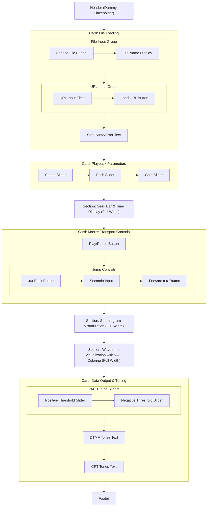

[//]: # ( REFACTOR_PLAN.md )

# **Vibe Player V3: The Hexagonal Refactoring Plan**

### **0. Context & Vision**

This document outlines the complete architectural blueprint for Vibe Player V3. It is not an incremental fix, but a ground-up redesign based on the principles of **Hexagonal (Ports and Adapters) Architecture** and **Behavior-Driven Development (BDD)**.

The primary impetus for this refactor stems from a careful analysis of the project's history: the successes and limitations of the original `vibe-player` (V1), and the architectural failures of the subsequent `vibe-player-v2.3` refactor attempt. V3 is a necessary redesign based on the lessons learned from both, built with the explicit constraint that the implementation will be performed by AI agents, requiring extreme clarity, robustness, and automated validation.

The vision for V3 is to create a system that is:

*   **Fundamentally Testable:** Every piece of core application logic must be testable in complete isolation, without depending on a UI framework, browser APIs, or live Web Workers. This will be achieved by treating every major domain of functionality as its own independent, self-contained hexagon.
*   **Behavior-Driven:** Application features will be defined by clear, human-readable **Gherkin scenarios** (`.feature` files). These executable specifications will drive the implementation and serve as the foundation for our end-to-end test suite, ensuring the AI agent builds exactly what is required.
*   **Decoupled and Maintainable:** The application's core business logic will be completely separated from the external "technologies" that drive it (the UI) and that it drives (Web Workers, state stores). This allows any piece of technology to be swapped out without affecting the core application.
*   **Robust and Predictable:** By enforcing strict boundaries and unidirectional data flow between highly specialized modules, we will eliminate the entire class of race conditions and state management bugs that plagued previous versions. The root cause of V2.3's failure—fragile worker communication—will be solved by a dedicated, reusable, and observable infrastructure utility.
*   **Built on a Simple, Typed Foundation:** The V3 application will be built as a **new, clean project** using **pure JavaScript**. Type safety and robustness will be enforced through **JSDoc-driven static analysis** via the TypeScript compiler (`tsc --checkJs`) in its strictest mode, avoiding the framework complexity that contributed to the V2.3 failure.

---

### **1. Critique of Previous Architectures (Lessons Learned)**

To justify this comprehensive redesign, we must first perform a critical analysis of the previous versions, acknowledging what worked and identifying the root causes of what failed.

#### **1.1. Analysis of V1 (The Working-but-Brittle Monolith)**

The original `vibe-player` in Vanilla JS was functionally complete and, importantly, **it worked**.

*   **What Worked:** It successfully integrated complex technologies like the Web Audio API, ONNX Runtime, and Rubberband WASM. Its "analyze once, tune in real-time" model for VAD was highly effective.
*   **Tradeoffs & Flaws:**
    *   **Tight Coupling:** Its success was dependent on a fragile, manually-enforced script loading order in `index.html`. A change in this order would break the entire application.
    *   **Monolithic Controller:** `app.js` was a "God Object" that knew about and controlled every other module, from UI management to audio processing to VAD analysis. This made it extremely difficult to test or modify any single piece of functionality in isolation.
    *   **Global State:** State was managed via properties on the global `AudioApp` namespace, making it difficult to track when and where state was being changed.
    *   **Main-Thread Blocking:** Intensive tasks like VAD and Spectrogram analysis were performed on the main thread with `async/await` and `setTimeout` hacks to yield control. While this worked for moderately sized files, it was not a truly non-blocking solution and could lead to UI stuttering.

#### **1.2. Analysis of V2.3 (The Flawed Refactor)**

The V2.3 SvelteKit refactor was a positive step towards modernization, but it failed to address the core architectural problems, instead "porting the monolith" into a new framework.

*   **What Improved:** It introduced a proper build system, TypeScript for type safety, and a reactive UI layer with Svelte. It correctly moved intensive tasks into dedicated Web Workers.
*   **The Architectural Failure:** The core flaw was the **decentralized and fragile worker communication contract**. Each service (`audioEngine.service`, `analysis.service`, etc.) independently implemented its own manual, error-prone system for managing asynchronous communication with its worker. This involved:
    1.  Manually creating and storing promise `resolve`/`reject` callbacks.
    2.  Manually generating unique message IDs.
    3.  Manually managing a `Map` of pending requests.
    4.  Requiring the worker to perfectly echo back the message ID.
*   **The Consequence:** This fragile, duplicated boilerplate was the direct cause of the bugs we chased. A missing `messageId` in `sileroVad.worker.ts` caused its `initialize()` promise to hang forever. When we fixed that, we immediately discovered the *exact same bug* in `rubberband.worker.ts`. This pattern of repeated, identical bugs is a clear sign that the architecture itself, not the implementation, is the problem.

---

### **2. The V3 Architectural Model: A Federation of Hexagons**

V3 will be built as a **federation of collaborating, self-contained hexagons**, driven by **behavioral specifications**. This is an advanced application of the Ports and Adapters pattern where each domain of functionality is its own "micro-application."

*   **The Hexagon (Application Core):** A module containing pure, isolated business logic written in pure JavaScript with JSDoc typing. It has no dependencies on external technologies (like the DOM, Web Workers, or a UI framework).
*   **Ports:** The formal interfaces (defined as JSDoc `@typedef` in a central `src/lib/types/` directory) that define how data and commands flow into or out of the hexagon.
*   **Adapters:** The "pluggable" pieces of technology that connect to the ports.
    *   **Driving Adapters:** Initiate action *on* the hexagon (e.g., the `uiManager.js` translating a button click into a command, a test suite).
    *   **Driven Adapters:** Are driven *by* the hexagon to perform a task (e.g., a `WebAudioAdapter` that uses the Web Audio API, a `SileroVadAdapter` that uses a `WorkerChannel`).

---

### **3. The V3 System Components**

#### **3.1. The Hexagons (Core Business Logic)**

*   **`AppHexagon` (The Orchestrator):**
    *   **Core Responsibility:** Manages the application's top-level state machine (`Initializing`, `Idle`, `Loading`, `Ready`, `Error`) and defines the high-level user stories. It is the primary client of all other domain hexagons.
    *   **Inside (`AppService.js`):** Contains the logic for coordinating services to fulfill use cases like `initializeApp()` and `loadAudio(source)`.
    *   **Ports:**
        *   **Driving (`IAppDriver`):** The public methods of the `AppService`.
        *   **Driven (`ILoaderPort`, `IPlaybackPort`, `IAnalysisPort`):** Interfaces used to command the other hexagons.
    *   **Adapters:**
        *   **Driving:** The `uiManager.js` UI Adapter, Keyboard Input Adapter.
        *   **Driven:** The other Hexagons (`PlaybackHexagon`, `VADHexagon`, etc.) are the adapters that plug into this hexagon's driven ports.

*   **`PlaybackHexagon`:**
    *   **Core Responsibility:** The pure state machine for a time-stretchable audio player. It knows nothing of the Web Audio API.
    *   **Inside (`PlaybackService.js`):** Manages properties like `duration`, `currentTime`, `speed`, and states like `playing` or `paused`.
    *   **Ports:**
        *   **Driving (`IPlaybackDriver`):** Public methods like `play()`, `pause()`, `seek()`.
        *   **Driven (`IAudioOutput`, `IPlayerStatePublisher`):** Interfaces to command an audio backend and to publish state updates.
    *   **Adapters (Driven):** The `WebAudioAdapter` (which uses a `WorkerChannel` to the `rubberband.worker`) and the `StateStoreAdapter`.

*   **Visualization Hexagons (`WaveformHexagon`, `SpectrogramHexagon`):**
    *   **Core Responsibility:** Pure data transformation.
    *   **Inside (`WaveformService.js`, `SpectrogramService.js`):** Contain the algorithms to convert an `AudioBuffer` into visual data (peak arrays or frequency-magnitude arrays). The `WaveformService` will explicitly implement the V1 `min/max` peak detection algorithm to avoid regressions.
    *   **Ports (Driven):** The `SpectrogramService` depends on a `IFFTEngine` port to perform FFT calculations.
    *   **Adapters (Driven):** The `FFTJsAdapter` (which uses a `WorkerChannel` to the `fft.js` worker) and the "dumb" `CanvasAdapters` in the `uiManager.js` that only know how to render the data they receive.

*   **Analysis Hexagons (`VADHexagon`, `DTMFHexagon`):**
    *   **Core Responsibility:** Pure signal processing and analysis logic.
    *   **Inside (`VADService.js`, `DTMFService.js`):** Contain the algorithms for VAD region merging and Goertzel-based tone detection.
    *   **Ports (Driven):** The `VADService` depends on an `IInferenceEngine` port to get raw speech probabilities.
    *   **Adapters (Driven):** The `SileroVadAdapter` and `DTMFAdapter`, both of which will use a `WorkerChannel` to communicate with their respective workers.

#### **3.2. Driving UI Adapter (`uiManager.js`)**

*   **Role:** This is the primary Driving Adapter for user interaction. It replaces the over-engineered `UIHexagon` concept with a pragmatic solution for our pure JS environment.
*   **Core Responsibilities:**
    *   **Direct State Consumption:** It directly **subscribes to** and **reads state from** the application's centralized state stores (e.g., `playerStore`, `statusStore`).
    *   **Embedded Presentation Logic:** The logic for transforming application state into visual properties (e.g., `if isPlaying then button.textContent = 'Pause'`) resides directly within the `uiManager`'s methods.
    *   **Direct DOM Manipulation:** It directly **manipulates the DOM elements** (e.g., setting `textContent`, `disabled` attributes, `canvas` drawing commands).
    *   **Command Dispatch:** It is responsible for translating raw user interactions (e.g., button clicks, slider inputs) into high-level **commands** that it dispatches directly to the `AppHexagon`'s driving ports.

#### **3.3. Infrastructure Utility: The `WorkerChannel` (Web Worker Communication Layer)**

*   **Role:** This is a technical infrastructure utility, not a business-domain Hexagon. It is the direct solution to the "fragile worker communication" problem that caused the V2.3 refactor to fail.
*   **Core Responsibility:** To provide a generic, robust, **Promise-based (`async/await`) request/response communication channel** over the native Web Worker API to a *single dedicated worker instance*. It acts as an **Anti-Corruption Layer (ACL)**, abstracting away the low-level complexities of `postMessage`, `onmessage` handling, message ID correlation, and `Transferable` object management.
*   **Instantiation & Analogy:** `WorkerChannel` is a **reusable class** that is **instantiated by driven adapters** (e.g., `SileroVadAdapter`, `WebAudioAdapter`). Each adapter instance manages its own `WorkerChannel` instance, which acts as a dedicated "sidecar" providing a reliable communication pipeline to its worker.
*   **Observability Hook:** It provides a centralized point to inject cross-cutting observability concerns for all worker communications, including **latency tracing**, optional **traffic logging**, and automated **error metrics**.
*   **Schema Responsibility:** The `WorkerChannel` itself **does not** validate message content. Schemas for all worker messages are defined as JSDoc `@typedef` interfaces in a central `src/lib/types/` directory.

---

### **4. Detailed State Management & Data Flow**

This section defines the strict rules for state ownership and data flow in V3, consolidating and clarifying the concepts from the original plan's appendices.

#### **4.1. Core Principles**

*   **State Store as a Write-Only Bus:** The centralized "State Store" (a collection of plain JavaScript objects with a pub/sub mechanism) is a **Driven Adapter**, not a Hexagon. Hexagons **drive** the `StateStoreAdapter` to write state; they do not read from it.
*   **Command vs. Event Pattern:**
    *   **Commands (Input):** Originate from a **Driving Adapter** (e.g., `uiManager.js`) or the `AppHexagon`. They are requests for the application to *do something* (e.g., `play()`, `seek()`).
    *   **Events (Output):** Originate from a **Driven Adapter** (e.g., `WebAudioAdapter`). They are notifications that a *system event has occurred* (e.g., `playbackFinished`, `workerCrashed`).
*   **`AppHexagon` as Transactional Authority:** The `AppHexagon` is the sole authority for all major state transitions. It receives events, consults its current status, and issues explicit commands back down to the domain hexagons to update the canonical state.
*   **Controlled Exception: The "Hot Path"**
    *   **What:** For high-frequency UI updates like the seek bar's position during playback, the `WebAudioAdapter` runs a `requestAnimationFrame` loop. Inside this loop, it calculates the estimated time and writes **directly** to a dedicated, lightweight UI store (`timeStore`).
    *   **Why:** This is a deliberate, controlled exception to achieve smooth 60fps UI updates without burdening the core application logic with `rAF` loops.
    *   **Limitations:** This is the *only* such exception. The `timeStore` is treated as a read-only sink for UI display purposes and does not trigger core application logic.
*   **Large Data Handling Protocol:** To maintain UI performance, large, static data payloads (like the `vadProbabilities` array) are **not** stored in reactive state stores. The owning hexagon (`VADHexagon`) holds the data internally. The state store will only hold a boolean flag (e.g., `hasProbabilities: true`), signaling to the UI that it can now call a synchronous accessor method on the hexagon's port (e.g., `VADHexagon.getProbabilityData()`) to retrieve the data for rendering.

#### **4.2. State Ownership & Pathways**

| State Item                           | Owning Hexagon       | Location in Store                       | Description                                                                                                                                                   |
|:-------------------------------------|:---------------------|:----------------------------------------|:--------------------------------------------------------------------------------------------------------------------------------------------------------------|
| `status` (`loading`, `ready`, etc.)  | `AppHexagon`         | `statusStore`                           | The single source of truth for the application's overall state.                                                                                               |
| `error`                              | `AppHexagon`         | `statusStore`                           | The global error message, if any.                                                                                                                             |
| `fileName`, `duration`, `isPlayable` | `AppHexagon`         | `playerStore`                           | High-level metadata about the loaded audio, managed by the orchestrator.                                                                                      |
| `isPlaying`, `isLooping`             | `PlaybackHexagon`    | `playerStore`                           | The canonical boolean playback state.                                                                                                                         |
| `currentTime`                        | `PlaybackHexagon`    | `timeStore` (Hot), `playerStore` (Cold) | The canonical playback time. Updated on the "hot path" by the `WebAudioAdapter` for UI, and synced on the "cold path" by the `PlaybackHexagon` on pause/seek. |
| `speed`, `pitchShift`, `gain`        | `PlaybackHexagon`    | `playerStore`                           | Playback manipulation parameters.                                                                                                                             |
| `isSeeking`, `wasPlayingBeforeSeek`  | `AppHexagon`         | *Internal to `AppHexagon`*              | Ephemeral UI state for managing the seek interaction. **Not published to the store.**                                                                       |
| `vadProbabilities`                   | `VADHexagon`         | *Internal to `VADHexagon`*              | The raw frame-by-frame speech probabilities. **Not published to the store.**                                                                                  |
| `hasVadProbabilities`                | `VADHexagon`         | `analysisStore`                         | A boolean flag indicating that the probability data is available for retrieval via accessor.                                                                  |
| `vadRegions`                         | `VADHexagon`         | `analysisStore`                         | The calculated speech time segments, derived from `vadProbabilities` and the current thresholds.                                                              |
| `vadPositiveThreshold`, etc.         | `VADHexagon`         | `analysisStore`                         | The tuning parameters for VAD region calculation.                                                                                                             |
| `dtmfResults`                        | `DTMFHexagon`        | `dtmfStore`                             | The list of detected DTMF tones.                                                                                                                              |
| `spectrogramData`                    | `SpectrogramHexagon` | *Internal to `SpectrogramHexagon`*      | The calculated spectrogram data. **Not published to the store.**                                                                                              |
| `hasSpectrogramData`                 | `SpectrogramHexagon` | `analysisStore`                         | A boolean flag indicating spectrogram data is available for retrieval via accessor.                                                                           |
| `waveformData`                       | `WaveformHexagon`    | `playerStore`                           | The calculated peak data for waveform visualization.                                                                                                          |

---

### **5. Detailed Interaction Flows (Behavior-Driven)**

This section outlines key user interactions using **Gherkin scenarios** to define the *what* (external behavior) and a step-by-step internal flow to define the *how* (architectural implementation).

#### **Flow 1: Successful File Load**

*   **Gherkin Scenario (`file_loading.feature`):**
    ```gherkin
    Scenario: User loads a valid audio file
      Given the application is idle
      When the user selects the audio file "C.Noisy_Voice.wav"
      Then the status message should indicate "Loading C.Noisy_Voice.wav..."
      And the player controls should be disabled
      And the waveform and spectrogram should appear in a "loading" state
      And the status message should eventually indicate "Ready: C.Noisy_Voice.wav"
      And the player controls should be enabled
      And the VAD highlights should eventually appear on the waveform
    ```

*   **Internal Implementation Flow:**
    1.  **UI Adapter (`uiManager.js`):** `on:change` event on the file input triggers `AppHexagon.loadAudio(file)`.
    2.  **`AppHexagon`:**
        *   Updates `statusStore` to `Status: Loading`.
        *   Drives `AudioLoaderService` to decode the file into an `AudioBuffer`.
    3.  **`AudioLoaderService`:** Returns the `AudioBuffer`.
    4.  **`AppHexagon`:**
        *   Drives `PlaybackHexagon.prepare(audioBuffer)` to set duration.
        *   Drives `WaveformHexagon.generatePeaks(audioBuffer)`. Result is published to `playerStore`.
        *   **IMMEDIATELY** updates `statusStore` to `Status: Ready`. UI controls become enabled.
        *   **In the background (fire-and-forget):**
            *   Calls `VADHexagon.process(audioBuffer)`.
            *   Calls `DTMFHexagon.process(audioBuffer)`.
            *   Calls `SpectrogramHexagon.process(audioBuffer)`.
    5.  **Analysis Hexagons:** As each background task completes, it publishes its results (`vadRegions`, `dtmfResults`, `hasSpectrogramData`) to the state stores.
    6.  **UI Reaction:** The UI, subscribed to these stores, updates reactively, "popping in" VAD highlights, DTMF results, and the spectrogram as their data becomes available.

#### **Flow 2: Playback and Seeking**

*   **Gherkin Scenario (`playback.feature`):**
    ```gherkin
    Scenario: User seeks while audio is playing
      Given the audio file "C.Noisy_Voice.wav" is playing
      When the user drags the seek bar to the 50% position
      Then the playback time immediately reflects the drag position
      And when the user releases the seek bar
      Then the audio continues playing from the new position
    ```

*   **Internal Implementation Flow:**
    1.  **UI Adapter (`uiManager.js`):** `mousedown` on seek bar calls `AppHexagon.beginSeek()`.
    2.  **`AppHexagon`:**
        *   Reads `playerStore` to see `isPlaying` is true; saves this internally (`wasPlaying = true`).
        *   Commands `PlaybackHexagon.pause()`.
    3.  **UI Adapter (`uiManager.js`):** `input` event on seek bar directly updates `timeStore` with the new time. The UI provides instant visual feedback.
    4.  **UI Adapter (`uiManager.js`):** `mouseup` on seek bar calls `AppHexagon.endSeek(finalTime)`.
    5.  **`AppHexagon`:**
        *   Commands `PlaybackHexagon.seek(finalTime)`.
        *   Checks internal `wasPlaying` flag. Since it's true, it commands `PlaybackHexagon.play()`.
        *   Resets its internal flags (`isSeeking`, `wasPlaying`).

---

### **6. V3 Testing and Quality Assurance Strategy**

The primary philosophy is to "shift left," enabling the AI agent to catch issues locally with fast, offline tools before relying on slower CI checks.

#### **6.1. The Testing Pyramid**

| Layer                  | Tool(s)                                 | Purpose                                                        | Runs Locally? | Runs in CI? | Speed        |
|:-----------------------|:----------------------------------------|:---------------------------------------------------------------|:--------------|:-----------------|:-------------|
| **Static Analysis**    | `tsc`, Biome, `dependency-cruiser`      | Type safety, code quality, style, **architectural rules**      | **Yes**       | **Yes**          | Blazing Fast |
| **Unit Tests**         | Vitest / Jest                           | Test individual hexagons/functions in isolation                | **Yes**       | **Yes**          | Fast         |
| **Integration Tests**  | Vitest / Jest                           | Test how hexagons and adapters collaborate                     | **Yes**       | **Yes**          | Fast         |
| **E2E Tests (BDD)**    | Playwright + Cucumber.js                | Verify user flows defined in Gherkin `.feature` files          | **Yes**       | **Yes**          | Slow         |
| **Visual Regression**  | Playwright (`toHaveScreenshot`)         | Prevent visual bugs in UI and visualizations                   | **Yes**       | **Yes**          | Slow         |
| **CI Static Analysis** | SonarCloud, GitHub CodeQL               | Tech debt, maintainability, deep security scans                | No            | **Yes**          | Slow         |

#### **6.2. Local Development Checks (The Inner Loop)**

*   **Type Safety (`tsc`):** A `jsconfig.json` will be configured with `"strict": true` and `"checkJs": true`. `tsc --noEmit` will be the project's official static type-checker, making JSDoc types mandatory.
*   **Code Quality & Formatting (Biome):** Biome will replace both ESLint and Prettier to enforce a strict set of rules and ensure 100% consistent formatting.
*   **Architectural Rules (`dependency-cruiser`):** This is **critical**. It will enforce rules such as:
    *   Hexagons (`src/lib/hexagons/`) **cannot** import from Adapters (`src/lib/adapters/`).
    *   Adapters **can** import their corresponding Hexagon's port definitions from `src/lib/ports/`.

#### **6.3. Automated Testing (Unit & Integration)**

*   **Unit Tests & V1 Characterization Testing:** Core algorithms (VAD region calculation, DTMF parsing) will be validated using V1 as the "golden master." We will run V1 logic with specific inputs, save the outputs to JSON "test vectors," and write V3 unit tests that assert the new functions produce identical output.
*   **Integration Tests:** Will verify collaboration between hexagons and their ports using mock adapters. For example, a test will instantiate `AppHexagon` and a real `PlaybackHexagon` but inject a *mock* `WebAudioAdapter` to assert the correct commands are received.

#### **6.4. CI/CD Pipeline Checks (The Final Gate)**

*   **BDD End-to-End Testing (Playwright + Cucumber.js):** The CI pipeline will run the full application and execute the Gherkin scenarios defined in `tests/features/`. This is the ultimate validation of external behavior.
*   **Visual Regression Testing:** Using Playwright's `toHaveScreenshot`, the CI will take snapshots of the waveform and spectrogram canvases to prevent unintended visual regressions.
*   **Deep Security & Code Maintainability (CodeQL & SonarCloud):** A workflow will run on every PR to perform deep semantic analysis for security vulnerabilities and report on code smells, complexity, and technical debt.

---

### **7. V3 Implementation Strategy & Process**

This section details the practical, step-by-step process for developing Vibe Player V3.

#### **7.1. Guiding Principles**

*   **Inside-Out Development:** Build from the pure business logic core (hexagons) outwards towards the browser-specific technologies (adapters).
*   **Test-Driven Development (TDD) / Behavior-Driven Development (BDD):** Every new piece of logic will begin with a test (unit or E2E) that defines its requirements. Code will only be written to make a failing test pass.
*   **Early & Continuous Integration:** The CI/CD pipeline and its automated quality gates are a foundational piece of the development environment.

#### **7.2. Phase 1: Project Foundation & CI Setup (The First Commit)**

1.  **Initialize Project Structure:**
    *   **Action:** Create a **new, empty `vibe-player-v3/` project directory.** This will be a fresh start, not a modification of `vibe-player-v2.3`.
    *   **Action:** Initialize `package.json`.
    *   **Action:** Create the source directory structure which makes the hexagonal architecture explicit:
        ```
        vibe-player-v3/
        ├── src/
        │   ├── lib/
        │   │   ├── hexagons/      # Core business logic (e.g., VADService.js)
        │   │   ├── adapters/      # Technology-specific code (e.g., WebAudioAdapter.js)
        │   │   └── types/         # JSDoc @typedefs for ports and message schemas
        │   ├── app.js             # Main entry point; the final driving adapter
        │   └── index.html         # The final application shell
        ├── tests/
        │   ├── features/          # Gherkin .feature files for BDD
        │   ├── e2e/               # Playwright + Cucumber step definitions
        │   ├── unit/
        │   ├── integration/
        │   └── vectors/           # JSON files for V1 characterization tests
        └── ...
        ```
2.  **Install & Configure Core Tooling:**
    *   **Action:** Install all development dependencies: `vitest`, `typescript` (for `tsc`), `biome`, `dependency-cruiser`, `playwright`, `cucumber`, etc.
    *   **Action:** Configure `jsconfig.json` with `"strict": true` and `"checkJs": true`.
    *   **Action:** Configure `biome.json` with strict linting and formatting rules.
    *   **Action:** Configure `.dependency-cruiser.js` to enforce architectural boundaries.
    *   **Action:** Set up a **Component Isolation Tool** (e.g., Storybook or a lightweight alternative) for isolated UI development.
3.  **Implement CI/CD Workflows:**
    *   **Action:** Create the initial GitHub Actions workflows (`ci.yml`, `codeql.yml`, `sonarcloud.yml`). The `ci.yml` workflow will be configured to run all static analysis, unit, integration, and E2E tests on every PR.

#### **7.3. Phase 2: The Core Development Loop (Iterative)**

1.  **Gherkin Scenario First:** For any new feature, **first identify or write the Gherkin scenario** in a `.feature` file that describes the desired behavior.
2.  **Characterization Test (If Applicable):** If refactoring a V1 feature, generate a "test vector" JSON file by running the pure logic from the V1 codebase.
3.  **Hexagon Implementation (TDD):** Write a failing unit test (using the JSON vector if applicable), then implement the pure logic inside the hexagon file until the test passes.
4.  **Adapter & UI Implementation:** Implement the necessary adapters and `uiManager.js` logic to connect the hexagon to the outside world, making the E2E Gherkin test pass.

#### **7.4. Phase 3: Documentation & Handover**

1.  **Update Project Documentation:**
    *   Upon completion, the root `README.md` will be updated to reflect the new V3 architecture.
    *   The `vibe-player` (V1) and `vibe-player-v2.3` directories will be **archived and then removed from the main branch.** The `vibe-player-v3` directory will be renamed to `vibe-player`.
2.  **Final Quality Review:** A final review of the SonarCloud dashboard will be conducted to address any remaining high-priority issues.

---

### **Appendix A: AI Agent Collaboration Guidelines & Operational Instructions**

This section defines the operational protocols for any AI agent working on this project. It is a mandatory guide for implementation. It is an integration of the `CONTRIBUTING-LLM.md` file.

*   **P0: Agent Autonomy & Minimized Interaction:** The agent should operate with a high degree of autonomy once a task and its objectives are clearly defined. Default to making reasonable, well-documented decisions to keep work flowing.
*   **P1: Task-Driven Workflow & Initial Confirmation:** Complex tasks require an initial proposal and user confirmation before full implementation.
*   **P2: Clarity & Explicit Communication:** Proactively seek clarification for ambiguous tasks. Explain all changes and their rationale in a structured manner (e.g., commit messages).
*   **P3: Maintainability & Consistency:**
    *   **P3.1:** Strictly adhere to the V3 architectural patterns defined in this document.
    *   **P3.2:** Generate high-quality JSDoc comments for all public functions, classes, and types. Preserve existing meaningful comments.
    *   **P3.4 & P3.5:** All full files must include file identification comments at the start and end. Use section headers for long files.
*   **P4: Guideline Adherence & Conflict Reporting:** The agent must report if its knowledge suggests a guideline is suboptimal for a task, and must report any direct conflicts between user instructions and established guidelines, seeking explicit direction.
*   **P6: README Generation Requirement:** The main `README.md` must contain a reference to this collaboration guide.
*   **P7: Branch-Based Code Submission:** The agent must submit all work by committing to feature branches and pushing to the remote repository.
*   **P8: Gherkin-Driven Implementation and Testing (NEW):**
    *   When implementing a new feature, the agent **must** consult the relevant Gherkin scenarios (`tests/features/*.feature`) to understand the desired external behavior.
    *   The agent **must** ensure that its generated code passes the automated E2E tests derived from these Gherkin scenarios.
    *   If no relevant Gherkin scenario exists for a new feature, the agent **must first propose a new Gherkin scenario** for user review and approval before proceeding with implementation.

---

### **Appendix B: UI Layout**

