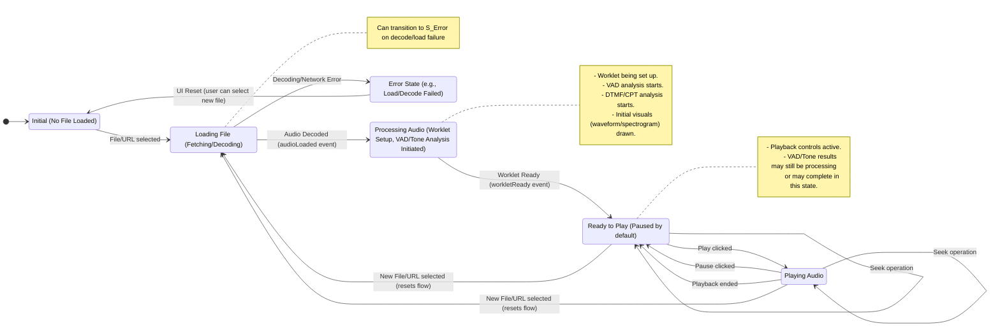

```mermaid
stateDiagram-v2
    direction LR

    [*] --> S_Initial
    S_Initial: Initial (No File Loaded)

    S_Initial --> S_LoadingFile: File/URL selected
    S_LoadingFile: Loading File (Fetching/Decoding)

    S_LoadingFile --> S_ProcessingAudio: Audio Decoded (audioLoaded event)
    note right of S_LoadingFile: Can transition to S_Error on decode/load failure

    S_LoadingFile --> S_Error: Decoding/Network Error

    S_ProcessingAudio: Processing Audio (Worklet Setup, VAD/Tone Analysis Initiated)
    note right of S_ProcessingAudio
        - Worklet being set up.
        - VAD analysis starts.
        - DTMF/CPT analysis starts.
        - Initial visuals (waveform/spectrogram) drawn.
    end note
    S_ProcessingAudio --> S_Ready: Worklet Ready (workletReady event)

    S_Ready: Ready to Play (Paused by default)
    note right of S_Ready
        - Playback controls active.
        - VAD/Tone results may still be processing
          or may complete in this state.
    end note

    S_Ready --> S_Playing: Play clicked
    S_Playing: Playing Audio

    S_Playing --> S_Ready: Pause clicked
    S_Playing --> S_Ready: Playback ended
    S_Playing --> S_Playing: Seek operation

    S_Ready --> S_Ready: Seek operation

    S_Ready --> S_LoadingFile: New File/URL selected (resets flow)
    S_Playing --> S_LoadingFile: New File/URL selected (resets flow)

    S_Error: Error State (e.g., Load/Decode Failed)
    S_Error --> S_Initial: UI Reset (user can select new file)

```
