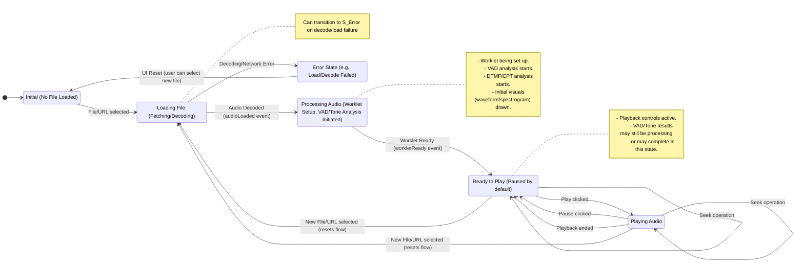

<!-- /vibe-player/architecture.md -->

# Vibe Player Architecture

## 1. Overview

* **Purpose:** Browser-based audio player focused on playback speed/pitch manipulation, voice activity detection (VAD)
  visualization, and waveform/spectrogram display. Designed for static file deployment.
* **Core Philosophy:** Prioritize simplicity and minimal dependencies by using Vanilla JS, HTML, and CSS. Leverage
  WebAssembly (WASM) via standardized Web APIs (`AudioWorklet`, `ONNX Runtime Web`) for computationally intensive
  tasks (audio processing, ML inference) that would otherwise be difficult or impossible client-side. The application
  follows an event-driven interaction flow managed by a central controller (`app.js`).

## 2. Key Technologies

* **Frontend:** HTML5, CSS3 (98.css for styling + custom `styles.css`), Vanilla JavaScript (ES6 Modules via IIFE pattern
  on `AudioApp` namespace)
* **Audio Engine:** Web Audio API (`AudioContext`, `GainNode`, `AudioWorkletNode`, `OfflineAudioContext` for resampling)
* **Time/Pitch Shifting:** Rubberband WASM library (via `js/player/rubberbandProcessor.js` AudioWorklet).
    * **Loader (`lib/rubberband-loader.js`):** ***Note:*** *This is a heavily modified version of the standard
      Emscripten loader, adapted specifically for use within the AudioWorklet context and to handle WASM instantiation
      via a hook.*
    * **Temporal Accuracy:** ***Note:*** *Rubberband prioritizes audio quality over strict temporal accuracy. The number
      of output frames generated may not perfectly match the requested time ratio for a given input block, and its
      internal time/latency reporting can drift relative to the Web Audio clock. Therefore, its time reports are not
      used directly for precise UI indicator synchronization.*
* **VAD:** Silero VAD model (`model/silero_vad.onnx`) executed via ONNX Runtime Web (WASM backend in `lib/`)
* **Visualizations:** HTML Canvas API (2D Context), FFT.js library (`lib/fft.js`).
    * **FFT Library (`lib/fft.js`):** ***Note:*** *This is based on indutny/fft.js but contains modifications made
      during initial development to ensure compatibility or functionality.*
* **DTMF & Call Progress Tone (CPT) Detection:**
    * The application can detect and display common DTMF tones (0-9, *, #, A-D) and Call Progress Tones (e.g., Dial
      Tone, Busy Signal, Ringback).
    * This is achieved using JavaScript implementations of the Goertzel algorithm and custom parsers (`DTMFParser`,
      `CallProgressToneParser`) located in `js/goertzel.js`.
    * `DTMFParser` identifies DTMF characters by detecting pairs of specific frequencies.
    * `CallProgressToneParser` identifies CPTs by detecting specific frequencies and their cadences (on/off patterns).

## 3. Code Structure (`js/` directory)

* **`app.js` (Controller):** Initializes modules, orchestrates loading/VAD/DTMF-CPT/playback flow, handles events,
  manages core state. Manages main-thread time updates using `AudioContext.currentTime`. For DTMF/CPT detection, it
  resamples audio to 16kHz mono, iterates through it in blocks, passes these to `DTMFParser` and
  `CallProgressToneParser` instances, and relays results to `uiManager.js` for display.
* **`constants.js`:** Defines shared constants (paths, parameters, colors, etc.).
* **`goertzel.js`:** Contains implementations of the Goertzel algorithm (`GoertzelFilter`), `DTMFParser`, and
  `CallProgressToneParser` for detecting specific frequencies and patterns for DTMF and CPTs.
* **`utils.js`:** Contains shared utility functions (e.g., `formatTime`, `yieldToMainThread`, `hannWindow`,
  `viridisColor`).
* **`uiManager.js` (View/UI Logic):** Handles all direct DOM manipulation, UI event listeners, and dispatches UI events.
  Manages VAD progress bar UI.
* **`js/player/`:**
    * **`audioEngine.js` (Audio Backend):** Manages Web Audio API, `AudioWorkletNode` lifecycle/communication, audio
      decoding, and resampling capability. Relays time updates from worklet but isn't the primary source for UI timing.
    * **`rubberbandProcessor.js` (AudioWorklet):** Runs in worklet thread. Interfaces with Rubberband WASM for
      time/pitch processing. Communicates via messages with `audioEngine.js`. Reports its consumed source time,
      acknowledging potential inaccuracies.
* **`js/vad/`:**
    * **`sileroWrapper.js` (VAD ONNX Interface):** Wraps ONNX Runtime session for the Silero VAD model. Handles
      inference calls and state tensors.
    * **`sileroProcessor.js` (VAD Frame Logic):** Iterates audio frames, calls `sileroWrapper`, calculates regions based
      on probabilities/thresholds, yields to main thread, reports progress.
    * **`vadAnalyzer.js` (VAD State Manager):** Bridges `app.js` and VAD processing. Holds VAD results/thresholds.
      Initiates analysis and recalculation.
* **`js/visualizers/`:**
    * **`waveformVisualizer.js`:** Computes and draws the waveform display, handles highlighting, resizing, progress
      indicator, and click-to-seek.
    * **`spectrogramVisualizer.js`:** Computes (using FFT.js) and draws the spectrogram display, manages caching,
      resizing, progress indicator, click-to-seek, and loading spinner.

## 4. Interaction Flow & State Management

* **Loading Sequence:**
    1. `UI (Choose File)` -> `uiManager` dispatches `audioapp:fileSelected`.
    2. `app.js (handleFileSelected)`: Resets state/UI, shows spinner, calls `audioEngine.loadAndProcessFile`.
    3. `audioEngine`: Decodes audio, dispatches `audioapp:audioLoaded`. Sets up worklet asynchronously.
    4. `app.js (handleAudioLoaded)`: Stores `currentAudioBuffer`, updates time/seek UI, calls
       `visualizer.computeAndDrawVisuals([])` (triggers gray waveform + spectrogram draw), hides main spinner, calls
       `runVadInBackground` (async), and calls `processAudioForTones` (async).
    5. `audioEngine`: When worklet setup is complete, dispatches `audioapp:workletReady`.
    6. `app.js (handleWorkletReady)`: Sets `workletPlaybackReady=true`, enables playback controls/seek bar. **Playback
       is now possible.**
    7. `app.js (runVadInBackground)` (Running concurrently with tone detection):
        * Initializes VAD model if needed (`sileroWrapper.create`).
        * Shows VAD progress bar (`uiManager`).
        * Calls `audioEngine.resampleTo16kMono` (if not already done for tones, or uses existing resampled data).
        * Calls `vadAnalyzer.analyze` (which calls `sileroProcessor.analyzeAudio` with progress callback).
        * `sileroProcessor`: Iterates frames, calls `sileroWrapper.process`, yields, calls progress callback ->
          `uiManager.updateVadProgress`.
        * On VAD completion/error: Updates VAD results in `app.js`, updates VAD slider UI (`uiManager`), redraws
          waveform highlights (`visualizer.redrawWaveformHighlight`), updates progress bar to 100% or 0%.
    8. `app.js (processAudioForTones)` (Running concurrently with VAD):
        * Calls `audioEngine.resampleTo16kMono` (if not already done for VAD, or uses existing resampled data).
        * Initializes `DTMFParser` and `CallProgressToneParser`.
        * Iterates through resampled audio data in blocks, feeding them to the parsers.
        * Collects results and passes them to `uiManager.setDtmfCptResults` for display.
* **Playback Control:** `UI (Button Click)` -> `uiManager` dispatches event -> `app.js (handlePlayPause/Jump/Seek)` ->
  `audioEngine` (sends command message) -> `rubberbandProcessor`. Status feedback: `rubberbandProcessor` (sends state
  message) -> `audioEngine` (dispatches event) -> `app.js (handlePlaybackStateChange)` -> `uiManager` (updates button).
* **Parameter Control (Speed/Pitch/Gain):** `UI (Slider Input)` -> `uiManager` dispatches event ->
  `app.js (handleSpeed/Pitch/GainChange)` -> `audioEngine`. Gain applied directly via `GainNode`. Speed/Pitch command
  message sent to `rubberbandProcessor`.
* **VAD Threshold Tuning:** `UI (Slider Input)` -> `uiManager` dispatches `audioapp:thresholdChanged` ->
  `app.js (handleThresholdChange)` (checks if VAD done) -> `vadAnalyzer.handleThresholdUpdate` ->
  `sileroProcessor.recalculateSpeechRegions` -> `app.js` receives new regions -> `visualizer.redrawWaveformHighlight` &
  `uiManager.setSpeechRegionsText`.
* **State:** Core state (`currentAudioBuffer`, playback flags, `currentVadResults`, DTMF/CPT results) managed centrally
  in `app.js`. `audioEngine` manages worklet communication state. `vadAnalyzer` manages VAD results/thresholds.
  `uiManager` reflects state in the DOM. `sileroWrapper` and `rubberbandProcessor` manage internal WASM state.
* **Key Points:** Loading involves: Decode -> Initial Visuals (Waveform+Spectrogram) -> Background VAD & DTMF/CPT
  Processing (concurrently) -> Waveform Highlighting & Tone Display. Playback enabled after worklet ready, independent
  of VAD/Tone completion.
* **Time Synchronization:** UI progress indicator is driven by `app.js` using main-thread `AudioContext.currentTime`
  calculations, compensated for speed changes. Explicit seeks are sent to `audioEngine` on pause and after speed slider
  adjustments (debounced) to force engine synchronization with the main thread's estimate, mitigating drift from
  Rubberband's internal timing.

### 4.1 GUI State Transitions

The following diagram illustrates the primary states and transitions of the Vibe Player GUI.

## 5. Design Decisions, Constraints & Tradeoffs

* **Static Hosting:** Simplifies deployment, no backend required. Limits features requiring server interaction. (
  Constraint C1)
* **Vanilla JS:** Reduces dependency footprint, avoids framework overhead/learning curve. Requires manual implementation
  of patterns (modules, state management). (Constraint C2)
* **IIFE Module Pattern:** Provides simple namespacing (`AudioApp`) without requiring a build step. Relies on careful
  script loading order.
* **Custom Events (`audioapp:*`):** Decouples UI Manager and Audio Engine from the main App controller, allowing modules
  to signal state changes or requests without direct dependencies on `app.js`'s internal methods. (Constraint C3)
* **AudioWorklet for Rubberband:** Essential for performing complex audio processing (time-stretching) off the main
  thread without blocking UI or audio playback. Adds architectural complexity for message passing and state
  synchronization between main thread (`audioEngine`) and worklet thread (`rubberbandProcessor`). Required a *
  *customized WASM loader** (`lib/rubberband-loader.js`).
    * **Alternative Considered (SoundTouchJS):** SoundTouchJS was evaluated, but the audio quality, especially at slower
      speeds, was significantly worse than Rubberband. Rubberband's computational cost was deemed acceptable for the
      quality improvement. Native Web Audio playback rate changes were also too choppy at low speeds.
    * **Rubberband Flags:** The primary goal for flag tuning was improving voice quality. The primary flags used are
      `ProcessRealTime`, `PitchHighQuality`, and `PhaseIndependent`. Other flags like `TransientsCrisp` might be part of
      the default behavior of the Rubberband library version used or were considered in earlier configurations.
      `EngineFiner` was tested but resulted in stuttering playback, likely due to exceeding CPU limits on the test
      machine; the default (faster) engine is currently used.
    * **Rubberband Temporal Inaccuracy:** ***(RESTORED)*** Rubberband prioritizes audio quality, leading to potential
      drift in its output duration and time reporting relative to Web Audio clock. This necessitates **main-thread time
      calculation** for the UI indicator and periodic seek-based synchronization. Analogy: Cannot use a rubber band as a
      precise ruler.
* **ONNX Runtime Web for VAD:** Enables use of standard ML models (like Silero VAD) directly in the browser via WASM.
  Avoids needing a dedicated VAD implementation.
* **Main-Thread VAD (Async):** VAD processing (`sileroProcessor`) runs on the main thread but uses `async/await` and
  `setTimeout(0)` to yield periodically.
    * **Tradeoff:** Simpler implementation for MVP compared to setting up a dedicated Web Worker for VAD. Avoids
      additional complexity of worker communication and state transfer.
    * **Downside:** Can still cause minor UI sluggishness during intense computation phases within
      `sileroWrapper.process`. Susceptible to browser throttling in background tabs (prevents VAD completion if tab is
      unfocused for a long time).
    * **(Clarification):** VAD processing currently does *not* run in a Web Worker. The idea was considered to allow
      completion even when the tab is backgrounded, but not implemented yet.
* **VAD Progress Updates:** Initial attempts at direct UI updates or simple `setTimeout(0)` from the VAD loop were
  unreliable for progress bar updates. The current solution uses a callback function passed down to `sileroProcessor`
  which calls `uiManager.updateVadProgress`.
* **JSDoc:** Chosen standard for JavaScript documentation in this project. (Constraint C7)
* **Manual Testing:** Adopted for rapid iteration during MVP phase. Lacks automated checks for regressions. (Constraint
  C5)
* **Visualizer Computation:** Waveform data calculated per-pixel. Spectrogram data computed entirely upfront (using *
  *modified `lib/fft.js`**) before being drawn asynchronously chunk-by-chunk.
    * **Tradeoff:** Faster waveform display. Spectrogram has an initial computation delay before drawing starts, but
      avoids the complexity of streaming FFT computation. Async drawing prevents blocking during render.
* **File Structure:** Modular approach with separate files/folders for distinct responsibilities (UI, Player, VAD,
  Visualizers, Controller, Constants, Utils). Asset types (CSS, Fonts) organized into folders. (Constraint C6, Asset
  Reorg)

## 6. Known Issues & Development Log

* **Formant Shifting (Non-Functional):** The mechanism for formant shifting is implemented, but it produces no audible
  effect with the current Rubberband WASM build and configuration.
    * **Details:** Attempts were made to enable formant scaling using `_rubberband_set_formant_scale`. Rubberband flags
      tested included permutations of `EngineFiner`, `PhaseIndependent`, `FormantPreserved`, and the current default
      flag set. Formant scaling was tested alone and in combination with phase/speed shifting (0.25x to 2.0x). Debugging
      confirmed the target scale value was successfully passed to the WASM function via the correct API call.
    * **Result:** No errors were thrown, but **no audible effect** from formant shifting was ever observed. The feature
      was abandoned as non-functional in the current Rubberband WASM build/configuration. It's uncertain if the issue is
      in the WASM compilation, the underlying library's formant preservation interaction with other flags, or a
      misunderstanding of the scale parameter (though multiplier is standard).
* **VAD Performance & Backgrounding:** Runs on main thread; may cause minor UI jank and pauses when tab unfocused.
* **Spectrogram Latency:** Initial computation delay before drawing begins.
* **Rubberband Engine Choice:** `EngineFiner` caused stuttering; using default (faster) engine.
* **Playback Indicator Drift (Mitigated):** Reliance on main-thread calculation and sync-on-pause/speed-change
  significantly reduces drift compared to trusting worklet time reports, but minor visual discrepancies *during* rapid
  parameter changes might still occur due to inherent system latencies.

<!-- /vibe-player/architecture.md -->
